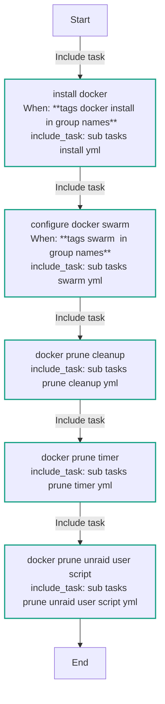
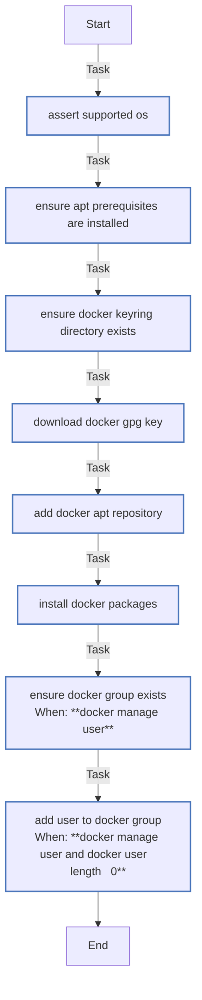
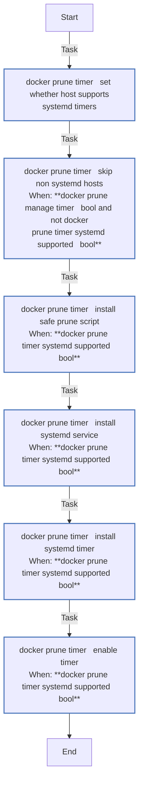

<!-- DOCSIBLE START -->

# 📃 Role overview

## docker

| Field                | Value           |
|--------------------- |-----------------|
| Readme update        | 2026/04/11 |

### Defaults

**These are static variables with lower priority**

#### File: defaults/main.yml

| Var          | Type         | Value       |
|--------------|--------------|-------------|
| [docker_packages](https://github.com/Lebowski89/homelab/blob/main/defaults/main.yml#L3)   | list | `[]` |    
| [docker_packages.**0**](https://github.com/Lebowski89/homelab/blob/main/defaults/main.yml#L4)   | str | `docker-ce` |    
| [docker_packages.**1**](https://github.com/Lebowski89/homelab/blob/main/defaults/main.yml#L5)   | str | `docker-ce-cli` |    
| [docker_packages.**2**](https://github.com/Lebowski89/homelab/blob/main/defaults/main.yml#L6)   | str | `containerd.io` |    
| [docker_packages.**3**](https://github.com/Lebowski89/homelab/blob/main/defaults/main.yml#L7)   | str | `docker-buildx-plugin` |    
| [docker_packages.**4**](https://github.com/Lebowski89/homelab/blob/main/defaults/main.yml#L8)   | str | `docker-compose-plugin` |    
| [docker_prereq_packages](https://github.com/Lebowski89/homelab/blob/main/defaults/main.yml#L10)   | list | `[]` |    
| [docker_prereq_packages.**0**](https://github.com/Lebowski89/homelab/blob/main/defaults/main.yml#L11)   | str | `ca-certificates` |    
| [docker_prereq_packages.**1**](https://github.com/Lebowski89/homelab/blob/main/defaults/main.yml#L12)   | str | `curl` |    
| [docker_apt_arch_map](https://github.com/Lebowski89/homelab/blob/main/defaults/main.yml#L14)   | dict | `{}` |    
| [docker_apt_arch_map.**x86_64**](https://github.com/Lebowski89/homelab/blob/main/defaults/main.yml#L15)   | str | `amd64` |    
| [docker_apt_arch_map.**aarch64**](https://github.com/Lebowski89/homelab/blob/main/defaults/main.yml#L16)   | str | `arm64` |    
| [docker_apt_arch](https://github.com/Lebowski89/homelab/blob/main/defaults/main.yml#L18)   | str | `{{ docker_apt_arch_map[ansible_architecture] ¦ default(ansible_architecture) }}` |    
| [docker_repo_url](https://github.com/Lebowski89/homelab/blob/main/defaults/main.yml#L20)   | str | `https://download.docker.com/linux/ubuntu` |    
| [docker_repo_channel](https://github.com/Lebowski89/homelab/blob/main/defaults/main.yml#L21)   | str | `stable` |    
| [docker_keyring_dir](https://github.com/Lebowski89/homelab/blob/main/defaults/main.yml#L22)   | str | `/etc/apt/keyrings` |    
| [docker_keyring_file](https://github.com/Lebowski89/homelab/blob/main/defaults/main.yml#L23)   | str | `/etc/apt/keyrings/docker.asc` |    
| [docker_repo_filename](https://github.com/Lebowski89/homelab/blob/main/defaults/main.yml#L24)   | str | `docker` |    
| [docker_install_compose_plugin](https://github.com/Lebowski89/homelab/blob/main/defaults/main.yml#L26)   | bool | `True` |    
| [docker_manage_user](https://github.com/Lebowski89/homelab/blob/main/defaults/main.yml#L27)   | bool | `False` |    
| [docker_user](https://github.com/Lebowski89/homelab/blob/main/defaults/main.yml#L28)   | str |  |    
| [docker_network](https://github.com/Lebowski89/homelab/blob/main/defaults/main.yml#L30)   | str | `overlay` |    
| [docker_network_driver](https://github.com/Lebowski89/homelab/blob/main/defaults/main.yml#L31)   | str | `overlay` |    
| [docker_network_subnet](https://github.com/Lebowski89/homelab/blob/main/defaults/main.yml#L32)   | str | `172.98.0.0/24` |    
| [docker_prune_threshold_percent](https://github.com/Lebowski89/homelab/blob/main/defaults/main.yml#L34)   | int | `80` |    
| [docker_prune_filesystem_path](https://github.com/Lebowski89/homelab/blob/main/defaults/main.yml#L35)   | str | `/` |    
| [docker_prune_until](https://github.com/Lebowski89/homelab/blob/main/defaults/main.yml#L36)   | str | `168h` |    
| [docker_prune_images](https://github.com/Lebowski89/homelab/blob/main/defaults/main.yml#L38)   | bool | `True` |    
| [docker_prune_containers](https://github.com/Lebowski89/homelab/blob/main/defaults/main.yml#L39)   | bool | `True` |    
| [docker_prune_builder_cache](https://github.com/Lebowski89/homelab/blob/main/defaults/main.yml#L40)   | bool | `True` |    
| [docker_prune_networks](https://github.com/Lebowski89/homelab/blob/main/defaults/main.yml#L41)   | bool | `False` |    
| [docker_prune_volumes](https://github.com/Lebowski89/homelab/blob/main/defaults/main.yml#L42)   | bool | `False` |    
| [docker_prune_manage_timer](https://github.com/Lebowski89/homelab/blob/main/defaults/main.yml#L44)   | bool | `True` |    
| [docker_prune_timer_name](https://github.com/Lebowski89/homelab/blob/main/defaults/main.yml#L45)   | str | `docker-prune-safe` |    
| [docker_prune_timer_on_calendar](https://github.com/Lebowski89/homelab/blob/main/defaults/main.yml#L46)   | str | `Sun *-*-* 04:30:00` |    
| [docker_prune_timer_randomized_delay_sec](https://github.com/Lebowski89/homelab/blob/main/defaults/main.yml#L47)   | str | `1h` |    
| [docker_prune_script_path](https://github.com/Lebowski89/homelab/blob/main/defaults/main.yml#L48)   | str | `/usr/local/sbin/docker-prune-safe` |    
| [docker_prune_timer_min_usage_percent](https://github.com/Lebowski89/homelab/blob/main/defaults/main.yml#L52)   | int | `0` |    
| [docker_prune_unraid_user_script_manage](https://github.com/Lebowski89/homelab/blob/main/defaults/main.yml#L54)   | bool | `True` |    
| [docker_prune_unraid_user_script_name](https://github.com/Lebowski89/homelab/blob/main/defaults/main.yml#L55)   | str | `docker-prune-safe` |    
| [docker_prune_unraid_user_scripts_root](https://github.com/Lebowski89/homelab/blob/main/defaults/main.yml#L56)   | str | `/boot/config/plugins/user.scripts/scripts` |    
| [docker_prune_unraid_user_script_dir](https://github.com/Lebowski89/homelab/blob/main/defaults/main.yml#L57)   | str | `{{ docker_prune_unraid_user_scripts_root }}/{{ docker_prune_unraid_user_script_name }}` |    
| [docker_prune_unraid_user_script_path](https://github.com/Lebowski89/homelab/blob/main/defaults/main.yml#L58)   | str | `{{ docker_prune_unraid_user_script_dir }}/script` |    

### Tasks

#### File: tasks/main.yml

| Name | Module | Has Conditions | Tags |
| ---- | ------ | -------------- | -----|
| Install Docker | ansible.builtin.include_tasks | True | docker,docker_install |
| Configure Docker Swarm | ansible.builtin.include_tasks | True | docker,docker_swarm,docker_swarm_init,docker_swarm_join,docker_swarm_network,docker_swarm_labels |
| Docker Prune Cleanup | ansible.builtin.include_tasks | False | docker_prune,docker_prune_dangling,docker_prune_unused,docker_prune_volumes |
| Docker Prune Timer | ansible.builtin.include_tasks | False | d,o,c,k,e,r,_,p,r,u,n,e,_,t,i,m,e,r |
| Docker Prune Unraid User Script | ansible.builtin.include_tasks | False | d,o,c,k,e,r,_,p,r,u,n,e,_,u,n,r,a,i,d,_,u,s,e,r,_,s,c,r,i,p,t |

#### File: tasks/sub_tasks/install.yml

| Name | Module | Has Conditions |
| ---- | ------ | -------------- |
| Assert supported OS | ansible.builtin.assert | False |
| Ensure apt prerequisites are installed | ansible.builtin.apt | False |
| Ensure Docker keyring directory exists | ansible.builtin.file | False |
| Download Docker GPG key | ansible.builtin.get_url | False |
| Add Docker apt repository | ansible.builtin.apt_repository | False |
| Install Docker packages | ansible.builtin.apt | False |
| Ensure docker group exists | ansible.builtin.group | True |
| Add user to docker group | ansible.builtin.user | True |

#### File: tasks/sub_tasks/prune/cleanup.yml

| Name | Module | Has Conditions |
| ---- | ------ | -------------- |
| Docker prune cleanup ¦ Get filesystem usage | ansible.builtin.command | False |
| Docker prune cleanup ¦ Parse filesystem usage percent | ansible.builtin.set_fact | False |
| Docker prune cleanup ¦ Show current usage | ansible.builtin.debug | False |
| Docker prune cleanup ¦ Run safe cleanup when above threshold | block | True |
| Docker prune cleanup ¦ Show Docker disk usage before cleanup | ansible.builtin.command | False |
| Docker prune cleanup ¦ Remove stopped containers older than retention | ansible.builtin.command | True |
| Docker prune cleanup ¦ Remove unused images older than retention | ansible.builtin.command | True |
| Docker prune cleanup ¦ Remove unused builder cache older than retention | ansible.builtin.command | True |
| Docker prune cleanup ¦ Remove unused networks older than retention | ansible.builtin.command | True |
| Docker prune cleanup ¦ Remove unused volumes | ansible.builtin.command | True |
| Docker prune cleanup ¦ Show Docker disk usage after cleanup | ansible.builtin.command | False |
| Docker prune cleanup ¦ Cleanup summary | ansible.builtin.debug | False |
| Docker prune cleanup ¦ Skip cleanup below threshold | ansible.builtin.debug | True |

#### File: tasks/sub_tasks/prune/timer.yml

| Name | Module | Has Conditions |
| ---- | ------ | -------------- |
| Docker prune timer ¦ Set whether host supports systemd timers | ansible.builtin.set_fact | False |
| Docker prune timer ¦ Skip non-systemd hosts | ansible.builtin.debug | True |
| Docker prune timer ¦ Install safe prune script | ansible.builtin.copy | True |
| Docker prune timer ¦ Install systemd service | ansible.builtin.copy | True |
| Docker prune timer ¦ Install systemd timer | ansible.builtin.copy | True |
| Docker prune timer ¦ Enable timer | ansible.builtin.systemd | True |

#### File: tasks/sub_tasks/prune/unraid_user_script.yml

| Name | Module | Has Conditions |
| ---- | ------ | -------------- |
| Docker prune Unraid User Script ¦ Set whether host is Unraid-style non-systemd | ansible.builtin.set_fact | False |
| Docker prune Unraid User Script ¦ Skip unsupported hosts | ansible.builtin.debug | True |
| Docker prune Unraid User Script ¦ Check User Scripts plugin directory | ansible.builtin.stat | True |
| Docker prune Unraid User Script ¦ Assert User Scripts plugin exists | ansible.builtin.assert | True |
| Docker prune Unraid User Script ¦ Ensure script directory exists | ansible.builtin.file | True |
| Docker prune Unraid User Script ¦ Install safe prune script | ansible.builtin.copy | True |
| Docker prune Unraid User Script ¦ Show next manual step | ansible.builtin.debug | True |

#### File: tasks/sub_tasks/swarm.yml

| Name | Module | Has Conditions | Tags |
| ---- | ------ | -------------- | -----|
| Ensure this host is part of the swarm inventory | ansible.builtin.set_fact | False |  |
| End swarm tasks for non-swarm hosts | ansible.builtin.meta | True |  |
| Assert primary swarm manager is defined | ansible.builtin.assert | False |  |
| Assert local_ip is defined for swarm node | ansible.builtin.assert | False |  |
| Initialise swarm on primary manager | community.docker.docker_swarm | True | d,o,c,k,e,r,_,s,w,a,r,m,_,i,n,i,t |
| Get worker join token from primary manager | ansible.builtin.command | False | d,o,c,k,e,r,_,s,w,a,r,m,_,j,o,i,n |
| Get manager join token from primary manager | ansible.builtin.command | False | d,o,c,k,e,r,_,s,w,a,r,m,_,j,o,i,n |
| Store join tokens on primary manager hostvars | ansible.builtin.set_fact | False | d,o,c,k,e,r,_,s,w,a,r,m,_,j,o,i,n |
| Join additional managers to swarm | community.docker.docker_swarm | True | d,o,c,k,e,r,_,s,w,a,r,m,_,j,o,i,n |
| Join workers to swarm | community.docker.docker_swarm | True | d,o,c,k,e,r,_,s,w,a,r,m,_,j,o,i,n |
| Conduct overlay network tasks | block | False | d,o,c,k,e,r,_,s,w,a,r,m,_,n,e,t,w,o,r,k |
| Register overlay network | community.docker.docker_network_info | False |  |
| Create overlay network | community.docker.docker_network | True |  |
| Apply swarm node labels | community.docker.docker_node | True | d,o,c,k,e,r,_,s,w,a,r,m,_,l,a,b,e,l,s |

## Task Flow Graphs

### Graph for main.yml

### Graph for sub_tasks/install.yml

### Graph for sub_tasks/prune/cleanup.yml

```mermaid
flowchart TD
Start
classDef block stroke:#3498db,stroke-width:2px;
classDef task stroke:#4b76bb,stroke-width:2px;
classDef includeTasks stroke:#16a085,stroke-width:2px;
classDef importTasks stroke:#34495e,stroke-width:2px;
classDef includeRole stroke:#2980b9,stroke-width:2px;
classDef importRole stroke:#699ba7,stroke-width:2px;
classDef includeVars stroke:#8e44ad,stroke-width:2px;
classDef rescue stroke:#665352,stroke-width:2px;

  Start-->|Task| Docker_prune_cleanup___Get_filesystem_usage0[docker prune cleanup   get filesystem usage]:::task
  Docker_prune_cleanup___Get_filesystem_usage0-->|Task| Docker_prune_cleanup___Parse_filesystem_usage_percent1[docker prune cleanup   parse filesystem usage<br>percent]:::task
  Docker_prune_cleanup___Parse_filesystem_usage_percent1-->|Task| Docker_prune_cleanup___Show_current_usage2[docker prune cleanup   show current usage]:::task
  Docker_prune_cleanup___Show_current_usage2-->|Block Start| Docker_prune_cleanup___Run_safe_cleanup_when_above_threshold3_block_start_0[[docker prune cleanup   run safe cleanup when above<br>threshold<br>When: **docker prune usage percent     docker prune<br>threshold percent   int**]]:::block
  Docker_prune_cleanup___Run_safe_cleanup_when_above_threshold3_block_start_0-->|Task| Docker_prune_cleanup___Show_Docker_disk_usage_before_cleanup0[docker prune cleanup   show docker disk usage<br>before cleanup]:::task
  Docker_prune_cleanup___Show_Docker_disk_usage_before_cleanup0-->|Task| Docker_prune_cleanup___Remove_stopped_containers_older_than_retention1[docker prune cleanup   remove stopped containers<br>older than retention<br>When: **docker prune containers   bool**]:::task
  Docker_prune_cleanup___Remove_stopped_containers_older_than_retention1-->|Task| Docker_prune_cleanup___Remove_unused_images_older_than_retention2[docker prune cleanup   remove unused images older<br>than retention<br>When: **docker prune images   bool**]:::task
  Docker_prune_cleanup___Remove_unused_images_older_than_retention2-->|Task| Docker_prune_cleanup___Remove_unused_builder_cache_older_than_retention3[docker prune cleanup   remove unused builder cache<br>older than retention<br>When: **docker prune builder cache   bool**]:::task
  Docker_prune_cleanup___Remove_unused_builder_cache_older_than_retention3-->|Task| Docker_prune_cleanup___Remove_unused_networks_older_than_retention4[docker prune cleanup   remove unused networks<br>older than retention<br>When: **docker prune networks   bool**]:::task
  Docker_prune_cleanup___Remove_unused_networks_older_than_retention4-->|Task| Docker_prune_cleanup___Remove_unused_volumes5[docker prune cleanup   remove unused volumes<br>When: **docker prune volumes   bool**]:::task
  Docker_prune_cleanup___Remove_unused_volumes5-->|Task| Docker_prune_cleanup___Show_Docker_disk_usage_after_cleanup6[docker prune cleanup   show docker disk usage<br>after cleanup]:::task
  Docker_prune_cleanup___Show_Docker_disk_usage_after_cleanup6-->|Task| Docker_prune_cleanup___Cleanup_summary7[docker prune cleanup   cleanup summary]:::task
  Docker_prune_cleanup___Cleanup_summary7-.->|End of Block| Docker_prune_cleanup___Run_safe_cleanup_when_above_threshold3_block_start_0
  Docker_prune_cleanup___Cleanup_summary7-->|Task| Docker_prune_cleanup___Skip_cleanup_below_threshold4[docker prune cleanup   skip cleanup below<br>threshold<br>When: **docker prune usage percent    docker prune<br>threshold percent   int**]:::task
  Docker_prune_cleanup___Skip_cleanup_below_threshold4-->End
```

### Graph for sub_tasks/prune/timer.yml

### Graph for sub_tasks/prune/unraid_user_script.yml

```mermaid
flowchart TD
Start
classDef block stroke:#3498db,stroke-width:2px;
classDef task stroke:#4b76bb,stroke-width:2px;
classDef includeTasks stroke:#16a085,stroke-width:2px;
classDef importTasks stroke:#34495e,stroke-width:2px;
classDef includeRole stroke:#2980b9,stroke-width:2px;
classDef importRole stroke:#699ba7,stroke-width:2px;
classDef includeVars stroke:#8e44ad,stroke-width:2px;
classDef rescue stroke:#665352,stroke-width:2px;

  Start-->|Task| Docker_prune_Unraid_User_Script___Set_whether_host_is_Unraid_style_non_systemd0[docker prune unraid user script   set whether host<br>is unraid style non systemd]:::task
  Docker_prune_Unraid_User_Script___Set_whether_host_is_Unraid_style_non_systemd0-->|Task| Docker_prune_Unraid_User_Script___Skip_unsupported_hosts1[docker prune unraid user script   skip unsupported<br>hosts<br>When: **not docker prune unraid supported   bool**]:::task
  Docker_prune_Unraid_User_Script___Skip_unsupported_hosts1-->|Task| Docker_prune_Unraid_User_Script___Check_User_Scripts_plugin_directory2[docker prune unraid user script   check user<br>scripts plugin directory<br>When: **docker prune unraid supported   bool**]:::task
  Docker_prune_Unraid_User_Script___Check_User_Scripts_plugin_directory2-->|Task| Docker_prune_Unraid_User_Script___Assert_User_Scripts_plugin_exists3[docker prune unraid user script   assert user<br>scripts plugin exists<br>When: **docker prune unraid supported   bool**]:::task
  Docker_prune_Unraid_User_Script___Assert_User_Scripts_plugin_exists3-->|Task| Docker_prune_Unraid_User_Script___Ensure_script_directory_exists4[docker prune unraid user script   ensure script<br>directory exists<br>When: **docker prune unraid supported   bool**]:::task
  Docker_prune_Unraid_User_Script___Ensure_script_directory_exists4-->|Task| Docker_prune_Unraid_User_Script___Install_safe_prune_script5[docker prune unraid user script   install safe<br>prune script<br>When: **docker prune unraid supported   bool**]:::task
  Docker_prune_Unraid_User_Script___Install_safe_prune_script5-->|Task| Docker_prune_Unraid_User_Script___Show_next_manual_step6[docker prune unraid user script   show next manual<br>step<br>When: **docker prune unraid supported   bool**]:::task
  Docker_prune_Unraid_User_Script___Show_next_manual_step6-->End
```

### Graph for sub_tasks/swarm.yml

```mermaid
flowchart TD
Start
classDef block stroke:#3498db,stroke-width:2px;
classDef task stroke:#4b76bb,stroke-width:2px;
classDef includeTasks stroke:#16a085,stroke-width:2px;
classDef importTasks stroke:#34495e,stroke-width:2px;
classDef includeRole stroke:#2980b9,stroke-width:2px;
classDef importRole stroke:#699ba7,stroke-width:2px;
classDef includeVars stroke:#8e44ad,stroke-width:2px;
classDef rescue stroke:#665352,stroke-width:2px;

  Start-->|Task| Ensure_this_host_is_part_of_the_swarm_inventory0[ensure this host is part of the swarm inventory]:::task
  Ensure_this_host_is_part_of_the_swarm_inventory0-->|Task| End_swarm_tasks_for_non_swarm_hosts1[end swarm tasks for non swarm hosts<br>When: **not docker swarm enabled   bool**]:::task
  End_swarm_tasks_for_non_swarm_hosts1-->|Task| Assert_primary_swarm_manager_is_defined2[assert primary swarm manager is defined]:::task
  Assert_primary_swarm_manager_is_defined2-->|Task| Assert_local_ip_is_defined_for_swarm_node3[assert local ip is defined for swarm node]:::task
  Assert_local_ip_is_defined_for_swarm_node3-->|Task| Initialise_swarm_on_primary_manager4[initialise swarm on primary manager<br>When: **inventory hostname    docker swarm primary manager**]:::task
  Initialise_swarm_on_primary_manager4-->|Task| Get_worker_join_token_from_primary_manager5[get worker join token from primary manager]:::task
  Get_worker_join_token_from_primary_manager5-->|Task| Get_manager_join_token_from_primary_manager6[get manager join token from primary manager]:::task
  Get_manager_join_token_from_primary_manager6-->|Task| Store_join_tokens_on_primary_manager_hostvars7[store join tokens on primary manager hostvars]:::task
  Store_join_tokens_on_primary_manager_hostvars7-->|Task| Join_additional_managers_to_swarm8[join additional managers to swarm<br>When: **tags swarm manager  in group names and inventory<br>hostname    docker swarm primary manager**]:::task
  Join_additional_managers_to_swarm8-->|Task| Join_workers_to_swarm9[join workers to swarm<br>When: **tags swarm worker  in group names**]:::task
  Join_workers_to_swarm9-->|Block Start| Conduct_overlay_network_tasks10_block_start_0[[conduct overlay network tasks]]:::block
  Conduct_overlay_network_tasks10_block_start_0-->|Task| Register_overlay_network0[register overlay network]:::task
  Register_overlay_network0-->|Task| Create_overlay_network1[create overlay network<br>When: **not docker network result exists**]:::task
  Create_overlay_network1-.->|End of Block| Conduct_overlay_network_tasks10_block_start_0
  Create_overlay_network1-->|Task| Apply_swarm_node_labels11[apply swarm node labels<br>When: **tags swarm  in group names and docker swarm node<br>labels is defined and docker swarm node labels  <br>length   0**]:::task
  Apply_swarm_node_labels11-->End
```

#### Dependencies

No dependencies specified.
<!-- DOCSIBLE END -->
