<!-- DOCSIBLE START -->

# 📃 Role overview

## docker_services


| Field                | Value           |
|--------------------- |-----------------|
| Readme update        | 2026/04/11 |


### Tasks


#### File: tasks/compose/00_init.yml

| Name | Module | Has Conditions |
| ---- | ------ | -------------- |
| Ensure docker_services_compose_stacks exists on mgt | ansible.builtin.set_fact | False |
| Load this stack's current docker_services_compose_services | ansible.builtin.set_fact | True |

#### File: tasks/compose/01_base/sub_tasks/service_base.yml

| Name | Module | Has Conditions |
| ---- | ------ | -------------- |
| Ensure docker_services_service_name is set | ansible.builtin.assert | False |
| Normalize effective stack deploy type | ansible.builtin.set_fact | False |
| Set base service definition | ansible.builtin.set_fact | False |

#### File: tasks/compose/01_base/sub_tasks/stack_networks.yml

| Name | Module | Has Conditions |
| ---- | ------ | -------------- |
| Ensure docker_services_stack_name is provided | ansible.builtin.assert | False |
| Ensure stack_network_names is provided (list or mapping) | ansible.builtin.assert | False |
| Normalize stack networks input into a mapping | ansible.builtin.set_fact | False |
| Default external=true for any network defs that omit it | ansible.builtin.set_fact | True |
| Merge into docker_services_compose_stacks[docker_services_stack_name].networks (centralized on mgt) | ansible.builtin.set_fact | False |

#### File: tasks/compose/01_base/sub_tasks/stack_volumes.yml

| Name | Module | Has Conditions |
| ---- | ------ | -------------- |
| Ensure docker_services_stack_name is provided | ansible.builtin.assert | False |
| Ensure stack_volume_names is provided (list or mapping) | ansible.builtin.assert | False |
| Normalize stack volumes input into a mapping | ansible.builtin.set_fact | False |
| Default external=true for any volume defs that omit it | ansible.builtin.set_fact | True |
| Merge into docker_services_compose_stacks[docker_services_stack_name].volumes (centralized on mgt) | ansible.builtin.set_fact | False |

#### File: tasks/compose/01_base/tasker.yml

| Name | Module | Has Conditions |
| ---- | ------ | -------------- |
| Register networks needed by this stack | ansible.builtin.include_tasks | True |
| Register external volumes needed by this stack | ansible.builtin.include_tasks | True |
| Normalize network_mode for container deploys (derive network_mode + is_container) | ansible.builtin.set_fact | True |
| Normalize network_mode for container deploys (derive has_network_mode) | ansible.builtin.set_fact | True |
| Build service networks list | ansible.builtin.set_fact | True |
| Set base service variables | ansible.builtin.include_tasks | True |

#### File: tasks/compose/02_runtime/sub_tasks/caps.yml

| Name | Module | Has Conditions |
| ---- | ------ | -------------- |
| Ensure docker_services_service_name is set | ansible.builtin.assert | False |
| Ensure caps_target is valid | ansible.builtin.assert | False |
| Ensure caps_action is valid | ansible.builtin.assert | False |
| Normalize caps input | ansible.builtin.set_fact | False |
| Add caps for service (append/replace/append_unique) | ansible.builtin.set_fact | False |

#### File: tasks/compose/02_runtime/sub_tasks/command.yml

| Name | Module | Has Conditions |
| ---- | ------ | -------------- |
| Ensure docker_services_service_name is set | ansible.builtin.assert | False |
| Ensure command_action is valid | ansible.builtin.assert | False |
| Select command input | ansible.builtin.set_fact | False |
| Fail if no command provided | ansible.builtin.fail | True |
| Normalize command list input | ansible.builtin.set_fact | True |
| Normalize command | ansible.builtin.set_fact | False |
| Read existing command | ansible.builtin.set_fact | False |
| Normalize existing/new command values for merge actions | ansible.builtin.set_fact | False |
| Compute final command | ansible.builtin.set_fact | False |
| Set command for service (append/replace/append_unique) | ansible.builtin.set_fact | False |

#### File: tasks/compose/02_runtime/sub_tasks/depends_on.yml

| Name | Module | Has Conditions |
| ---- | ------ | -------------- |
| Ensure docker_services_service_name is set | ansible.builtin.assert | False |
| Ensure depends_on_action is valid | ansible.builtin.assert | False |
| Normalize depends_on input | ansible.builtin.set_fact | False |
| Attach depends_on to service | ansible.builtin.set_fact | False |

#### File: tasks/compose/02_runtime/sub_tasks/devices.yml

| Name | Module | Has Conditions |
| ---- | ------ | -------------- |
| Ensure docker_services_service_name is set | ansible.builtin.assert | False |
| Ensure devices_action is valid | ansible.builtin.assert | False |
| Normalize devices input | ansible.builtin.set_fact | False |
| Add devices for service (append/replace/append_unique) | ansible.builtin.set_fact | False |

#### File: tasks/compose/02_runtime/sub_tasks/healthcheck.yml

| Name | Module | Has Conditions |
| ---- | ------ | -------------- |
| Ensure docker_services_service_name is set | ansible.builtin.assert | False |
| Ensure health_test is provided | ansible.builtin.assert | False |
| Normalize healthcheck test into list form | ansible.builtin.set_fact | False |
| Attach healthcheck to service | ansible.builtin.set_fact | False |

#### File: tasks/compose/02_runtime/sub_tasks/security_opt.yml

| Name | Module | Has Conditions |
| ---- | ------ | -------------- |
| Ensure docker_services_service_name is set | ansible.builtin.assert | False |
| Ensure security_opt_action is valid | ansible.builtin.assert | False |
| Normalize security_opt input | ansible.builtin.set_fact | False |
| Attach security_opt to service | ansible.builtin.set_fact | False |

#### File: tasks/compose/02_runtime/sub_tasks/sysctls.yml

| Name | Module | Has Conditions |
| ---- | ------ | -------------- |
| Sysctls ¦ Validate input | ansible.builtin.assert | False |
| Sysctls ¦ Normalize sysctls dict (drop empty/omit, stringify values) | ansible.builtin.set_fact | False |
| Sysctls ¦ Attach sysctls to service | ansible.builtin.set_fact | True |

#### File: tasks/compose/02_runtime/sub_tasks/user.yml

| Name | Module | Has Conditions |
| ---- | ------ | -------------- |
| Ensure docker_services_service_name is set | ansible.builtin.assert | False |
| Set user for service | ansible.builtin.set_fact | False |

#### File: tasks/compose/02_runtime/tasker.yml

| Name | Module | Has Conditions |
| ---- | ------ | -------------- |
| Set security_opt | ansible.builtin.include_tasks | True |
| Set sysctls | ansible.builtin.include_tasks | True |
| Set depends_on | ansible.builtin.include_tasks | True |
| Add Linux capabilities (cap_add) | ansible.builtin.include_tasks | True |
| Drop Linux capabilities (cap_drop) | ansible.builtin.include_tasks | True |
| Add devices | ansible.builtin.include_tasks | True |
| Set command variable | ansible.builtin.include_tasks | True |
| Set healthcheck variable | ansible.builtin.include_tasks | True |
| Set user variable | ansible.builtin.include_tasks | True |

#### File: tasks/compose/03_io/sub_tasks/configs.yml

| Name | Module | Has Conditions |
| ---- | ------ | -------------- |
| Configs ¦ Ensure docker_services_service_name is set | ansible.builtin.assert | False |
| Configs ¦ Ensure configs_list is a list | ansible.builtin.assert | False |
| Configs ¦ Resolve effective config sources | ansible.builtin.set_fact | False |
| Configs ¦ Attach configs to service (replace) | ansible.builtin.set_fact | False |

#### File: tasks/compose/03_io/sub_tasks/env.yml

| Name | Module | Has Conditions |
| ---- | ------ | -------------- |
| Ensure docker_services_service_name is set | ansible.builtin.assert | False |
| Ensure environment_action is valid | ansible.builtin.assert | False |
| Normalize environment inputs | ansible.builtin.set_fact | False |
| Build final environment dict | ansible.builtin.set_fact | False |
| Attach environment to service | ansible.builtin.set_fact | False |

#### File: tasks/compose/03_io/sub_tasks/env_file.yml

| Name | Module | Has Conditions |
| ---- | ------ | -------------- |
| Ensure docker_services_service_name is set | ansible.builtin.assert | False |
| Normalize env_file to list | ansible.builtin.set_fact | False |
| Attach env_file to service | ansible.builtin.set_fact | False |

#### File: tasks/compose/03_io/sub_tasks/ports.yml

| Name | Module | Has Conditions |
| ---- | ------ | -------------- |
| Ensure docker_services_service_name is set | ansible.builtin.assert | False |
| Ensure ports_action is valid | ansible.builtin.assert | False |
| Normalize effective stack deploy type | ansible.builtin.set_fact | False |
| Build new port entries (ports/ports_list/legacy single) | ansible.builtin.set_fact | False |
| Validate new ports entries are dicts with required keys | ansible.builtin.assert | False |
| Reset working ports list (prevent cross-service bleed) | ansible.builtin.set_fact | False |
| Canonicalise new ports (types + defaults) | ansible.builtin.set_fact | False |
| Validate port protocols are tcp/udp | ansible.builtin.assert | False |
| Compute merged ports list | ansible.builtin.set_fact | False |
| Attach ports to service | ansible.builtin.set_fact | False |

#### File: tasks/compose/03_io/sub_tasks/secrets.yml

| Name | Module | Has Conditions |
| ---- | ------ | -------------- |
| Ensure docker_services_service_name is set | ansible.builtin.assert | False |
| Ensure secrets is a list (accept string or list) | ansible.builtin.set_fact | False |
| Attach secrets list to service (swarm) | ansible.builtin.set_fact | True |
| Convert secrets to bind-mount volumes (compose) | ansible.builtin.set_fact | True |
| Attach secret mounts to service volumes (compose) | ansible.builtin.set_fact | True |

#### File: tasks/compose/03_io/sub_tasks/shm.yml

| Name | Module | Has Conditions |
| ---- | ------ | -------------- |
| Ensure docker_services_service_name is set | ansible.builtin.assert | False |
| Set SHM size for service | ansible.builtin.set_fact | False |

#### File: tasks/compose/03_io/sub_tasks/tmpfs.yml

| Name | Module | Has Conditions |
| ---- | ------ | -------------- |
| Ensure tmpfs_action is valid | ansible.builtin.assert | False |
| Normalise tmpfs entries to list | ansible.builtin.set_fact | False |
| Merge tmpfs entries into compose services | ansible.builtin.set_fact | False |

#### File: tasks/compose/03_io/sub_tasks/volumes.yml

| Name | Module | Has Conditions |
| ---- | ------ | -------------- |
| Ensure docker_services_service_name is set | ansible.builtin.assert | False |
| Ensure volumes_action is valid | ansible.builtin.assert | False |
| Build raw volume entries (mapping OR list OR legacy single) | ansible.builtin.set_fact | False |
| Validate raw volume entries are dicts | ansible.builtin.assert | False |
| Reset working volumes list (prevent cross-service bleed) | ansible.builtin.set_fact | False |
| Canonicalise new volume entries | ansible.builtin.set_fact | False |
| Validate canonical volume entries | ansible.builtin.assert | False |
| Capture existing volumes list | ansible.builtin.set_fact | False |
| Compute merged volumes list (append/replace/append_unique) | ansible.builtin.set_fact | False |
| Attach volumes to service | ansible.builtin.set_fact | False |

#### File: tasks/compose/03_io/tasker.yml

| Name | Module | Has Conditions |
| ---- | ------ | -------------- |
| Set environment variables | ansible.builtin.include_tasks | True |
| Attach env_file to service | ansible.builtin.include_tasks | True |
| Set secrets variable (docker_services_svc format) | ansible.builtin.include_tasks | True |
| Set configs variable (swarm only) | ansible.builtin.include_tasks | True |
| Set ports variable | ansible.builtin.include_tasks | True |
| Set tmpfs variable | ansible.builtin.include_tasks | True |
| Set volumes variable | ansible.builtin.include_tasks | True |
| Add /dev/shm tmpfs for swarm | ansible.builtin.include_tasks | True |
| Set SHM size (compose only) | ansible.builtin.include_tasks | True |

#### File: tasks/compose/04_metadata/sub_tasks/labels.yml

| Name | Module | Has Conditions |
| ---- | ------ | -------------- |
| Ensure docker_services_service_name is set | ansible.builtin.assert | False |
| Ensure labels_action is valid | ansible.builtin.assert | False |
| Ensure labels_precedence is valid | ansible.builtin.assert | False |
| Normalize labels input to mapping | ansible.builtin.set_fact | False |
| Build final labels dict | ansible.builtin.set_fact | False |
| Attach labels to service | ansible.builtin.set_fact | False |

#### File: tasks/compose/04_metadata/tasker.yml

| Name | Module | Has Conditions |
| ---- | ------ | -------------- |
| Attach labels (service-level) | ansible.builtin.include_tasks | True |

#### File: tasks/deploy/sub_tasks/deploy_all.yml

| Name | Module | Has Conditions |
| ---- | ------ | -------------- |
| DeployAll ¦ Ensure docker_services_compose_stacks exists | ansible.builtin.set_fact | False |
| DeployAll ¦ Deploy each stack | ansible.builtin.include_tasks | True |

#### File: tasks/deploy/sub_tasks/deploy_config.yml

| Name | Module | Has Conditions |
| ---- | ------ | -------------- |
| Ensure docker_services_service_name is set | ansible.builtin.assert | False |
| Normalize deploy mode and capture raw replicas | ansible.builtin.set_fact | False |
| Validate deploy mode | ansible.builtin.assert | False |
| Validate deploy_replicas raw input | ansible.builtin.assert | True |
| Normalize deploy replicas | ansible.builtin.set_fact | False |
| Normalize deploy constraints into list | ansible.builtin.set_fact | False |
| Normalize optional deploy sub-dicts (treat omit as empty) | ansible.builtin.set_fact | False |
| Validate normalized deploy inputs | ansible.builtin.assert | False |
| Build deploy dict | ansible.builtin.set_fact | False |
| Attach deploy config to service | ansible.builtin.set_fact | False |

#### File: tasks/deploy/sub_tasks/deploy_one.yml

| Name | Module | Has Conditions |
| ---- | ------ | -------------- |
| DeployOne ¦ Validate inputs | ansible.builtin.assert | False |
| DeployOne ¦ Derive effective deploy host | ansible.builtin.set_fact | False |
| DeployOne ¦ Ensure /opt/stacks exists | ansible.builtin.file | False |
| DeployOne ¦ Render compose/stack file | ansible.builtin.template | False |
| DeployOne ¦ Swarm deploy | community.docker.docker_stack | True |
| DeployOne ¦ Compose deploy | community.docker.docker_compose_v2 | True |

#### File: tasks/deploy/tasker.yml

| Name | Module | Has Conditions |
| ---- | ------ | -------------- |
| Set deploy config (swarm only, compose structure) | ansible.builtin.include_tasks | True |
| Persist compose into docker_services_compose_stacks[docker_services_stack_name_effective] (centralized queue) | ansible.builtin.set_fact | True |

#### File: tasks/init/sub_tasks/validate_svc.yml

| Name | Module | Has Conditions |
| ---- | ------ | -------------- |
| Validate ¦ docker_services_svc is defined | ansible.builtin.assert | False |
| Validate ¦ docker_services_svc.name | ansible.builtin.assert | True |
| Validate ¦ docker_services_svc.image (required) | ansible.builtin.assert | False |
| Validate ¦ docker_services_svc.user | ansible.builtin.assert | True |
| Validate ¦ docker_services_svc.command shape | ansible.builtin.assert | True |
| Validate ¦ docker_services_svc.command string form | ansible.builtin.assert | True |
| Validate ¦ docker_services_svc.command list form | ansible.builtin.assert | True |
| Validate ¦ docker_services_svc.env_file shape | ansible.builtin.assert | True |
| Validate ¦ docker_services_svc.env_file string form | ansible.builtin.assert | True |
| Validate ¦ docker_services_svc.env_file list form | ansible.builtin.assert | True |
| Validate ¦ docker_services_svc.devices shape | ansible.builtin.assert | True |
| Validate ¦ docker_services_svc.cap_add shape | ansible.builtin.assert | True |
| Validate ¦ docker_services_svc.cap_drop shape | ansible.builtin.assert | True |
| Validate ¦ docker_services_svc.sysctls shape | ansible.builtin.assert | True |
| Validate ¦ docker_services_svc.deploy shape | ansible.builtin.assert | True |
| Validate ¦ docker_services_svc.deploy.type | ansible.builtin.assert | True |
| Validate ¦ docker_services_svc.deploy.mode | ansible.builtin.assert | True |
| Validate ¦ docker_services_svc.deploy.replicas | ansible.builtin.assert | True |
| Validate ¦ docker_services_svc.deploy.host (optional) | ansible.builtin.assert | True |
| Validate ¦ docker_services_svc.deploy.constraints | ansible.builtin.assert | True |
| Validate ¦ docker_services_svc.targets shape | ansible.builtin.assert | True |
| Validate ¦ docker_services_svc.targets entries are mappings | ansible.builtin.assert | True |
| Validate ¦ docker_services_svc.named_networks | ansible.builtin.assert | True |
| Validate ¦ docker_services_svc.named_volumes | ansible.builtin.assert | True |
| Validate ¦ docker_services_svc.paths shape | ansible.builtin.assert | True |
| Validate ¦ docker_services_svc.paths entries | ansible.builtin.assert | True |
| Validate ¦ docker_services_svc.paths mode formatting | ansible.builtin.assert | True |
| Validate ¦ docker_services_svc.templates shape | ansible.builtin.assert | True |
| Validate ¦ docker_services_svc.templates entries | ansible.builtin.assert | True |
| Validate ¦ docker_services_svc.templates mode formatting | ansible.builtin.assert | True |
| Validate ¦ docker_services_svc.copies shape | ansible.builtin.assert | True |
| Validate ¦ docker_services_svc.copies entries | ansible.builtin.assert | True |
| Validate ¦ docker_services_svc.infisical shape | ansible.builtin.assert | True |
| Validate ¦ docker_services_svc.infisical.secrets_map | ansible.builtin.assert | True |
| Validate ¦ docker_services_svc.infisical.secrets_map var names | ansible.builtin.assert | True |
| Validate ¦ docker_services_svc.infisical.secrets_map docker_secret names | ansible.builtin.assert | True |
| Validate ¦ docker_services_svc.postgres shape | ansible.builtin.assert | True |
| Validate ¦ docker_services_svc.postgres.databases | ansible.builtin.assert | True |
| Validate ¦ docker_services_svc.healthcheck shape | ansible.builtin.assert | True |
| Validate ¦ docker_services_svc.secrets shape | ansible.builtin.assert | True |
| Validate ¦ docker_services_svc.secrets string form | ansible.builtin.assert | True |
| Validate ¦ docker_services_svc.secrets list form is non-empty | ansible.builtin.assert | True |
| Validate ¦ docker_services_svc.secrets list items are strings or dicts | ansible.builtin.assert | True |
| Validate ¦ docker_services_svc.secrets string items are non-empty | ansible.builtin.assert | True |
| Validate ¦ docker_services_svc.secrets dict items have source and target | ansible.builtin.assert | True |
| Validate ¦ docker_services_svc.ports shape | ansible.builtin.assert | True |
| Validate ¦ Normalize ports items | ansible.builtin.set_fact | True |
| Validate ¦ docker_services_svc.ports entries | ansible.builtin.assert | True |
| Validate ¦ docker_services_svc.volumes shape | ansible.builtin.assert | True |
| Validate ¦ Normalize volume items | ansible.builtin.set_fact | True |
| Validate ¦ docker_services_svc.volumes entries basic | ansible.builtin.assert | True |
| Validate ¦ docker_services_svc.volumes required keys by type | ansible.builtin.assert | True |
| Validate ¦ docker_services_svc.environment shape | ansible.builtin.assert | True |
| Validate ¦ docker_services_svc.labels shape | ansible.builtin.assert | True |

#### File: tasks/init/tasker.yml

| Name | Module | Has Conditions |
| ---- | ------ | -------------- |
| Normalize role interface vars (compat with old names) | ansible.builtin.set_fact | False |
| Ensure docker_services_service_cfg is provided | ansible.builtin.assert | False |
| Validate target exists when targets are defined | ansible.builtin.assert | False |
| Normalize service config (targets aware) | ansible.builtin.set_fact | False |
| Validate normalized service config | ansible.builtin.include_tasks | False |
| Derive common service context | ansible.builtin.set_fact | False |
| Derive stack name (multi-service per stack) | ansible.builtin.set_fact | False |
| Derive effective deploy host (swarm always on mgt) | ansible.builtin.set_fact | False |
| Derive effective stack key (avoid container host collisions) | ansible.builtin.set_fact | False |
| Derive effective filesystem hosts (dirs/templates/copies) | ansible.builtin.set_fact | False |
| Expand filesystem hosts if a group name was provided | ansible.builtin.set_fact | True |
| De-dupe filesystem hosts | ansible.builtin.set_fact | False |
| Assert container deploy has a single deploy.host | ansible.builtin.assert | True |
| Determine if this host should build/deploy compose artifacts | ansible.builtin.set_fact | False |

#### File: tasks/main.yml

| Name | Module | Has Conditions | Tags |
| ---- | ------ | -------------- | -----|
| Init (validate + normalize) | ansible.builtin.include_tasks | False | deploy,update,remove,recreate,bootstrap |
| Prep ¦ cleanup tasks | ansible.builtin.include_tasks | False |  |
| Prep ¦ Pre-template tasks | ansible.builtin.include_tasks | False |  |
| Prep ¦ filesystem tasks | ansible.builtin.include_tasks | False |  |
| Prep ¦ Relevant services tasks | ansible.builtin.include_tasks | False |  |
| Compose ¦ Init tasks | ansible.builtin.include_tasks | False |  |
| Compose ¦ Service Base tasks | ansible.builtin.include_tasks | False |  |
| Compose ¦ Runtime tasks | ansible.builtin.include_tasks | False |  |
| Compose ¦ Input-Output tasks | ansible.builtin.include_tasks | False |  |
| Compose ¦ Metadata tasks | ansible.builtin.include_tasks | False |  |
| Run centralized deploy (once) | ansible.builtin.include_tasks | False | deploy,update,recreate |

#### File: tasks/prep/00_cleanup/sub_tasks/cleanup.yml

| Name | Module | Has Conditions |
| ---- | ------ | -------------- |
| Ensure docker_services_stack_name is set | ansible.builtin.assert | False |
| Cleanup container stack (compose) | block | True |
| Check if compose file exists | ansible.builtin.stat | False |
| Compose down | community.docker.docker_compose_v2 | True |
| Remove compose file | ansible.builtin.file | False |
| Remove container secret files directory (per-stack) | ansible.builtin.file | False |
| Remove stack directory if empty (optional) | ansible.builtin.file | False |
| Cleanup swarm stack | block | True |
| Stack down | community.docker.docker_stack | False |
| Remove stack file | ansible.builtin.file | False |

#### File: tasks/prep/00_cleanup/tasker.yml

| Name | Module | Has Conditions | Tags |
| ---- | ------ | -------------- | -----|
| Derive cleanup flags (stack-scoped) | ansible.builtin.set_fact | False | remove,recreate |
| Init cleaned-stacks tracker | ansible.builtin.set_fact | True | remove,recreate |
| Cleanup ¦ Determine if stack cleanup should run (once per stack) | ansible.builtin.set_fact | True |  |
| Remove existing stack (optional, once per stack) | ansible.builtin.include_tasks | True | remove,recreate |
| Mark stack as cleaned | ansible.builtin.set_fact | True | remove,recreate |

#### File: tasks/prep/01_pre_filesystem/sub_tasks/authelia/_keys.yml

| Name | Module | Has Conditions |
| ---- | ------ | -------------- |
| Authelia keys ¦ Assert required inputs | ansible.builtin.assert | False |
| Authelia keys ¦ Resolve keys host (Swarm Manager) | ansible.builtin.set_fact | False |
| Authelia keys ¦ Determine if key already exists | ansible.builtin.set_fact | False |
| Authelia keys ¦ Determine if docker secret creation is enabled | ansible.builtin.set_fact | False |
| Authelia keys ¦ Ensure secret exists (provided key) | community.docker.docker_secret | True |
| Authelia keys ¦ Generate key (temporary container) | block | True |
| Authelia keys ¦ Run generator container | community.docker.docker_container | False |
| Authelia keys ¦ Extract generated value | ansible.builtin.shell | False |
| Authelia keys ¦ Mark generated this run | ansible.builtin.set_fact | False |
| Authelia keys ¦ Fail if generation produced empty output | ansible.builtin.assert | False |
| Authelia keys ¦ Save generated value as a mgt fact | ansible.builtin.set_fact | True |
| Authelia keys ¦ Ensure secret exists (generated key) | community.docker.docker_secret | True |

#### File: tasks/prep/01_pre_filesystem/sub_tasks/authelia/tasker.yml

| Name | Module | Has Conditions |
| ---- | ------ | -------------- |
| Authelia prep ¦ Generate argon2 + secrets (once) | block | True |
| Authelia prep ¦ Generate argon2 digest (users_database) | ansible.builtin.include_tasks | False |
| Authelia prep ¦ Ensure session key secret | ansible.builtin.include_tasks | False |
| Authelia prep ¦ Ensure storage key secret | ansible.builtin.include_tasks | False |
| Authelia prep ¦ IMPORTANT ¦ Persist storage key in Infisical | ansible.builtin.debug | True |
| Authelia prep ¦ Ensure JWT reset key secret | ansible.builtin.include_tasks | False |

#### File: tasks/prep/01_pre_filesystem/sub_tasks/cloudflare/_dns.yml

| Name | Module | Has Conditions |
| ---- | ------ | -------------- |
| Cloudflare DNS ¦ Normalize inputs | ansible.builtin.set_fact | False |
| Cloudflare DNS ¦ Debug normalized inputs | ansible.builtin.debug | False |
| Cloudflare DNS ¦ Assert normalized inputs look sane | ansible.builtin.assert | False |
| Cloudflare DNS ¦ Add or update record | community.general.cloudflare_dns | False |
| Cloudflare DNS ¦ Display status | ansible.builtin.debug | True |

#### File: tasks/prep/01_pre_filesystem/sub_tasks/cloudflare/tasker.yml

| Name | Module | Has Conditions |
| ---- | ------ | -------------- |
| Cloudflare ¦ Normalize record values for public IP check | ansible.builtin.set_fact | True |
| Cloudflare ¦ Determine whether public IP lookup is needed | ansible.builtin.set_fact | False |
| Cloudflare ¦ Gather public IP facts | block | True |
| Gather IP geolocation data | community.general.ipinfoio_facts | False |
| Gather public IP data | community.general.ipify_facts | False |
| Public IP output | ansible.builtin.debug | False |
| Set public_ip fact | ansible.builtin.set_fact | False |
| Cloudflare ¦ Detect if API is missing | ansible.builtin.set_fact | False |
| Cloudflare ¦ Fetch cloudflare_api from Infisical (only if missing) | ansible.builtin.include_tasks | True |
| Cloudflare ¦ Detect if zone is missing | ansible.builtin.set_fact | False |
| Cloudflare ¦ Fetch cloudflare_zone from Infisical (only if missing) | ansible.builtin.include_tasks | True |
| Cloudflare ¦ Assert creds are now present | ansible.builtin.assert | False |
| Create Cloudflare API secret | community.docker.docker_secret | True |
| Build Cloudflare records list (single or multiple) | ansible.builtin.set_fact | False |
| Configure Cloudflare DNS records | ansible.builtin.include_tasks | False |

#### File: tasks/prep/01_pre_filesystem/sub_tasks/infisical/_fetch.yml

| Name | Module | Has Conditions |
| ---- | ------ | -------------- |
| Ensure secrets_map is defined | ansible.builtin.assert | False |
| Ensure infisical_lookup_default_params is defined | ansible.builtin.assert | False |
| Initialize dict output (optional) | ansible.builtin.set_fact | True |
| Fetch secrets from Infisical (flattened vars) | ansible.builtin.set_fact | True |
| Fail if any fetched secret is empty (flattened) | ansible.builtin.assert | True |
| Fetch secrets from Infisical (dict output) | ansible.builtin.set_fact | True |
| Fail if any fetched secret is empty (dict output) | ansible.builtin.assert | True |

#### File: tasks/prep/01_pre_filesystem/sub_tasks/infisical/_resolver.yml

| Name | Module | Has Conditions |
| ---- | ------ | -------------- |
| EnvResolve ¦ Determine fail-on-empty behavior | ansible.builtin.set_fact | True |
| EnvResolve ¦ Initialize resolved environment + placeholder key list | ansible.builtin.set_fact | True |
| EnvResolve ¦ Resolve placeholders into docker_services_env_resolved | ansible.builtin.set_fact | True |
| EnvResolve ¦ Replace docker_services_svc.environment with resolved values | ansible.builtin.set_fact | True |
| EnvResolve ¦ Fail if any placeholders remain (means resolver didn't run) | ansible.builtin.fail | True |
| EnvResolve ¦ Fail if any placeholder-resolved env key is empty | ansible.builtin.assert | True |

#### File: tasks/prep/01_pre_filesystem/sub_tasks/infisical/_secrets.yml

| Name | Module | Has Conditions |
| ---- | ------ | -------------- |
| Secrets ¦ Reset working list (prevent cross-service bleed) | ansible.builtin.set_fact | False |
| Secrets ¦ Resolve deploy host | ansible.builtin.set_fact | False |
| Secrets ¦ Resolve effective secrets host (swarm -> mgt, else deploy host) | ansible.builtin.set_fact | False |
| Secrets ¦ Build desired secret items from secrets_map (opt-in via docker_secret) | ansible.builtin.set_fact | False |
| Secrets ¦ Dedupe by name (keep first), keep empties for visibility | ansible.builtin.set_fact | False |
| Secrets ¦ Warn about empty secret values (if any) | ansible.builtin.debug | True |
| Create Docker secrets (swarm) | community.docker.docker_secret | True |
| Ensure secrets directory exists on deploy host (compose/container) | ansible.builtin.file | True |
| Remove secret path if it exists but is a directory (compose/container pre-clean) | ansible.builtin.file | True |
| Write secret files on deploy host (compose/container) | ansible.builtin.copy | True |
| Verify secret paths exist and are files (compose/container) | ansible.builtin.stat | True |
| Fail if any secret path is not a file (compose/container) | ansible.builtin.assert | True |

#### File: tasks/prep/01_pre_filesystem/sub_tasks/infisical/tasker.yml

| Name | Module | Has Conditions | Tags |
| ---- | ------ | -------------- | -----|
| Prep ¦ Fetch Infisical secrets (docker_services_svc.infisical) | ansible.builtin.include_tasks | True |  |
| Prep ¦ Resolve Infisical placeholders in docker_services_svc.environment | ansible.builtin.include_tasks | True |  |
| Prep ¦ Propagate Infisical flattened vars to deploy host | ansible.builtin.set_fact | True |  |
| Prep ¦ Propagate Infisical dict to deploy host | ansible.builtin.set_fact | True |  |
| Prep ¦ Create docker secrets / files from Infisical secrets_map | ansible.builtin.include_tasks | True |  |

#### File: tasks/prep/01_pre_filesystem/sub_tasks/postgres.yml

| Name | Module | Has Conditions |
| ---- | ------ | -------------- |
| Postgres ¦ Ensure creds exist (fetch from Infisical if missing) | block | True |
| Postgres ¦ Detect if creds are missing | ansible.builtin.set_fact | False |
| Postgres ¦ Fetch postgres_user/postgres_pass from Infisical (only if missing) | ansible.builtin.include_tasks | True |
| Postgres ¦ Assert creds are now present | ansible.builtin.assert | False |
| Prepare Postgres docker secret | community.docker.docker_secret | True |
| Normalize postgres database list from docker_services_svc schema | ansible.builtin.set_fact | True |
| Ping for existing database(s) | community.postgresql.postgresql_ping | True |
| Create postgres database(s) if missing | community.postgresql.postgresql_db | True |

#### File: tasks/prep/01_pre_filesystem/sub_tasks/qbittorrent.yml

| Name | Module | Has Conditions |
| ---- | ------ | -------------- |
| Qbit prep ¦ Set derived vars | ansible.builtin.set_fact | False |
| Qbit prep ¦ Assert downloads-instance password is present | ansible.builtin.assert | True |
| Qbit prep ¦ Generate downloads-instance pass | qbittorrent_passwd | True |
| Qbit prep ¦ Assert seeds-instance password is present | ansible.builtin.assert | True |
| Qbit prep ¦ Generate seeds-instance pass | qbittorrent_passwd | True |

#### File: tasks/prep/01_pre_filesystem/sub_tasks/swarm_configs/_absent.yml

| Name | Module | Has Conditions |
| ---- | ------ | -------------- |
| Swarm configs ¦ List existing swarm config names | ansible.builtin.command | False |
| Swarm configs ¦ Find matching configs for absent base name | ansible.builtin.set_fact | False |
| Swarm configs ¦ Record absent config base name | ansible.builtin.set_fact | False |
| Swarm configs ¦ Remove absent configs by base-name match | community.docker.docker_config | True |

#### File: tasks/prep/01_pre_filesystem/sub_tasks/swarm_configs/_present.yml

| Name | Module | Has Conditions |
| ---- | ------ | -------------- |
| Swarm configs ¦ Render desired config content | ansible.builtin.set_fact | False |
| Swarm configs ¦ Hash rendered content | ansible.builtin.set_fact | False |
| Swarm configs ¦ Ensure versioned config exists | community.docker.docker_config | False |
| Swarm configs ¦ Store effective config mapping | ansible.builtin.set_fact | False |

#### File: tasks/prep/01_pre_filesystem/sub_tasks/swarm_configs/tasker.yml

| Name | Module | Has Conditions |
| ---- | ------ | -------------- |
| Swarm configs ¦ Ensure swarm_configs is a list | ansible.builtin.assert | False |
| Swarm configs ¦ Resolve deploy host (swarm manager) | ansible.builtin.set_fact | False |
| Swarm configs ¦ Initialize effective config maps | ansible.builtin.set_fact | False |
| Swarm configs ¦ Validate each config spec | ansible.builtin.assert | False |
| Swarm configs ¦ Process absent configs | ansible.builtin.include_tasks | True |
| Swarm configs ¦ Process present configs | ansible.builtin.include_tasks | True |

#### File: tasks/prep/01_pre_filesystem/tasker.yml

| Name | Module | Has Conditions | Tags |
| ---- | ------ | -------------- | -----|
| Prep ¦ Infisical Secrets | ansible.builtin.include_tasks | False |  |
| Prep ¦ Swarm configs | ansible.builtin.include_tasks | True |  |
| Prep ¦ Authelia key material (argon2/session/jwt/storage) | ansible.builtin.include_tasks | True |  |
| Create Postgres database | ansible.builtin.include_tasks | True | deploy,update,recreate |
| Hash qBittorrent passwords | ansible.builtin.include_tasks | True | deploy,update,recreate |
| Ensure Cloudflare creds exist (Infisical when missing) | ansible.builtin.include_tasks | True | deploy,update,recreate |

#### File: tasks/prep/02_filesystem/sub_tasks/copies.yml

| Name | Module | Has Conditions |
| ---- | ------ | -------------- |
| Copy files (role-relative src) | ansible.builtin.copy | False |
| Wait for copied files (optional) | ansible.builtin.wait_for | True |

#### File: tasks/prep/02_filesystem/sub_tasks/paths.yml

| Name | Module | Has Conditions |
| ---- | ------ | -------------- |
| Validate each path spec | ansible.builtin.assert | False |
| Apply filesystem state on deploy host | ansible.builtin.file | False |

#### File: tasks/prep/02_filesystem/sub_tasks/templates.yml

| Name | Module | Has Conditions |
| ---- | ------ | -------------- |
| Render templates on deploy host | ansible.builtin.template | False |

#### File: tasks/prep/02_filesystem/tasker.yml

| Name | Module | Has Conditions | Tags |
| ---- | ------ | -------------- | -----|
| Create filesystem paths (on filesystem hosts) | ansible.builtin.include_tasks | True | deploy,update,recreate |
| Copy static files (on filesystem hosts) | ansible.builtin.include_tasks | True | deploy,update,recreate |
| Render templates (on filesystem host) | ansible.builtin.include_tasks | True | deploy,update,recreate |
| Render swarm env templates (always on services manager) | ansible.builtin.include_tasks | True | deploy,update,recreate |
| Render Traefik app router file (on traefik host) | ansible.builtin.template | True | deploy,update,recreate |

#### File: tasks/prep/03_post_filesystem/sub_tasks/bazarr.yml

| Name | Module | Has Conditions |
| ---- | ------ | -------------- |
| Bazarr prep ¦ Set derived vars | ansible.builtin.set_fact | False |
| Bazarr prep ¦ Set secret vars | ansible.builtin.set_fact | False |
| Bazarr prep ¦ Set postgres vars | ansible.builtin.set_fact | True |
| Bazarr prep ¦ Assert postgres inputs are complete | ansible.builtin.assert | True |
| Bazarr prep ¦ Ensure config dir exists | ansible.builtin.file | False |
| Bazarr prep ¦ Check config exists | ansible.builtin.stat | False |
| Bazarr prep ¦ Generate Bazarr config (temp container) | block | True |
| Bazarr prep ¦ Start temp container to generate config | community.docker.docker_container | False |
| Bazarr prep ¦ Wait for config.yaml to appear | ansible.builtin.wait_for | False |
| Bazarr prep ¦ Give Bazarr time to finish writing config | ansible.builtin.pause | False |
| Bazarr prep ¦ Configure api setting | yedit | False |
| Bazarr prep ¦ Configure misc settings | yedit | False |
| Bazarr prep ¦ Configure opensubtitlescom settings | yedit | False |
| Bazarr prep ¦ Configure radarr settings | yedit | False |
| Bazarr prep ¦ Configure sonarr settings | yedit | False |
| Bazarr prep ¦ Configure postgres settings | yedit | False |

#### File: tasks/prep/03_post_filesystem/sub_tasks/hugo.yml

| Name | Module | Has Conditions |
| ---- | ------ | -------------- |
| Hugo prep ¦ Set derived vars | ansible.builtin.set_fact | False |
| Hugo prep ¦ Assert GitHub identity is set | ansible.builtin.assert | False |
| Hugo prep ¦ Check if site exists | ansible.builtin.stat | False |
| Hugo prep ¦ Generate new Hugo site | block | True |
| Hugo prep ¦ Run hugo new site | community.docker.docker_container | False |
| Hugo prep ¦ Check if repo already initialized | ansible.builtin.stat | False |
| Hugo prep ¦ Init git repo | ansible.builtin.command | True |
| Hugo prep ¦ Set repo git user.name | community.general.git_config | False |
| Hugo prep ¦ Set repo git user.email | community.general.git_config | False |
| Hugo prep ¦ Check if theme submodule exists | ansible.builtin.stat | False |
| Hugo prep ¦ Add Terminal theme submodule | ansible.builtin.command | True |
| Hugo prep ¦ Ensure origin remote is set | community.general.git_config | False |
| Hugo prep ¦ Check if repo has any commits | ansible.builtin.command | False |
| Hugo prep ¦ Initial commit + push | block | True |
| Hugo prep ¦ git add | ansible.builtin.command | False |
| Hugo prep ¦ git commit | ansible.builtin.command | False |
| Hugo prep ¦ Ensure main branch | ansible.builtin.command | False |
| Hugo prep ¦ git push | ansible.builtin.command | True |

#### File: tasks/prep/03_post_filesystem/sub_tasks/nzbhydra2.yml

| Name | Module | Has Conditions |
| ---- | ------ | -------------- |
| NZBHydra2 prep ¦ Set derived vars | ansible.builtin.set_fact | False |
| NZBHydra2 prep ¦ Assert required secrets are present | ansible.builtin.assert | False |
| NZBHydra2 prep ¦ Assert altHUB secrets are complete when used | ansible.builtin.assert | False |
| NZBHydra2 prep ¦ Assert NZBGeek secrets are complete when used | ansible.builtin.assert | False |
| NZBHydra2 prep ¦ Assert Drunken Slug secrets are complete when used | ansible.builtin.assert | False |
| NZBHydra2 prep ¦ Ensure config dir exists | ansible.builtin.file | False |
| NZBHydra2 prep ¦ Check config exists | ansible.builtin.stat | False |
| NZBHydra2 prep ¦ Generate nzbhydra.yml (temp container) | block | True |
| NZBHydra2 prep ¦ Start temp container to generate config | community.docker.docker_container | False |
| NZBHydra2 prep ¦ Wait for config to appear | ansible.builtin.wait_for | False |
| NZBHydra2 prep ¦ Wait for config file size to stabilize | ansible.builtin.shell | False |
| NZBHydra2 prep ¦ Build config facts | ansible.builtin.set_fact | False |
| NZBHydra2 prep ¦ Set auth user | yedit | False |
| NZBHydra2 prep ¦ Set API key | yedit | False |
| NZBHydra2 prep ¦ Replace downloaders list | block | False |
| NZBHydra2 prep ¦ Remove existing downloaders | yedit | False |
| NZBHydra2 prep ¦ Write managed downloaders | yedit | False |
| NZBHydra2 prep ¦ Replace indexers list | block | False |
| NZBHydra2 prep ¦ Remove existing indexers | yedit | False |
| NZBHydra2 prep ¦ Write managed indexers | yedit | False |
| NZBHydra2 prep ¦ Ensure config file permissions are restricted | ansible.builtin.file | False |
| NZBHydra2 prep ¦ Slurp config | ansible.builtin.slurp | False |
| NZBHydra2 prep ¦ Parse config YAML | ansible.builtin.set_fact | False |
| NZBHydra2 prep ¦ Assert API key set | ansible.builtin.assert | False |
| NZBHydra2 prep ¦ Assert SABnzbd downloader is set | ansible.builtin.assert | False |
| NZBHydra2 prep ¦ Assert configured indexers were written | ansible.builtin.assert | False |

#### File: tasks/prep/03_post_filesystem/sub_tasks/plex/_claim.yml

| Name | Module | Has Conditions |
| ---- | ------ | -------------- |
| Claim ¦ Set derived vars | ansible.builtin.set_fact | False |
| Claim ¦ Load token + client identifier from token host | ansible.builtin.set_fact | False |
| Claim ¦ Assert required vars exist | ansible.builtin.assert | False |
| Claim ¦ Check if Plex server is already claimed | ansible.builtin.stat | False |
| Claim ¦ Read Preferences.xml | community.general.xml | True |
| Claim ¦ Determine claimed status | ansible.builtin.set_fact | False |
| Claim ¦ Request claim token from plex.tv | ansible.builtin.uri | True |
| Claim ¦ Persist claim code to token host | ansible.builtin.set_fact | True |
| Claim ¦ Validate claim code | ansible.builtin.assert | True |
| Claim ¦ Report claim status | ansible.builtin.debug | False |

#### File: tasks/prep/03_post_filesystem/sub_tasks/plex/_preferences.yml

| Name | Module | Has Conditions |
| ---- | ------ | -------------- |
| Preferences ¦ Conduct preferences.xml tasks | block | False |
| Preferences ¦ Set derived vars | ansible.builtin.set_fact | False |
| Preferences ¦ Check if Preferences.xml exists | ansible.builtin.stat | False |
| Preferences ¦ Read Preferences.xml attributes | community.general.xml | True |
| Preferences ¦ Remove Preferences.xml if malformed | ansible.builtin.file | True |
| Preferences ¦ Derive flags from Preferences.xml | ansible.builtin.set_fact | True |
| Preferences ¦ Fix TranscoderTempDirectory | community.general.xml | True |

#### File: tasks/prep/03_post_filesystem/sub_tasks/plex/_token.yml

| Name | Module | Has Conditions |
| ---- | ------ | -------------- |
| Token ¦ Check if plex.ini exists | ansible.builtin.stat | False |
| Token ¦ Set client identifier fact | block | True |
| Token ¦ Lookup client_identifier | ansible.builtin.set_fact | False |
| Token ¦ Generate new identifier | ansible.builtin.set_fact | True |
| Token ¦ Set token variable if previously saved | ansible.builtin.set_fact | True |
| Token ¦ Set docker_services_plex_no_token status | ansible.builtin.set_fact | False |
| Token ¦ Check if Token is valid | ansible.builtin.uri | True |
| Token ¦ Generate New Token | block | True |
| Token ¦ Generate PIN | ansible.builtin.uri | False |
| Token ¦ Login prompt | ansible.builtin.pause | False |
| Token ¦ Check PIN | ansible.builtin.uri | False |
| Token ¦ Set docker_services_plex_auth_token variable | ansible.builtin.set_fact | False |
| Token ¦ Check if new Token is valid | ansible.builtin.uri | False |
| Token ¦ Fail if new token is invalid | ansible.builtin.fail | True |
| Token ¦ Add Client Identifier to plex.ini | community.general.ini_file | False |
| Token ¦ Add Token to plex.ini | community.general.ini_file | False |
| Token ¦ Display Token | ansible.builtin.debug | False |

#### File: tasks/prep/03_post_filesystem/sub_tasks/plex/tasker.yml

| Name | Module | Has Conditions |
| ---- | ------ | -------------- |
| Plex prep ¦ Set derived vars | ansible.builtin.set_fact | False |
| Plex prep ¦ Assert derived hosts are valid | ansible.builtin.assert | False |
| Plex prep ¦ Create media volume (NFS) | community.docker.docker_volume | False |
| Plex prep ¦ Include Plex token tasks | ansible.builtin.include_tasks | False |
| Plex prep ¦ Include Plex preferences.xml tasks | ansible.builtin.include_tasks | False |
| Plex prep ¦ Include Plex claim tasks | ansible.builtin.include_tasks | False |

#### File: tasks/prep/03_post_filesystem/sub_tasks/vaultwarden.yml

| Name | Module | Has Conditions |
| ---- | ------ | -------------- |
| Vaultwarden prep ¦ Set derived vars | ansible.builtin.set_fact | False |
| Vaultwarden prep ¦ Ensure vaultwarden dir exists | ansible.builtin.file | False |
| Vaultwarden prep ¦ Check if admin token file exists | ansible.builtin.stat | False |
| Vaultwarden prep ¦ Read existing token | ansible.builtin.slurp | True |
| Vaultwarden prep ¦ Create new admin token | block | True |
| Vaultwarden prep ¦ Generate random password | ansible.builtin.command | False |
| Vaultwarden prep ¦ Save generated password | ansible.builtin.copy | False |
| Vaultwarden prep ¦ Generate random salt | ansible.builtin.command | False |
| Vaultwarden prep ¦ Generate Argon2 PHC string | ansible.builtin.command | False |
| Vaultwarden prep ¦ Save argon2 token | ansible.builtin.copy | False |
| Vaultwarden prep ¦ Set admin token fact | ansible.builtin.set_fact | False |
| Vaultwarden prep ¦ Assert token looks like PHC argon2 string | ansible.builtin.assert | False |
| Vaultwarden prep ¦ Ensure docker secret exists | community.docker.docker_secret | False |

#### File: tasks/prep/03_post_filesystem/tasker.yml

| Name | Module | Has Conditions | Tags |
| ---- | ------ | -------------- | -----|
| Prep ¦ Plex (claims/token/etc) | ansible.builtin.include_tasks | True |  |
| Prep ¦ Bazarr | ansible.builtin.include_tasks | True |  |
| Prep ¦ Hugo (blog) | ansible.builtin.include_tasks | True |  |
| Prep ¦ NZBHydra2 | ansible.builtin.include_tasks | True |  |
| Prep ¦ Vaultwarden | ansible.builtin.include_tasks | True |  |


## Task Flow Graphs


### Graph for compose/00_init.yml

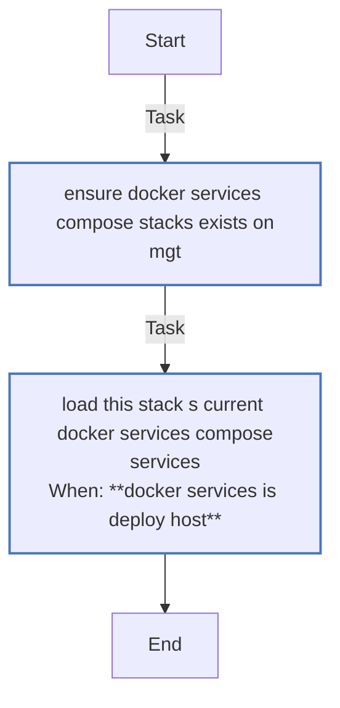


### Graph for compose/01_base/sub_tasks/service_base.yml

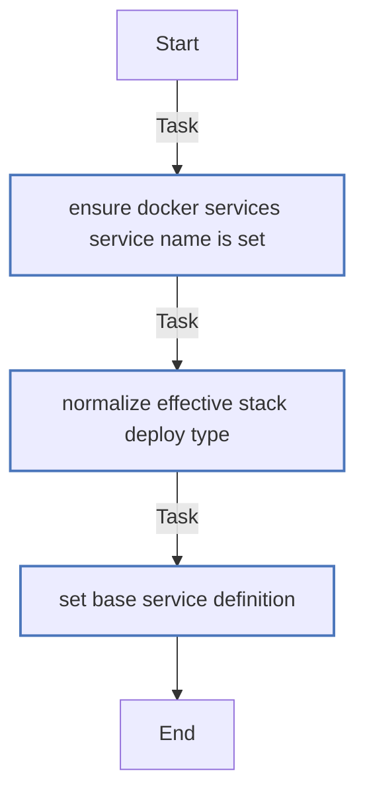


### Graph for compose/01_base/sub_tasks/stack_networks.yml

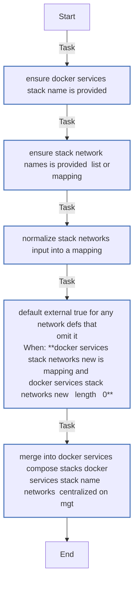


### Graph for compose/01_base/sub_tasks/stack_volumes.yml

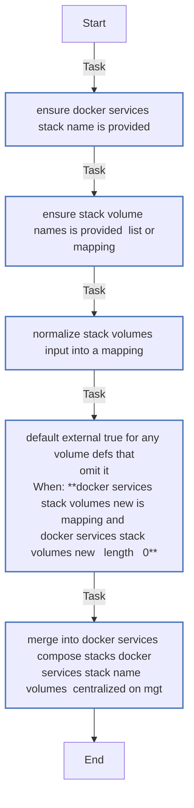


### Graph for compose/01_base/tasker.yml

```mermaid
flowchart TD
Start
classDef block stroke:#3498db,stroke-width:2px;
classDef task stroke:#4b76bb,stroke-width:2px;
classDef includeTasks stroke:#16a085,stroke-width:2px;
classDef importTasks stroke:#34495e,stroke-width:2px;
classDef includeRole stroke:#2980b9,stroke-width:2px;
classDef importRole stroke:#699ba7,stroke-width:2px;
classDef includeVars stroke:#8e44ad,stroke-width:2px;
classDef rescue stroke:#665352,stroke-width:2px;

  Start-->|Include task| Register_networks_needed_by_this_stack_sub_tasks_stack_networks_yml_0[register networks needed by this stack<br>When: **docker services is deploy host and docker services<br>svc named networks is defined and  docker services<br>svc named networks is mapping  and  docker<br>services svc named networks   length   0**<br>include_task: sub tasks stack networks yml]:::includeTasks
  Register_networks_needed_by_this_stack_sub_tasks_stack_networks_yml_0-->|Include task| Register_external_volumes_needed_by_this_stack_sub_tasks_stack_volumes_yml_1[register external volumes needed by this stack<br>When: **docker services is deploy host and docker services<br>svc named volumes is defined and  docker services<br>svc named volumes   length   0**<br>include_task: sub tasks stack volumes yml]:::includeTasks
  Register_external_volumes_needed_by_this_stack_sub_tasks_stack_volumes_yml_1-->|Task| Normalize_network_mode_for_container_deploys__derive_network_mode___is_container_2[normalize network mode for container deploys <br>derive network mode   is container <br>When: **docker services is deploy host**]:::task
  Normalize_network_mode_for_container_deploys__derive_network_mode___is_container_2-->|Task| Normalize_network_mode_for_container_deploys__derive_has_network_mode_3[normalize network mode for container deploys <br>derive has network mode <br>When: **docker services is deploy host**]:::task
  Normalize_network_mode_for_container_deploys__derive_has_network_mode_3-->|Task| Build_service_networks_list4[build service networks list<br>When: **docker services is deploy host**]:::task
  Build_service_networks_list4-->|Include task| Set_base_service_variables_sub_tasks_service_base_yml_5[set base service variables<br>When: **docker services is deploy host**<br>include_task: sub tasks service base yml]:::includeTasks
  Set_base_service_variables_sub_tasks_service_base_yml_5-->End
```


### Graph for compose/02_runtime/sub_tasks/caps.yml

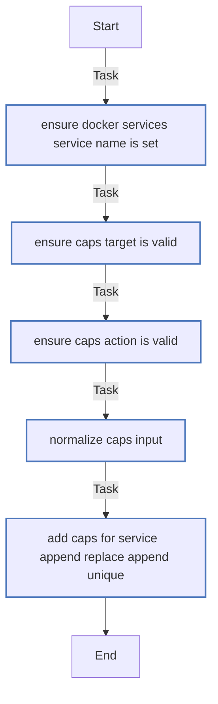


### Graph for compose/02_runtime/sub_tasks/command.yml

```mermaid
flowchart TD
Start
classDef block stroke:#3498db,stroke-width:2px;
classDef task stroke:#4b76bb,stroke-width:2px;
classDef includeTasks stroke:#16a085,stroke-width:2px;
classDef importTasks stroke:#34495e,stroke-width:2px;
classDef includeRole stroke:#2980b9,stroke-width:2px;
classDef importRole stroke:#699ba7,stroke-width:2px;
classDef includeVars stroke:#8e44ad,stroke-width:2px;
classDef rescue stroke:#665352,stroke-width:2px;

  Start-->|Task| Ensure_docker_services_service_name_is_set0[ensure docker services service name is set]:::task
  Ensure_docker_services_service_name_is_set0-->|Task| Ensure_command_action_is_valid1[ensure command action is valid]:::task
  Ensure_command_action_is_valid1-->|Task| Select_command_input2[select command input]:::task
  Select_command_input2-->|Task| Fail_if_no_command_provided3[fail if no command provided<br>When: **docker services cmd in is none**]:::task
  Fail_if_no_command_provided3-->|Task| Normalize_command_list_input4[normalize command list input<br>When: **docker services cmd in is sequence and docker<br>services cmd in is not string**]:::task
  Normalize_command_list_input4-->|Task| Normalize_command5[normalize command]:::task
  Normalize_command5-->|Task| Read_existing_command6[read existing command]:::task
  Read_existing_command6-->|Task| Normalize_existing_new_command_values_for_merge_actions7[normalize existing new command values for merge<br>actions]:::task
  Normalize_existing_new_command_values_for_merge_actions7-->|Task| Compute_final_command8[compute final command]:::task
  Compute_final_command8-->|Task| Set_command_for_service__append_replace_append_unique_9[set command for service  append replace append<br>unique ]:::task
  Set_command_for_service__append_replace_append_unique_9-->End
```


### Graph for compose/02_runtime/sub_tasks/depends_on.yml

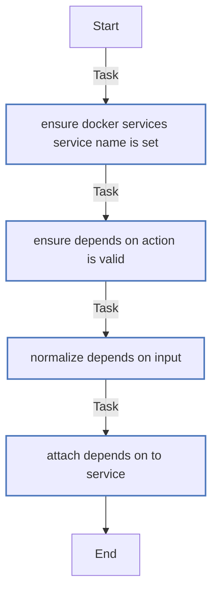


### Graph for compose/02_runtime/sub_tasks/devices.yml

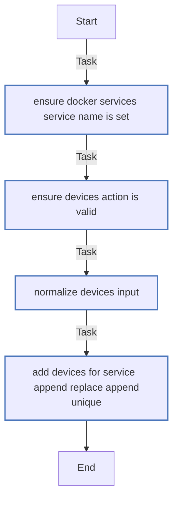


### Graph for compose/02_runtime/sub_tasks/healthcheck.yml

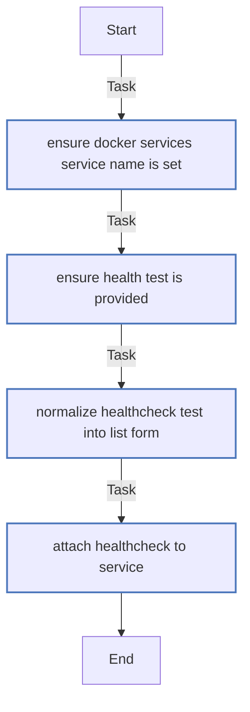


### Graph for compose/02_runtime/sub_tasks/security_opt.yml

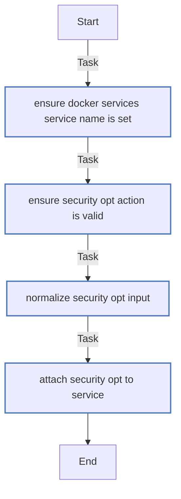


### Graph for compose/02_runtime/sub_tasks/sysctls.yml

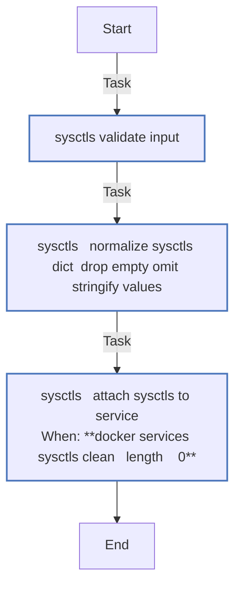


### Graph for compose/02_runtime/sub_tasks/user.yml

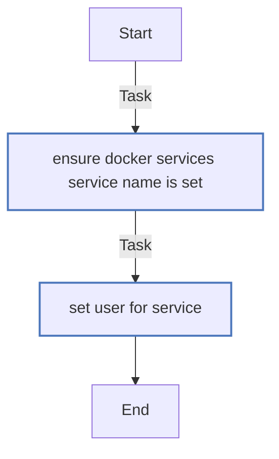


### Graph for compose/02_runtime/tasker.yml

```mermaid
flowchart TD
Start
classDef block stroke:#3498db,stroke-width:2px;
classDef task stroke:#4b76bb,stroke-width:2px;
classDef includeTasks stroke:#16a085,stroke-width:2px;
classDef importTasks stroke:#34495e,stroke-width:2px;
classDef includeRole stroke:#2980b9,stroke-width:2px;
classDef importRole stroke:#699ba7,stroke-width:2px;
classDef includeVars stroke:#8e44ad,stroke-width:2px;
classDef rescue stroke:#665352,stroke-width:2px;

  Start-->|Include task| Set_security_opt_sub_tasks_security_opt_yml_0[set security opt<br>When: **docker services is deploy host and docker services<br>stack deploy type     swarm  and docker services<br>svc security opt is defined and  docker services<br>svc security opt   length   0**<br>include_task: sub tasks security opt yml]:::includeTasks
  Set_security_opt_sub_tasks_security_opt_yml_0-->|Include task| Set_sysctls_sub_tasks_sysctls_yml_1[set sysctls<br>When: **docker services is deploy host and docker services<br>svc sysctls is defined and  docker services svc<br>sysctls is mapping  and  docker services svc<br>sysctls   length   0**<br>include_task: sub tasks sysctls yml]:::includeTasks
  Set_sysctls_sub_tasks_sysctls_yml_1-->|Include task| Set_depends_on_sub_tasks_depends_on_yml_2[set depends on<br>When: **docker services is deploy host and docker services<br>stack deploy type     swarm  and docker services<br>svc depends on is defined and  docker services svc<br>depends on   length   0**<br>include_task: sub tasks depends on yml]:::includeTasks
  Set_depends_on_sub_tasks_depends_on_yml_2-->|Include task| Add_Linux_capabilities__cap_add__sub_tasks_caps_yml_3[add linux capabilities  cap add <br>When: **docker services is deploy host and docker services<br>svc cap add is defined and  docker services svc<br>cap add   length   0**<br>include_task: sub tasks caps yml]:::includeTasks
  Add_Linux_capabilities__cap_add__sub_tasks_caps_yml_3-->|Include task| Drop_Linux_capabilities__cap_drop__sub_tasks_caps_yml_4[drop linux capabilities  cap drop <br>When: **docker services is deploy host and docker services<br>svc cap drop is defined and  docker services svc<br>cap drop   length   0**<br>include_task: sub tasks caps yml]:::includeTasks
  Drop_Linux_capabilities__cap_drop__sub_tasks_caps_yml_4-->|Include task| Add_devices_sub_tasks_devices_yml_5[add devices<br>When: **docker services is deploy host and docker services<br>svc devices is defined and  docker services svc<br>devices   length   0**<br>include_task: sub tasks devices yml]:::includeTasks
  Add_devices_sub_tasks_devices_yml_5-->|Include task| Set_command_variable_sub_tasks_command_yml_6[set command variable<br>When: **docker services is deploy host and docker services<br>svc command is defined**<br>include_task: sub tasks command yml]:::includeTasks
  Set_command_variable_sub_tasks_command_yml_6-->|Include task| Set_healthcheck_variable_sub_tasks_healthcheck_yml_7[set healthcheck variable<br>When: **docker services is deploy host and docker services<br>svc healthcheck is defined and docker services svc<br>healthcheck test is defined and     docker<br>services svc healthcheck test is sequence and<br>docker services svc healthcheck test is not string<br>and  docker services svc healthcheck test   length<br>  0    or  docker services svc healthcheck test is<br>string and  docker services svc healthcheck test  <br>trim   length   0**<br>include_task: sub tasks healthcheck yml]:::includeTasks
  Set_healthcheck_variable_sub_tasks_healthcheck_yml_7-->|Include task| Set_user_variable_sub_tasks_user_yml_8[set user variable<br>When: **docker services is deploy host and docker services<br>svc user is defined and  docker services svc user <br> string   trim   length   0**<br>include_task: sub tasks user yml]:::includeTasks
  Set_user_variable_sub_tasks_user_yml_8-->End
```


### Graph for compose/03_io/sub_tasks/configs.yml

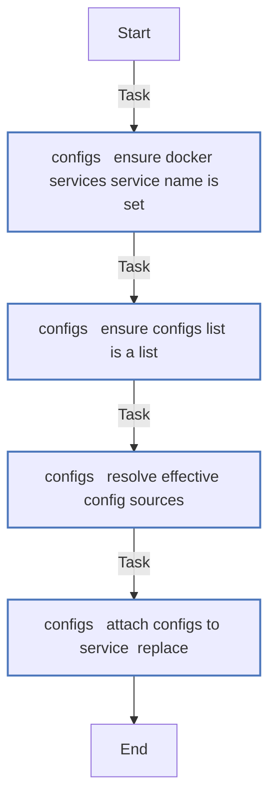


### Graph for compose/03_io/sub_tasks/env.yml

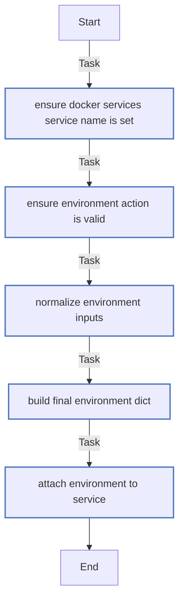


### Graph for compose/03_io/sub_tasks/env_file.yml

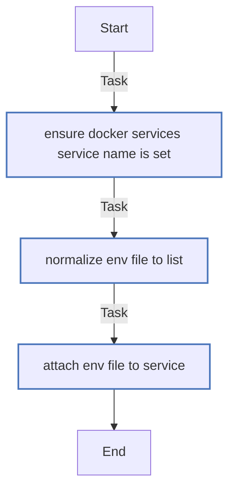


### Graph for compose/03_io/sub_tasks/ports.yml

```mermaid
flowchart TD
Start
classDef block stroke:#3498db,stroke-width:2px;
classDef task stroke:#4b76bb,stroke-width:2px;
classDef includeTasks stroke:#16a085,stroke-width:2px;
classDef importTasks stroke:#34495e,stroke-width:2px;
classDef includeRole stroke:#2980b9,stroke-width:2px;
classDef importRole stroke:#699ba7,stroke-width:2px;
classDef includeVars stroke:#8e44ad,stroke-width:2px;
classDef rescue stroke:#665352,stroke-width:2px;

  Start-->|Task| Ensure_docker_services_service_name_is_set0[ensure docker services service name is set]:::task
  Ensure_docker_services_service_name_is_set0-->|Task| Ensure_ports_action_is_valid1[ensure ports action is valid]:::task
  Ensure_ports_action_is_valid1-->|Task| Normalize_effective_stack_deploy_type2[normalize effective stack deploy type]:::task
  Normalize_effective_stack_deploy_type2-->|Task| Build_new_port_entries__ports_ports_list_legacy_single_3[build new port entries  ports ports list legacy<br>single ]:::task
  Build_new_port_entries__ports_ports_list_legacy_single_3-->|Task| Validate_new_ports_entries_are_dicts_with_required_keys4[validate new ports entries are dicts with required<br>keys]:::task
  Validate_new_ports_entries_are_dicts_with_required_keys4-->|Task| Reset_working_ports_list__prevent_cross_service_bleed_5[reset working ports list  prevent cross service<br>bleed ]:::task
  Reset_working_ports_list__prevent_cross_service_bleed_5-->|Task| Canonicalise_new_ports__types___defaults_6[canonicalise new ports  types   defaults ]:::task
  Canonicalise_new_ports__types___defaults_6-->|Task| Validate_port_protocols_are_tcp_udp7[validate port protocols are tcp udp]:::task
  Validate_port_protocols_are_tcp_udp7-->|Task| Compute_merged_ports_list8[compute merged ports list]:::task
  Compute_merged_ports_list8-->|Task| Attach_ports_to_service9[attach ports to service]:::task
  Attach_ports_to_service9-->End
```


### Graph for compose/03_io/sub_tasks/secrets.yml

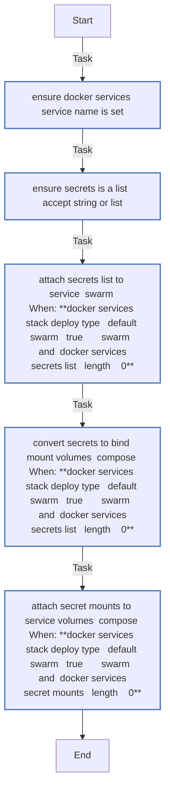


### Graph for compose/03_io/sub_tasks/shm.yml

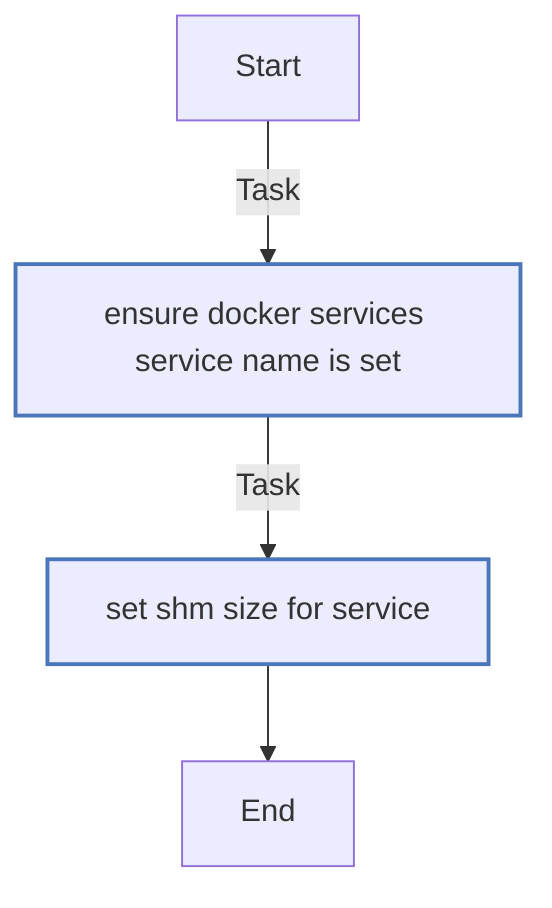


### Graph for compose/03_io/sub_tasks/tmpfs.yml

```mermaid
flowchart TD
Start
classDef block stroke:#3498db,stroke-width:2px;
classDef task stroke:#4b76bb,stroke-width:2px;
classDef includeTasks stroke:#16a085,stroke-width:2px;
classDef importTasks stroke:#34495e,stroke-width:2px;
classDef includeRole stroke:#2980b9,stroke-width:2px;
classDef importRole stroke:#699ba7,stroke-width:2px;
classDef includeVars stroke:#8e44ad,stroke-width:2px;
classDef rescue stroke:#665352,stroke-width:2px;

  Start-->|Task| Ensure_tmpfs_action_is_valid0[ensure tmpfs action is valid]:::task
  Ensure_tmpfs_action_is_valid0-->|Task| Normalise_tmpfs_entries_to_list1[normalise tmpfs entries to list]:::task
  Normalise_tmpfs_entries_to_list1-->|Task| Merge_tmpfs_entries_into_compose_services2[merge tmpfs entries into compose services]:::task
  Merge_tmpfs_entries_into_compose_services2-->End
```


### Graph for compose/03_io/sub_tasks/volumes.yml

```mermaid
flowchart TD
Start
classDef block stroke:#3498db,stroke-width:2px;
classDef task stroke:#4b76bb,stroke-width:2px;
classDef includeTasks stroke:#16a085,stroke-width:2px;
classDef importTasks stroke:#34495e,stroke-width:2px;
classDef includeRole stroke:#2980b9,stroke-width:2px;
classDef importRole stroke:#699ba7,stroke-width:2px;
classDef includeVars stroke:#8e44ad,stroke-width:2px;
classDef rescue stroke:#665352,stroke-width:2px;

  Start-->|Task| Ensure_docker_services_service_name_is_set0[ensure docker services service name is set]:::task
  Ensure_docker_services_service_name_is_set0-->|Task| Ensure_volumes_action_is_valid1[ensure volumes action is valid]:::task
  Ensure_volumes_action_is_valid1-->|Task| Build_raw_volume_entries__mapping_OR_list_OR_legacy_single_2[build raw volume entries  mapping or list or<br>legacy single ]:::task
  Build_raw_volume_entries__mapping_OR_list_OR_legacy_single_2-->|Task| Validate_raw_volume_entries_are_dicts3[validate raw volume entries are dicts]:::task
  Validate_raw_volume_entries_are_dicts3-->|Task| Reset_working_volumes_list__prevent_cross_service_bleed_4[reset working volumes list  prevent cross service<br>bleed ]:::task
  Reset_working_volumes_list__prevent_cross_service_bleed_4-->|Task| Canonicalise_new_volume_entries5[canonicalise new volume entries]:::task
  Canonicalise_new_volume_entries5-->|Task| Validate_canonical_volume_entries6[validate canonical volume entries]:::task
  Validate_canonical_volume_entries6-->|Task| Capture_existing_volumes_list7[capture existing volumes list]:::task
  Capture_existing_volumes_list7-->|Task| Compute_merged_volumes_list__append_replace_append_unique_8[compute merged volumes list  append replace append<br>unique ]:::task
  Compute_merged_volumes_list__append_replace_append_unique_8-->|Task| Attach_volumes_to_service9[attach volumes to service]:::task
  Attach_volumes_to_service9-->End
```


### Graph for compose/03_io/tasker.yml

```mermaid
flowchart TD
Start
classDef block stroke:#3498db,stroke-width:2px;
classDef task stroke:#4b76bb,stroke-width:2px;
classDef includeTasks stroke:#16a085,stroke-width:2px;
classDef importTasks stroke:#34495e,stroke-width:2px;
classDef includeRole stroke:#2980b9,stroke-width:2px;
classDef importRole stroke:#699ba7,stroke-width:2px;
classDef includeVars stroke:#8e44ad,stroke-width:2px;
classDef rescue stroke:#665352,stroke-width:2px;

  Start-->|Include task| Set_environment_variables_sub_tasks_env_yml_0[set environment variables<br>When: **docker services is deploy host and docker services<br>svc environment is defined and  docker services<br>svc environment   length   0**<br>include_task: sub tasks env yml]:::includeTasks
  Set_environment_variables_sub_tasks_env_yml_0-->|Include task| Attach_env_file_to_service_sub_tasks_env_file_yml_1[attach env file to service<br>When: **docker services is deploy host and docker services<br>svc env file is defined and docker services svc<br>env file   length   0**<br>include_task: sub tasks env file yml]:::includeTasks
  Attach_env_file_to_service_sub_tasks_env_file_yml_1-->|Include task| Set_secrets_variable__docker_services_svc_format__sub_tasks_secrets_yml_2[set secrets variable  docker services svc format <br>When: **docker services is deploy host and docker services<br>svc secrets is defined and  docker services svc<br>secrets   length   0**<br>include_task: sub tasks secrets yml]:::includeTasks
  Set_secrets_variable__docker_services_svc_format__sub_tasks_secrets_yml_2-->|Include task| Set_configs_variable__swarm_only__sub_tasks_configs_yml_3[set configs variable  swarm only <br>When: **docker services is deploy host and docker services<br>stack deploy type     swarm  and docker services<br>svc configs is defined and  docker services svc<br>configs   length   0**<br>include_task: sub tasks configs yml]:::includeTasks
  Set_configs_variable__swarm_only__sub_tasks_configs_yml_3-->|Include task| Set_ports_variable_sub_tasks_ports_yml_4[set ports variable<br>When: **docker services is deploy host and docker services<br>svc ports is defined and  docker services svc<br>ports   length   0**<br>include_task: sub tasks ports yml]:::includeTasks
  Set_ports_variable_sub_tasks_ports_yml_4-->|Include task| Set_tmpfs_variable_sub_tasks_tmpfs_yml_5[set tmpfs variable<br>When: **docker services is deploy host and docker services<br>stack deploy type     swarm  and docker services<br>svc tmpfs is defined and  docker services svc<br>tmpfs   length   0**<br>include_task: sub tasks tmpfs yml]:::includeTasks
  Set_tmpfs_variable_sub_tasks_tmpfs_yml_5-->|Include task| Set_volumes_variable_sub_tasks_volumes_yml_6[set volumes variable<br>When: **docker services is deploy host and docker services<br>svc volumes is defined and  docker services svc<br>volumes   length   0**<br>include_task: sub tasks volumes yml]:::includeTasks
  Set_volumes_variable_sub_tasks_volumes_yml_6-->|Include task| Add__dev_shm_tmpfs_for_swarm_sub_tasks_volumes_yml_7[add  dev shm tmpfs for swarm<br>When: **docker services is deploy host and docker services<br>stack deploy type     swarm  and docker services<br>svc shm tmpfs size is defined and  docker services<br>svc shm tmpfs size   int    0**<br>include_task: sub tasks volumes yml]:::includeTasks
  Add__dev_shm_tmpfs_for_swarm_sub_tasks_volumes_yml_7-->|Include task| Set_SHM_size__compose_only__sub_tasks_shm_yml_8[set shm size  compose only <br>When: **docker services is deploy host and docker services<br>stack deploy type     swarm  and docker services<br>svc shm size is defined and  docker services svc<br>shm size   string   trim   length   0**<br>include_task: sub tasks shm yml]:::includeTasks
  Set_SHM_size__compose_only__sub_tasks_shm_yml_8-->End
```


### Graph for compose/04_metadata/sub_tasks/labels.yml

```mermaid
flowchart TD
Start
classDef block stroke:#3498db,stroke-width:2px;
classDef task stroke:#4b76bb,stroke-width:2px;
classDef includeTasks stroke:#16a085,stroke-width:2px;
classDef importTasks stroke:#34495e,stroke-width:2px;
classDef includeRole stroke:#2980b9,stroke-width:2px;
classDef importRole stroke:#699ba7,stroke-width:2px;
classDef includeVars stroke:#8e44ad,stroke-width:2px;
classDef rescue stroke:#665352,stroke-width:2px;

  Start-->|Task| Ensure_docker_services_service_name_is_set0[ensure docker services service name is set]:::task
  Ensure_docker_services_service_name_is_set0-->|Task| Ensure_labels_action_is_valid1[ensure labels action is valid]:::task
  Ensure_labels_action_is_valid1-->|Task| Ensure_labels_precedence_is_valid2[ensure labels precedence is valid]:::task
  Ensure_labels_precedence_is_valid2-->|Task| Normalize_labels_input_to_mapping3[normalize labels input to mapping]:::task
  Normalize_labels_input_to_mapping3-->|Task| Build_final_labels_dict4[build final labels dict]:::task
  Build_final_labels_dict4-->|Task| Attach_labels_to_service5[attach labels to service]:::task
  Attach_labels_to_service5-->End
```


### Graph for compose/04_metadata/tasker.yml

```mermaid
flowchart TD
Start
classDef block stroke:#3498db,stroke-width:2px;
classDef task stroke:#4b76bb,stroke-width:2px;
classDef includeTasks stroke:#16a085,stroke-width:2px;
classDef importTasks stroke:#34495e,stroke-width:2px;
classDef includeRole stroke:#2980b9,stroke-width:2px;
classDef importRole stroke:#699ba7,stroke-width:2px;
classDef includeVars stroke:#8e44ad,stroke-width:2px;
classDef rescue stroke:#665352,stroke-width:2px;

  Start-->|Include task| Attach_labels__service_level__sub_tasks_labels_yml_0[attach labels  service level <br>When: **docker services is deploy host and docker services<br>svc labels is defined and  docker services svc<br>labels is mapping  or  docker services svc labels<br>is sequence and docker services svc labels is not<br>string  and  docker services svc labels   length  <br>0**<br>include_task: sub tasks labels yml]:::includeTasks
  Attach_labels__service_level__sub_tasks_labels_yml_0-->End
```


### Graph for deploy/sub_tasks/deploy_all.yml

```mermaid
flowchart TD
Start
classDef block stroke:#3498db,stroke-width:2px;
classDef task stroke:#4b76bb,stroke-width:2px;
classDef includeTasks stroke:#16a085,stroke-width:2px;
classDef importTasks stroke:#34495e,stroke-width:2px;
classDef includeRole stroke:#2980b9,stroke-width:2px;
classDef importRole stroke:#699ba7,stroke-width:2px;
classDef includeVars stroke:#8e44ad,stroke-width:2px;
classDef rescue stroke:#665352,stroke-width:2px;

  Start-->|Task| DeployAll___Ensure_docker_services_compose_stacks_exists0[deployall   ensure docker services compose stacks<br>exists]:::task
  DeployAll___Ensure_docker_services_compose_stacks_exists0-->|Include task| DeployAll___Deploy_each_stack_deploy_one_yml_1[deployall   deploy each stack<br>When: **docker services compose stacks effective   length<br>   0**<br>include_task: deploy one yml]:::includeTasks
  DeployAll___Deploy_each_stack_deploy_one_yml_1-->End
```


### Graph for deploy/sub_tasks/deploy_config.yml

```mermaid
flowchart TD
Start
classDef block stroke:#3498db,stroke-width:2px;
classDef task stroke:#4b76bb,stroke-width:2px;
classDef includeTasks stroke:#16a085,stroke-width:2px;
classDef importTasks stroke:#34495e,stroke-width:2px;
classDef includeRole stroke:#2980b9,stroke-width:2px;
classDef importRole stroke:#699ba7,stroke-width:2px;
classDef includeVars stroke:#8e44ad,stroke-width:2px;
classDef rescue stroke:#665352,stroke-width:2px;

  Start-->|Task| Ensure_docker_services_service_name_is_set0[ensure docker services service name is set]:::task
  Ensure_docker_services_service_name_is_set0-->|Task| Normalize_deploy_mode_and_capture_raw_replicas1[normalize deploy mode and capture raw replicas]:::task
  Normalize_deploy_mode_and_capture_raw_replicas1-->|Task| Validate_deploy_mode2[validate deploy mode]:::task
  Validate_deploy_mode2-->|Task| Validate_deploy_replicas_raw_input3[validate deploy replicas raw input<br>When: **docker services deploy mode     replicated**]:::task
  Validate_deploy_replicas_raw_input3-->|Task| Normalize_deploy_replicas4[normalize deploy replicas]:::task
  Normalize_deploy_replicas4-->|Task| Normalize_deploy_constraints_into_list5[normalize deploy constraints into list]:::task
  Normalize_deploy_constraints_into_list5-->|Task| Normalize_optional_deploy_sub_dicts__treat_omit_as_empty_6[normalize optional deploy sub dicts  treat omit as<br>empty ]:::task
  Normalize_optional_deploy_sub_dicts__treat_omit_as_empty_6-->|Task| Validate_normalized_deploy_inputs7[validate normalized deploy inputs]:::task
  Validate_normalized_deploy_inputs7-->|Task| Build_deploy_dict8[build deploy dict]:::task
  Build_deploy_dict8-->|Task| Attach_deploy_config_to_service9[attach deploy config to service]:::task
  Attach_deploy_config_to_service9-->End
```


### Graph for deploy/sub_tasks/deploy_one.yml

```mermaid
flowchart TD
Start
classDef block stroke:#3498db,stroke-width:2px;
classDef task stroke:#4b76bb,stroke-width:2px;
classDef includeTasks stroke:#16a085,stroke-width:2px;
classDef importTasks stroke:#34495e,stroke-width:2px;
classDef includeRole stroke:#2980b9,stroke-width:2px;
classDef importRole stroke:#699ba7,stroke-width:2px;
classDef includeVars stroke:#8e44ad,stroke-width:2px;
classDef rescue stroke:#665352,stroke-width:2px;

  Start-->|Task| DeployOne___Validate_inputs0[deployone   validate inputs]:::task
  DeployOne___Validate_inputs0-->|Task| DeployOne___Derive_effective_deploy_host1[deployone   derive effective deploy host]:::task
  DeployOne___Derive_effective_deploy_host1-->|Task| DeployOne___Ensure__opt_stacks_exists2[deployone   ensure  opt stacks exists]:::task
  DeployOne___Ensure__opt_stacks_exists2-->|Task| DeployOne___Render_compose_stack_file3[deployone   render compose stack file]:::task
  DeployOne___Render_compose_stack_file3-->|Task| DeployOne___Swarm_deploy4[deployone   swarm deploy<br>When: **deploy stack type   string   trim      swarm**]:::task
  DeployOne___Swarm_deploy4-->|Task| DeployOne___Compose_deploy5[deployone   compose deploy<br>When: **deploy stack type   string   trim      swarm**]:::task
  DeployOne___Compose_deploy5-->End
```


### Graph for deploy/tasker.yml

```mermaid
flowchart TD
Start
classDef block stroke:#3498db,stroke-width:2px;
classDef task stroke:#4b76bb,stroke-width:2px;
classDef includeTasks stroke:#16a085,stroke-width:2px;
classDef importTasks stroke:#34495e,stroke-width:2px;
classDef includeRole stroke:#2980b9,stroke-width:2px;
classDef importRole stroke:#699ba7,stroke-width:2px;
classDef includeVars stroke:#8e44ad,stroke-width:2px;
classDef rescue stroke:#665352,stroke-width:2px;

  Start-->|Include task| Set_deploy_config__swarm_only__compose_structure__sub_tasks_deploy_config_yml_0[set deploy config  swarm only  compose structure <br>When: **docker services is deploy host and  docker<br>services svc deploy is defined  and   docker<br>services svc deploy type   default  swarm       <br>swarm**<br>include_task: sub tasks deploy config yml]:::includeTasks
  Set_deploy_config__swarm_only__compose_structure__sub_tasks_deploy_config_yml_0-->|Task| Persist_compose_into_docker_services_compose_stacks_docker_services_stack_name_effective___centralized_queue_1[persist compose into docker services compose<br>stacks docker services stack name effective  <br>centralized queue <br>When: **docker services is deploy host**]:::task
  Persist_compose_into_docker_services_compose_stacks_docker_services_stack_name_effective___centralized_queue_1-->End
```


### Graph for init/sub_tasks/validate_svc.yml

```mermaid
flowchart TD
Start
classDef block stroke:#3498db,stroke-width:2px;
classDef task stroke:#4b76bb,stroke-width:2px;
classDef includeTasks stroke:#16a085,stroke-width:2px;
classDef importTasks stroke:#34495e,stroke-width:2px;
classDef includeRole stroke:#2980b9,stroke-width:2px;
classDef importRole stroke:#699ba7,stroke-width:2px;
classDef includeVars stroke:#8e44ad,stroke-width:2px;
classDef rescue stroke:#665352,stroke-width:2px;

  Start-->|Task| Validate___docker_services_svc_is_defined0[validate   docker services svc is defined]:::task
  Validate___docker_services_svc_is_defined0-->|Task| Validate___docker_services_svc_name1[validate   docker services svc name<br>When: **docker services svc name is defined**]:::task
  Validate___docker_services_svc_name1-->|Task| Validate___docker_services_svc_image__required_2[validate   docker services svc image  required ]:::task
  Validate___docker_services_svc_image__required_2-->|Task| Validate___docker_services_svc_user3[validate   docker services svc user<br>When: **docker services svc user is defined**]:::task
  Validate___docker_services_svc_user3-->|Task| Validate___docker_services_svc_command_shape4[validate   docker services svc command shape<br>When: **docker services svc command is defined**]:::task
  Validate___docker_services_svc_command_shape4-->|Task| Validate___docker_services_svc_command_string_form5[validate   docker services svc command string form<br>When: **docker services svc command is defined and docker<br>services svc command is string**]:::task
  Validate___docker_services_svc_command_string_form5-->|Task| Validate___docker_services_svc_command_list_form6[validate   docker services svc command list form<br>When: **docker services svc command is defined and docker<br>services svc command is sequence and docker<br>services svc command is not string**]:::task
  Validate___docker_services_svc_command_list_form6-->|Task| Validate___docker_services_svc_env_file_shape7[validate   docker services svc env file shape<br>When: **docker services svc env file is defined**]:::task
  Validate___docker_services_svc_env_file_shape7-->|Task| Validate___docker_services_svc_env_file_string_form8[validate   docker services svc env file string<br>form<br>When: **docker services svc env file is defined and docker<br>services svc env file is string**]:::task
  Validate___docker_services_svc_env_file_string_form8-->|Task| Validate___docker_services_svc_env_file_list_form9[validate   docker services svc env file list form<br>When: **docker services svc env file is defined and docker<br>services svc env file is sequence and docker<br>services svc env file is not string**]:::task
  Validate___docker_services_svc_env_file_list_form9-->|Task| Validate___docker_services_svc_devices_shape10[validate   docker services svc devices shape<br>When: **docker services svc devices is defined**]:::task
  Validate___docker_services_svc_devices_shape10-->|Task| Validate___docker_services_svc_cap_add_shape11[validate   docker services svc cap add shape<br>When: **docker services svc cap add is defined**]:::task
  Validate___docker_services_svc_cap_add_shape11-->|Task| Validate___docker_services_svc_cap_drop_shape12[validate   docker services svc cap drop shape<br>When: **docker services svc cap drop is defined**]:::task
  Validate___docker_services_svc_cap_drop_shape12-->|Task| Validate___docker_services_svc_sysctls_shape13[validate   docker services svc sysctls shape<br>When: **docker services svc sysctls is defined**]:::task
  Validate___docker_services_svc_sysctls_shape13-->|Task| Validate___docker_services_svc_deploy_shape14[validate   docker services svc deploy shape<br>When: **docker services svc deploy is defined**]:::task
  Validate___docker_services_svc_deploy_shape14-->|Task| Validate___docker_services_svc_deploy_type15[validate   docker services svc deploy type<br>When: **docker services svc deploy is defined and docker<br>services svc deploy is mapping and docker services<br>svc deploy type is defined**]:::task
  Validate___docker_services_svc_deploy_type15-->|Task| Validate___docker_services_svc_deploy_mode16[validate   docker services svc deploy mode<br>When: **docker services svc deploy is defined and docker<br>services svc deploy is mapping and docker services<br>svc deploy mode is defined**]:::task
  Validate___docker_services_svc_deploy_mode16-->|Task| Validate___docker_services_svc_deploy_replicas17[validate   docker services svc deploy replicas<br>When: **docker services svc deploy is defined and docker<br>services svc deploy is mapping and docker services<br>svc deploy replicas is defined**]:::task
  Validate___docker_services_svc_deploy_replicas17-->|Task| Validate___docker_services_svc_deploy_host__optional_18[validate   docker services svc deploy host <br>optional <br>When: **docker services svc deploy is defined and docker<br>services svc deploy is mapping and docker services<br>svc deploy host is defined**]:::task
  Validate___docker_services_svc_deploy_host__optional_18-->|Task| Validate___docker_services_svc_deploy_constraints19[validate   docker services svc deploy constraints<br>When: **docker services svc deploy is defined and docker<br>services svc deploy is mapping and docker services<br>svc deploy constraints is defined**]:::task
  Validate___docker_services_svc_deploy_constraints19-->|Task| Validate___docker_services_svc_targets_shape20[validate   docker services svc targets shape<br>When: **docker services svc targets is defined**]:::task
  Validate___docker_services_svc_targets_shape20-->|Task| Validate___docker_services_svc_targets_entries_are_mappings21[validate   docker services svc targets entries are<br>mappings<br>When: **docker services svc targets is defined and  docker<br>services svc targets   length   0**]:::task
  Validate___docker_services_svc_targets_entries_are_mappings21-->|Task| Validate___docker_services_svc_named_networks22[validate   docker services svc named networks<br>When: **docker services svc named networks is defined**]:::task
  Validate___docker_services_svc_named_networks22-->|Task| Validate___docker_services_svc_named_volumes23[validate   docker services svc named volumes<br>When: **docker services svc named volumes is defined**]:::task
  Validate___docker_services_svc_named_volumes23-->|Task| Validate___docker_services_svc_paths_shape24[validate   docker services svc paths shape<br>When: **docker services svc paths is defined**]:::task
  Validate___docker_services_svc_paths_shape24-->|Task| Validate___docker_services_svc_paths_entries25[validate   docker services svc paths entries<br>When: **docker services svc paths is defined and  docker<br>services svc paths   length   0**]:::task
  Validate___docker_services_svc_paths_entries25-->|Task| Validate___docker_services_svc_paths_mode_formatting26[validate   docker services svc paths mode<br>formatting<br>When: **docker services svc paths is defined and  docker<br>services svc paths   length   0**]:::task
  Validate___docker_services_svc_paths_mode_formatting26-->|Task| Validate___docker_services_svc_templates_shape27[validate   docker services svc templates shape<br>When: **docker services svc templates is defined**]:::task
  Validate___docker_services_svc_templates_shape27-->|Task| Validate___docker_services_svc_templates_entries28[validate   docker services svc templates entries<br>When: **docker services svc templates is defined and <br>docker services svc templates   length   0**]:::task
  Validate___docker_services_svc_templates_entries28-->|Task| Validate___docker_services_svc_templates_mode_formatting29[validate   docker services svc templates mode<br>formatting<br>When: **docker services svc templates is defined and <br>docker services svc templates   length   0**]:::task
  Validate___docker_services_svc_templates_mode_formatting29-->|Task| Validate___docker_services_svc_copies_shape30[validate   docker services svc copies shape<br>When: **docker services svc copies is defined**]:::task
  Validate___docker_services_svc_copies_shape30-->|Task| Validate___docker_services_svc_copies_entries31[validate   docker services svc copies entries<br>When: **docker services svc copies is defined and  docker<br>services svc copies   length   0**]:::task
  Validate___docker_services_svc_copies_entries31-->|Task| Validate___docker_services_svc_infisical_shape32[validate   docker services svc infisical shape<br>When: **docker services svc infisical is defined**]:::task
  Validate___docker_services_svc_infisical_shape32-->|Task| Validate___docker_services_svc_infisical_secrets_map33[validate   docker services svc infisical secrets<br>map<br>When: **docker services svc infisical is defined and<br>docker services svc infisical secrets map is<br>defined**]:::task
  Validate___docker_services_svc_infisical_secrets_map33-->|Task| Validate___docker_services_svc_infisical_secrets_map_var_names34[validate   docker services svc infisical secrets<br>map var names<br>When: **docker services svc infisical is defined and<br>docker services svc infisical secrets map is<br>defined and  docker services svc infisical secrets<br>map   length   0**]:::task
  Validate___docker_services_svc_infisical_secrets_map_var_names34-->|Task| Validate___docker_services_svc_infisical_secrets_map_docker_secret_names35[validate   docker services svc infisical secrets<br>map docker secret names<br>When: **docker services svc infisical is defined and<br>docker services svc infisical secrets map is<br>defined and  docker services svc infisical secrets<br>map   length   0  and  docker services svc<br>infisical secrets map   selectattr  docker secret <br>  defined     list   length    0**]:::task
  Validate___docker_services_svc_infisical_secrets_map_docker_secret_names35-->|Task| Validate___docker_services_svc_postgres_shape36[validate   docker services svc postgres shape<br>When: **docker services svc postgres is defined**]:::task
  Validate___docker_services_svc_postgres_shape36-->|Task| Validate___docker_services_svc_postgres_databases37[validate   docker services svc postgres databases<br>When: **docker services svc postgres is defined and docker<br>services svc postgres is mapping and docker<br>services svc postgres databases is defined**]:::task
  Validate___docker_services_svc_postgres_databases37-->|Task| Validate___docker_services_svc_healthcheck_shape38[validate   docker services svc healthcheck shape<br>When: **docker services svc healthcheck is defined**]:::task
  Validate___docker_services_svc_healthcheck_shape38-->|Task| Validate___docker_services_svc_secrets_shape39[validate   docker services svc secrets shape<br>When: **docker services svc secrets is defined**]:::task
  Validate___docker_services_svc_secrets_shape39-->|Task| Validate___docker_services_svc_secrets_string_form40[validate   docker services svc secrets string form<br>When: **docker services svc secrets is defined and docker<br>services svc secrets is string**]:::task
  Validate___docker_services_svc_secrets_string_form40-->|Task| Validate___docker_services_svc_secrets_list_form_is_non_empty41[validate   docker services svc secrets list form<br>is non empty<br>When: **docker services svc secrets is defined and docker<br>services svc secrets is sequence and docker<br>services svc secrets is not string**]:::task
  Validate___docker_services_svc_secrets_list_form_is_non_empty41-->|Task| Validate___docker_services_svc_secrets_list_items_are_strings_or_dicts42[validate   docker services svc secrets list items<br>are strings or dicts<br>When: **docker services svc secrets is defined and docker<br>services svc secrets is sequence and docker<br>services svc secrets is not string**]:::task
  Validate___docker_services_svc_secrets_list_items_are_strings_or_dicts42-->|Task| Validate___docker_services_svc_secrets_string_items_are_non_empty43[validate   docker services svc secrets string<br>items are non empty<br>When: **docker services svc secrets is defined and docker<br>services svc secrets is sequence and docker<br>services svc secrets is not string and  docker<br>services svc secrets   select  string     list  <br>length    0**]:::task
  Validate___docker_services_svc_secrets_string_items_are_non_empty43-->|Task| Validate___docker_services_svc_secrets_dict_items_have_source_and_target44[validate   docker services svc secrets dict items<br>have source and target<br>When: **docker services svc secrets is defined and docker<br>services svc secrets is sequence and docker<br>services svc secrets is not string and  docker<br>services svc secrets   select  mapping     list  <br>length    0**]:::task
  Validate___docker_services_svc_secrets_dict_items_have_source_and_target44-->|Task| Validate___docker_services_svc_ports_shape45[validate   docker services svc ports shape<br>When: **docker services svc ports is defined**]:::task
  Validate___docker_services_svc_ports_shape45-->|Task| Validate___Normalize_ports_items46[validate   normalize ports items<br>When: **docker services svc ports is defined**]:::task
  Validate___Normalize_ports_items46-->|Task| Validate___docker_services_svc_ports_entries47[validate   docker services svc ports entries<br>When: **docker services svc ports is defined**]:::task
  Validate___docker_services_svc_ports_entries47-->|Task| Validate___docker_services_svc_volumes_shape48[validate   docker services svc volumes shape<br>When: **docker services svc volumes is defined**]:::task
  Validate___docker_services_svc_volumes_shape48-->|Task| Validate___Normalize_volume_items49[validate   normalize volume items<br>When: **docker services svc volumes is defined**]:::task
  Validate___Normalize_volume_items49-->|Task| Validate___docker_services_svc_volumes_entries_basic50[validate   docker services svc volumes entries<br>basic<br>When: **docker services svc volumes is defined**]:::task
  Validate___docker_services_svc_volumes_entries_basic50-->|Task| Validate___docker_services_svc_volumes_required_keys_by_type51[validate   docker services svc volumes required<br>keys by type<br>When: **docker services svc volumes is defined**]:::task
  Validate___docker_services_svc_volumes_required_keys_by_type51-->|Task| Validate___docker_services_svc_environment_shape52[validate   docker services svc environment shape<br>When: **docker services svc environment is defined**]:::task
  Validate___docker_services_svc_environment_shape52-->|Task| Validate___docker_services_svc_labels_shape53[validate   docker services svc labels shape<br>When: **docker services svc labels is defined**]:::task
  Validate___docker_services_svc_labels_shape53-->End
```


### Graph for init/tasker.yml

```mermaid
flowchart TD
Start
classDef block stroke:#3498db,stroke-width:2px;
classDef task stroke:#4b76bb,stroke-width:2px;
classDef includeTasks stroke:#16a085,stroke-width:2px;
classDef importTasks stroke:#34495e,stroke-width:2px;
classDef includeRole stroke:#2980b9,stroke-width:2px;
classDef importRole stroke:#699ba7,stroke-width:2px;
classDef includeVars stroke:#8e44ad,stroke-width:2px;
classDef rescue stroke:#665352,stroke-width:2px;

  Start-->|Task| Normalize_role_interface_vars__compat_with_old_names_0[normalize role interface vars  compat with old<br>names ]:::task
  Normalize_role_interface_vars__compat_with_old_names_0-->|Task| Ensure_docker_services_service_cfg_is_provided1[ensure docker services service cfg is provided]:::task
  Ensure_docker_services_service_cfg_is_provided1-->|Task| Validate_target_exists_when_targets_are_defined2[validate target exists when targets are defined]:::task
  Validate_target_exists_when_targets_are_defined2-->|Task| Normalize_service_config__targets_aware_3[normalize service config  targets aware ]:::task
  Normalize_service_config__targets_aware_3-->|Include task| Validate_normalized_service_config_sub_tasks_validate_svc_yml_4[validate normalized service config<br>include_task: sub tasks validate svc yml]:::includeTasks
  Validate_normalized_service_config_sub_tasks_validate_svc_yml_4-->|Task| Derive_common_service_context5[derive common service context]:::task
  Derive_common_service_context5-->|Task| Derive_stack_name__multi_service_per_stack_6[derive stack name  multi service per stack ]:::task
  Derive_stack_name__multi_service_per_stack_6-->|Task| Derive_effective_deploy_host__swarm_always_on_mgt_7[derive effective deploy host  swarm always on mgt ]:::task
  Derive_effective_deploy_host__swarm_always_on_mgt_7-->|Task| Derive_effective_stack_key__avoid_container_host_collisions_8[derive effective stack key  avoid container host<br>collisions ]:::task
  Derive_effective_stack_key__avoid_container_host_collisions_8-->|Task| Derive_effective_filesystem_hosts__dirs_templates_copies_9[derive effective filesystem hosts  dirs templates<br>copies ]:::task
  Derive_effective_filesystem_hosts__dirs_templates_copies_9-->|Task| Expand_filesystem_hosts_if_a_group_name_was_provided10[expand filesystem hosts if a group name was<br>provided<br>When: **docker services fs hosts effective   length    1<br>and docker services fs hosts effective 0  in<br>groups**]:::task
  Expand_filesystem_hosts_if_a_group_name_was_provided10-->|Task| De_dupe_filesystem_hosts11[de dupe filesystem hosts]:::task
  De_dupe_filesystem_hosts11-->|Task| Assert_container_deploy_has_a_single_deploy_host12[assert container deploy has a single deploy host<br>When: **docker services stack deploy type   string   trim<br>     swarm**]:::task
  Assert_container_deploy_has_a_single_deploy_host12-->|Task| Determine_if_this_host_should_build_deploy_compose_artifacts13[determine if this host should build deploy compose<br>artifacts]:::task
  Determine_if_this_host_should_build_deploy_compose_artifacts13-->End
```


### Graph for main.yml

```mermaid
flowchart TD
Start
classDef block stroke:#3498db,stroke-width:2px;
classDef task stroke:#4b76bb,stroke-width:2px;
classDef includeTasks stroke:#16a085,stroke-width:2px;
classDef importTasks stroke:#34495e,stroke-width:2px;
classDef includeRole stroke:#2980b9,stroke-width:2px;
classDef importRole stroke:#699ba7,stroke-width:2px;
classDef includeVars stroke:#8e44ad,stroke-width:2px;
classDef rescue stroke:#665352,stroke-width:2px;

  Start-->|Include task| Init__validate___normalize__init_tasker_yml_0[init  validate   normalize <br>include_task: init tasker yml]:::includeTasks
  Init__validate___normalize__init_tasker_yml_0-->|Include task| Prep___cleanup_tasks_prep_00_cleanup_tasker_yml_1[prep   cleanup tasks<br>include_task: prep 00 cleanup tasker yml]:::includeTasks
  Prep___cleanup_tasks_prep_00_cleanup_tasker_yml_1-->|Include task| Prep___Pre_template_tasks_prep_01_pre_filesystem_tasker_yml_2[prep   pre template tasks<br>include_task: prep 01 pre filesystem tasker yml]:::includeTasks
  Prep___Pre_template_tasks_prep_01_pre_filesystem_tasker_yml_2-->|Include task| Prep___filesystem_tasks_prep_02_filesystem_tasker_yml_3[prep   filesystem tasks<br>include_task: prep 02 filesystem tasker yml]:::includeTasks
  Prep___filesystem_tasks_prep_02_filesystem_tasker_yml_3-->|Include task| Prep___Relevant_services_tasks_prep_03_post_filesystem_tasker_yml_4[prep   relevant services tasks<br>include_task: prep 03 post filesystem tasker yml]:::includeTasks
  Prep___Relevant_services_tasks_prep_03_post_filesystem_tasker_yml_4-->|Include task| Compose___Init_tasks_compose_00_init_yml_5[compose   init tasks<br>include_task: compose 00 init yml]:::includeTasks
  Compose___Init_tasks_compose_00_init_yml_5-->|Include task| Compose___Service_Base_tasks_compose_01_base_tasker_yml_6[compose   service base tasks<br>include_task: compose 01 base tasker yml]:::includeTasks
  Compose___Service_Base_tasks_compose_01_base_tasker_yml_6-->|Include task| Compose___Runtime_tasks_compose_02_runtime_tasker_yml_7[compose   runtime tasks<br>include_task: compose 02 runtime tasker yml]:::includeTasks
  Compose___Runtime_tasks_compose_02_runtime_tasker_yml_7-->|Include task| Compose___Input_Output_tasks_compose_03_io_tasker_yml_8[compose   input output tasks<br>include_task: compose 03 io tasker yml]:::includeTasks
  Compose___Input_Output_tasks_compose_03_io_tasker_yml_8-->|Include task| Compose___Metadata_tasks_compose_04_metadata_tasker_yml_9[compose   metadata tasks<br>include_task: compose 04 metadata tasker yml]:::includeTasks
  Compose___Metadata_tasks_compose_04_metadata_tasker_yml_9-->|Include task| Run_centralized_deploy__once__deploy_tasker_yml_10[run centralized deploy  once <br>include_task: deploy tasker yml]:::includeTasks
  Run_centralized_deploy__once__deploy_tasker_yml_10-->End
```


### Graph for prep/00_cleanup/sub_tasks/cleanup.yml

```mermaid
flowchart TD
Start
classDef block stroke:#3498db,stroke-width:2px;
classDef task stroke:#4b76bb,stroke-width:2px;
classDef includeTasks stroke:#16a085,stroke-width:2px;
classDef importTasks stroke:#34495e,stroke-width:2px;
classDef includeRole stroke:#2980b9,stroke-width:2px;
classDef importRole stroke:#699ba7,stroke-width:2px;
classDef includeVars stroke:#8e44ad,stroke-width:2px;
classDef rescue stroke:#665352,stroke-width:2px;

  Start-->|Task| Ensure_docker_services_stack_name_is_set0[ensure docker services stack name is set]:::task
  Ensure_docker_services_stack_name_is_set0-->|Block Start| Cleanup_container_stack__compose_1_block_start_0[[cleanup container stack  compose <br>When: **docker services stack deploy type   default <br>swarm   true    string   trim      swarm**]]:::block
  Cleanup_container_stack__compose_1_block_start_0-->|Task| Check_if_compose_file_exists0[check if compose file exists]:::task
  Check_if_compose_file_exists0-->|Task| Compose_down1[compose down<br>When: **docker services existing compose yaml stat exists**]:::task
  Compose_down1-->|Task| Remove_compose_file2[remove compose file]:::task
  Remove_compose_file2-->|Task| Remove_container_secret_files_directory__per_stack_3[remove container secret files directory  per stack<br>]:::task
  Remove_container_secret_files_directory__per_stack_3-->|Task| Remove_stack_directory_if_empty__optional_4[remove stack directory if empty  optional ]:::task
  Remove_stack_directory_if_empty__optional_4-.->|End of Block| Cleanup_container_stack__compose_1_block_start_0
  Remove_stack_directory_if_empty__optional_4-->|Block Start| Cleanup_swarm_stack2_block_start_0[[cleanup swarm stack<br>When: **docker services stack deploy type   default <br>swarm   true    string   trim      swarm**]]:::block
  Cleanup_swarm_stack2_block_start_0-->|Task| Stack_down0[stack down]:::task
  Stack_down0-->|Task| Remove_stack_file1[remove stack file]:::task
  Remove_stack_file1-.->|End of Block| Cleanup_swarm_stack2_block_start_0
  Remove_stack_file1-->End
```


### Graph for prep/00_cleanup/tasker.yml

```mermaid
flowchart TD
Start
classDef block stroke:#3498db,stroke-width:2px;
classDef task stroke:#4b76bb,stroke-width:2px;
classDef includeTasks stroke:#16a085,stroke-width:2px;
classDef importTasks stroke:#34495e,stroke-width:2px;
classDef includeRole stroke:#2980b9,stroke-width:2px;
classDef importRole stroke:#699ba7,stroke-width:2px;
classDef includeVars stroke:#8e44ad,stroke-width:2px;
classDef rescue stroke:#665352,stroke-width:2px;

  Start-->|Task| Derive_cleanup_flags__stack_scoped_0[derive cleanup flags  stack scoped ]:::task
  Derive_cleanup_flags__stack_scoped_0-->|Task| Init_cleaned_stacks_tracker1[init cleaned stacks tracker<br>When: **docker services is deploy host**]:::task
  Init_cleaned_stacks_tracker1-->|Task| Cleanup___Determine_if_stack_cleanup_should_run__once_per_stack_2[cleanup   determine if stack cleanup should run <br>once per stack <br>When: **docker services is deploy host**]:::task
  Cleanup___Determine_if_stack_cleanup_should_run__once_per_stack_2-->|Include task| Remove_existing_stack__optional__once_per_stack__sub_tasks_cleanup_yml_3[remove existing stack  optional  once per stack <br>When: **docker services is deploy host and docker services<br>do stack cleanup   bool**<br>include_task: sub tasks cleanup yml]:::includeTasks
  Remove_existing_stack__optional__once_per_stack__sub_tasks_cleanup_yml_3-->|Task| Mark_stack_as_cleaned4[mark stack as cleaned<br>When: **docker services is deploy host and docker services<br>do stack cleanup   bool and  docker services stack<br>name effective not in docker services stacks<br>cleaned**]:::task
  Mark_stack_as_cleaned4-->End
```


### Graph for prep/01_pre_filesystem/sub_tasks/authelia/_keys.yml

```mermaid
flowchart TD
Start
classDef block stroke:#3498db,stroke-width:2px;
classDef task stroke:#4b76bb,stroke-width:2px;
classDef includeTasks stroke:#16a085,stroke-width:2px;
classDef importTasks stroke:#34495e,stroke-width:2px;
classDef includeRole stroke:#2980b9,stroke-width:2px;
classDef importRole stroke:#699ba7,stroke-width:2px;
classDef includeVars stroke:#8e44ad,stroke-width:2px;
classDef rescue stroke:#665352,stroke-width:2px;

  Start-->|Task| Authelia_keys___Assert_required_inputs0[authelia keys   assert required inputs]:::task
  Authelia_keys___Assert_required_inputs0-->|Task| Authelia_keys___Resolve_keys_host__Swarm_Manager_1[authelia keys   resolve keys host  swarm manager ]:::task
  Authelia_keys___Resolve_keys_host__Swarm_Manager_1-->|Task| Authelia_keys___Determine_if_key_already_exists2[authelia keys   determine if key already exists]:::task
  Authelia_keys___Determine_if_key_already_exists2-->|Task| Authelia_keys___Determine_if_docker_secret_creation_is_enabled3[authelia keys   determine if docker secret<br>creation is enabled]:::task
  Authelia_keys___Determine_if_docker_secret_creation_is_enabled3-->|Task| Authelia_keys___Ensure_secret_exists__provided_key_4[authelia keys   ensure secret exists  provided key<br><br>When: **docker services authelia key is enabled and docker<br>services authelia secret is enabled**]:::task
  Authelia_keys___Ensure_secret_exists__provided_key_4-->|Block Start| Authelia_keys___Generate_key__temporary_container_5_block_start_0[[authelia keys   generate key  temporary container <br>When: **not docker services authelia key is enabled**]]:::block
  Authelia_keys___Generate_key__temporary_container_5_block_start_0-->|Task| Authelia_keys___Run_generator_container0[authelia keys   run generator container]:::task
  Authelia_keys___Run_generator_container0-->|Task| Authelia_keys___Extract_generated_value1[authelia keys   extract generated value]:::task
  Authelia_keys___Extract_generated_value1-->|Task| Authelia_keys___Mark_generated_this_run2[authelia keys   mark generated this run]:::task
  Authelia_keys___Mark_generated_this_run2-->|Task| Authelia_keys___Fail_if_generation_produced_empty_output3[authelia keys   fail if generation produced empty<br>output]:::task
  Authelia_keys___Fail_if_generation_produced_empty_output3-->|Task| Authelia_keys___Save_generated_value_as_a_mgt_fact4[authelia keys   save generated value as a mgt fact<br>When: **authelia fact name is defined and  authelia fact<br>name   string   trim   length    0**]:::task
  Authelia_keys___Save_generated_value_as_a_mgt_fact4-->|Task| Authelia_keys___Ensure_secret_exists__generated_key_5[authelia keys   ensure secret exists  generated<br>key <br>When: **docker services authelia secret is enabled**]:::task
  Authelia_keys___Ensure_secret_exists__generated_key_5-.->|End of Block| Authelia_keys___Generate_key__temporary_container_5_block_start_0
  Authelia_keys___Ensure_secret_exists__generated_key_5-->End
```


### Graph for prep/01_pre_filesystem/sub_tasks/authelia/tasker.yml

```mermaid
flowchart TD
Start
classDef block stroke:#3498db,stroke-width:2px;
classDef task stroke:#4b76bb,stroke-width:2px;
classDef includeTasks stroke:#16a085,stroke-width:2px;
classDef importTasks stroke:#34495e,stroke-width:2px;
classDef includeRole stroke:#2980b9,stroke-width:2px;
classDef importRole stroke:#699ba7,stroke-width:2px;
classDef includeVars stroke:#8e44ad,stroke-width:2px;
classDef rescue stroke:#665352,stroke-width:2px;

  Start-->|Block Start| Authelia_prep___Generate_argon2___secrets__once_0_block_start_0[[authelia prep   generate argon2   secrets  once <br>When: **inventory hostname    docker services primary<br>manager**]]:::block
  Authelia_prep___Generate_argon2___secrets__once_0_block_start_0-->|Include task| Authelia_prep___Generate_argon2_digest__users_database___keys_yml_0[authelia prep   generate argon2 digest  users<br>database <br>include_task:  keys yml]:::includeTasks
  Authelia_prep___Generate_argon2_digest__users_database___keys_yml_0-->|Include task| Authelia_prep___Ensure_session_key_secret__keys_yml_1[authelia prep   ensure session key secret<br>include_task:  keys yml]:::includeTasks
  Authelia_prep___Ensure_session_key_secret__keys_yml_1-->|Include task| Authelia_prep___Ensure_storage_key_secret__keys_yml_2[authelia prep   ensure storage key secret<br>include_task:  keys yml]:::includeTasks
  Authelia_prep___Ensure_storage_key_secret__keys_yml_2-->|Task| Authelia_prep___IMPORTANT___Persist_storage_key_in_Infisical3[authelia prep   important   persist storage key in<br>infisical<br>When: **docker services authelia generated this run  <br>default false     bool and  hostvars docker<br>services primary manager  authelia storage key  <br>default       string   trim   length    0 and <br>docker services svc infisical is not defined  or <br>docker services svc infisical secrets map is not<br>defined  or   docker services svc infisical<br>secrets map   selectattr  var    equalto   <br>authelia storage key     list   length    0**]:::task
  Authelia_prep___IMPORTANT___Persist_storage_key_in_Infisical3-->|Include task| Authelia_prep___Ensure_JWT_reset_key_secret__keys_yml_4[authelia prep   ensure jwt reset key secret<br>include_task:  keys yml]:::includeTasks
  Authelia_prep___Ensure_JWT_reset_key_secret__keys_yml_4-.->|End of Block| Authelia_prep___Generate_argon2___secrets__once_0_block_start_0
  Authelia_prep___Ensure_JWT_reset_key_secret__keys_yml_4-->End
```


### Graph for prep/01_pre_filesystem/sub_tasks/cloudflare/_dns.yml

```mermaid
flowchart TD
Start
classDef block stroke:#3498db,stroke-width:2px;
classDef task stroke:#4b76bb,stroke-width:2px;
classDef includeTasks stroke:#16a085,stroke-width:2px;
classDef importTasks stroke:#34495e,stroke-width:2px;
classDef includeRole stroke:#2980b9,stroke-width:2px;
classDef importRole stroke:#699ba7,stroke-width:2px;
classDef includeVars stroke:#8e44ad,stroke-width:2px;
classDef rescue stroke:#665352,stroke-width:2px;

  Start-->|Task| Cloudflare_DNS___Normalize_inputs0[cloudflare dns   normalize inputs]:::task
  Cloudflare_DNS___Normalize_inputs0-->|Task| Cloudflare_DNS___Debug_normalized_inputs1[cloudflare dns   debug normalized inputs]:::task
  Cloudflare_DNS___Debug_normalized_inputs1-->|Task| Cloudflare_DNS___Assert_normalized_inputs_look_sane2[cloudflare dns   assert normalized inputs look<br>sane]:::task
  Cloudflare_DNS___Assert_normalized_inputs_look_sane2-->|Task| Cloudflare_DNS___Add_or_update_record3[cloudflare dns   add or update record]:::task
  Cloudflare_DNS___Add_or_update_record3-->|Task| Cloudflare_DNS___Display_status4[cloudflare dns   display status<br>When: **docker services cf result is succeeded**]:::task
  Cloudflare_DNS___Display_status4-->End
```


### Graph for prep/01_pre_filesystem/sub_tasks/cloudflare/tasker.yml

```mermaid
flowchart TD
Start
classDef block stroke:#3498db,stroke-width:2px;
classDef task stroke:#4b76bb,stroke-width:2px;
classDef includeTasks stroke:#16a085,stroke-width:2px;
classDef importTasks stroke:#34495e,stroke-width:2px;
classDef includeRole stroke:#2980b9,stroke-width:2px;
classDef importRole stroke:#699ba7,stroke-width:2px;
classDef includeVars stroke:#8e44ad,stroke-width:2px;
classDef rescue stroke:#665352,stroke-width:2px;

  Start-->|Task| Cloudflare___Normalize_record_values_for_public_IP_check0[cloudflare   normalize record values for public ip<br>check<br>When: **docker services svc cloudflare records is defined<br>and docker services svc cloudflare records is<br>sequence and docker services svc cloudflare<br>records is not string**]:::task
  Cloudflare___Normalize_record_values_for_public_IP_check0-->|Task| Cloudflare___Determine_whether_public_IP_lookup_is_needed1[cloudflare   determine whether public ip lookup is<br>needed]:::task
  Cloudflare___Determine_whether_public_IP_lookup_is_needed1-->|Block Start| Cloudflare___Gather_public_IP_facts2_block_start_0[[cloudflare   gather public ip facts<br>When: **docker services cf needs public ip   bool**]]:::block
  Cloudflare___Gather_public_IP_facts2_block_start_0-->|Task| Gather_IP_geolocation_data0[gather ip geolocation data]:::task
  Gather_IP_geolocation_data0-->|Task| Gather_public_IP_data1[gather public ip data]:::task
  Gather_public_IP_data1-->|Task| Public_IP_output2[public ip output]:::task
  Public_IP_output2-->|Task| Set_public_ip_fact3[set public ip fact]:::task
  Set_public_ip_fact3-.->|End of Block| Cloudflare___Gather_public_IP_facts2_block_start_0
  Set_public_ip_fact3-->|Task| Cloudflare___Detect_if_API_is_missing3[cloudflare   detect if api is missing]:::task
  Cloudflare___Detect_if_API_is_missing3-->|Include task| Cloudflare___Fetch_cloudflare_api_from_Infisical__only_if_missing_____role_path____tasks_prep_01_pre_filesystem_sub_tasks_infisical__fetch_yml_4[cloudflare   fetch cloudflare api from infisical <br>only if missing <br>When: **docker services cf api missing   bool**<br>include_task:    role path    tasks prep 01 pre filesystem sub<br>tasks infisical  fetch yml]:::includeTasks
  Cloudflare___Fetch_cloudflare_api_from_Infisical__only_if_missing_____role_path____tasks_prep_01_pre_filesystem_sub_tasks_infisical__fetch_yml_4-->|Task| Cloudflare___Detect_if_zone_is_missing5[cloudflare   detect if zone is missing]:::task
  Cloudflare___Detect_if_zone_is_missing5-->|Include task| Cloudflare___Fetch_cloudflare_zone_from_Infisical__only_if_missing_____role_path____tasks_prep_01_pre_filesystem_sub_tasks_infisical__fetch_yml_6[cloudflare   fetch cloudflare zone from infisical <br>only if missing <br>When: **docker services cf zone missing   bool**<br>include_task:    role path    tasks prep 01 pre filesystem sub<br>tasks infisical  fetch yml]:::includeTasks
  Cloudflare___Fetch_cloudflare_zone_from_Infisical__only_if_missing_____role_path____tasks_prep_01_pre_filesystem_sub_tasks_infisical__fetch_yml_6-->|Task| Cloudflare___Assert_creds_are_now_present7[cloudflare   assert creds are now present]:::task
  Cloudflare___Assert_creds_are_now_present7-->|Task| Create_Cloudflare_API_secret8[create cloudflare api secret<br>When: **docker services stack deploy type   default <br>container   true       swarm**]:::task
  Create_Cloudflare_API_secret8-->|Task| Build_Cloudflare_records_list__single_or_multiple_9[build cloudflare records list  single or multiple ]:::task
  Build_Cloudflare_records_list__single_or_multiple_9-->|Include task| Configure_Cloudflare_DNS_records__dns_yml_10[configure cloudflare dns records<br>include_task:  dns yml]:::includeTasks
  Configure_Cloudflare_DNS_records__dns_yml_10-->End
```


### Graph for prep/01_pre_filesystem/sub_tasks/infisical/_fetch.yml

```mermaid
flowchart TD
Start
classDef block stroke:#3498db,stroke-width:2px;
classDef task stroke:#4b76bb,stroke-width:2px;
classDef includeTasks stroke:#16a085,stroke-width:2px;
classDef importTasks stroke:#34495e,stroke-width:2px;
classDef includeRole stroke:#2980b9,stroke-width:2px;
classDef importRole stroke:#699ba7,stroke-width:2px;
classDef includeVars stroke:#8e44ad,stroke-width:2px;
classDef rescue stroke:#665352,stroke-width:2px;

  Start-->|Task| Ensure_secrets_map_is_defined0[ensure secrets map is defined]:::task
  Ensure_secrets_map_is_defined0-->|Task| Ensure_infisical_lookup_default_params_is_defined1[ensure infisical lookup default params is defined]:::task
  Ensure_infisical_lookup_default_params_is_defined1-->|Task| Initialize_dict_output__optional_2[initialize dict output  optional <br>When: **not  infisical flatten   default true     bool**]:::task
  Initialize_dict_output__optional_2-->|Task| Fetch_secrets_from_Infisical__flattened_vars_3[fetch secrets from infisical  flattened vars <br>When: **infisical flatten   default true     bool**]:::task
  Fetch_secrets_from_Infisical__flattened_vars_3-->|Task| Fail_if_any_fetched_secret_is_empty__flattened_4[fail if any fetched secret is empty  flattened <br>When: **infisical flatten   default true     bool and <br>infisical fail on empty   default true     bool**]:::task
  Fail_if_any_fetched_secret_is_empty__flattened_4-->|Task| Fetch_secrets_from_Infisical__dict_output_5[fetch secrets from infisical  dict output <br>When: **not  infisical flatten   default true     bool**]:::task
  Fetch_secrets_from_Infisical__dict_output_5-->|Task| Fail_if_any_fetched_secret_is_empty__dict_output_6[fail if any fetched secret is empty  dict output <br>When: **not  infisical flatten   default true     bool and<br> infisical fail on empty   default true     bool**]:::task
  Fail_if_any_fetched_secret_is_empty__dict_output_6-->End
```


### Graph for prep/01_pre_filesystem/sub_tasks/infisical/_resolver.yml

```mermaid
flowchart TD
Start
classDef block stroke:#3498db,stroke-width:2px;
classDef task stroke:#4b76bb,stroke-width:2px;
classDef includeTasks stroke:#16a085,stroke-width:2px;
classDef importTasks stroke:#34495e,stroke-width:2px;
classDef includeRole stroke:#2980b9,stroke-width:2px;
classDef importRole stroke:#699ba7,stroke-width:2px;
classDef includeVars stroke:#8e44ad,stroke-width:2px;
classDef rescue stroke:#665352,stroke-width:2px;

  Start-->|Task| EnvResolve___Determine_fail_on_empty_behavior0[envresolve   determine fail on empty behavior<br>When: **docker services svc infisical is defined**]:::task
  EnvResolve___Determine_fail_on_empty_behavior0-->|Task| EnvResolve___Initialize_resolved_environment___placeholder_key_list1[envresolve   initialize resolved environment  <br>placeholder key list<br>When: **docker services svc environment is defined and <br>docker services svc environment   length    0**]:::task
  EnvResolve___Initialize_resolved_environment___placeholder_key_list1-->|Task| EnvResolve___Resolve_placeholders_into_docker_services_env_resolved2[envresolve   resolve placeholders into docker<br>services env resolved<br>When: **docker services svc environment is defined and <br>docker services svc environment   length    0**]:::task
  EnvResolve___Resolve_placeholders_into_docker_services_env_resolved2-->|Task| EnvResolve___Replace_docker_services_svc_environment_with_resolved_values3[envresolve   replace docker services svc<br>environment with resolved values<br>When: **docker services env resolved is defined**]:::task
  EnvResolve___Replace_docker_services_svc_environment_with_resolved_values3-->|Task| EnvResolve___Fail_if_any_placeholders_remain__means_resolver_didn_t_run_4[envresolve   fail if any placeholders remain <br>means resolver didn t run <br>When: **docker services env fail on empty   default true <br>   bool and docker services svc environment is<br>defined and  docker services svc environment  <br>dict2items   selectattr  value   string    <br>selectattr  value   match      infisical          <br>list   length    0**]:::task
  EnvResolve___Fail_if_any_placeholders_remain__means_resolver_didn_t_run_4-->|Task| EnvResolve___Fail_if_any_placeholder_resolved_env_key_is_empty5[envresolve   fail if any placeholder resolved env<br>key is empty<br>When: **docker services env fail on empty   default true <br>   bool and  docker services env placeholder keys <br> default       length    0**]:::task
  EnvResolve___Fail_if_any_placeholder_resolved_env_key_is_empty5-->End
```


### Graph for prep/01_pre_filesystem/sub_tasks/infisical/_secrets.yml

```mermaid
flowchart TD
Start
classDef block stroke:#3498db,stroke-width:2px;
classDef task stroke:#4b76bb,stroke-width:2px;
classDef includeTasks stroke:#16a085,stroke-width:2px;
classDef importTasks stroke:#34495e,stroke-width:2px;
classDef includeRole stroke:#2980b9,stroke-width:2px;
classDef importRole stroke:#699ba7,stroke-width:2px;
classDef includeVars stroke:#8e44ad,stroke-width:2px;
classDef rescue stroke:#665352,stroke-width:2px;

  Start-->|Task| Secrets___Reset_working_list__prevent_cross_service_bleed_0[secrets   reset working list  prevent cross<br>service bleed ]:::task
  Secrets___Reset_working_list__prevent_cross_service_bleed_0-->|Task| Secrets___Resolve_deploy_host1[secrets   resolve deploy host]:::task
  Secrets___Resolve_deploy_host1-->|Task| Secrets___Resolve_effective_secrets_host__swarm____mgt__else_deploy_host_2[secrets   resolve effective secrets host  swarm   <br>mgt  else deploy host ]:::task
  Secrets___Resolve_effective_secrets_host__swarm____mgt__else_deploy_host_2-->|Task| Secrets___Build_desired_secret_items_from_secrets_map__opt_in_via_docker_secret_3[secrets   build desired secret items from secrets<br>map  opt in via docker secret ]:::task
  Secrets___Build_desired_secret_items_from_secrets_map__opt_in_via_docker_secret_3-->|Task| Secrets___Dedupe_by_name__keep_first___keep_empties_for_visibility4[secrets   dedupe by name  keep first   keep<br>empties for visibility]:::task
  Secrets___Dedupe_by_name__keep_first___keep_empties_for_visibility4-->|Task| Secrets___Warn_about_empty_secret_values__if_any_5[secrets   warn about empty secret values  if any <br>When: **docker services docker secret items   selectattr <br>value    equalto         list   length    0**]:::task
  Secrets___Warn_about_empty_secret_values__if_any_5-->|Task| Create_Docker_secrets__swarm_6[create docker secrets  swarm <br>When: **docker services stack deploy type   default <br>container   true       swarm  and  docker services<br>docker secret items   length    0 and  docker<br>services docker secret items   selectattr  value  <br> ne         list   length    0**]:::task
  Create_Docker_secrets__swarm_6-->|Task| Ensure_secrets_directory_exists_on_deploy_host__compose_container_7[ensure secrets directory exists on deploy host <br>compose container <br>When: **docker services stack deploy type   default <br>container   true       swarm  and  docker services<br>docker secret items   length    0 and  docker<br>services docker secret items   selectattr  value  <br> ne         list   length    0**]:::task
  Ensure_secrets_directory_exists_on_deploy_host__compose_container_7-->|Task| Remove_secret_path_if_it_exists_but_is_a_directory__compose_container_pre_clean_8[remove secret path if it exists but is a directory<br> compose container pre clean <br>When: **docker services stack deploy type   default <br>container   true       swarm  and  docker services<br>docker secret items   selectattr  value    ne     <br>   list   length    0**]:::task
  Remove_secret_path_if_it_exists_but_is_a_directory__compose_container_pre_clean_8-->|Task| Write_secret_files_on_deploy_host__compose_container_9[write secret files on deploy host  compose<br>container <br>When: **docker services stack deploy type   default <br>container   true       swarm  and  docker services<br>docker secret items   selectattr  value    ne     <br>   list   length    0**]:::task
  Write_secret_files_on_deploy_host__compose_container_9-->|Task| Verify_secret_paths_exist_and_are_files__compose_container_10[verify secret paths exist and are files  compose<br>container <br>When: **docker services stack deploy type   default <br>container   true       swarm  and  docker services<br>docker secret items   selectattr  value    ne     <br>   list   length    0**]:::task
  Verify_secret_paths_exist_and_are_files__compose_container_10-->|Task| Fail_if_any_secret_path_is_not_a_file__compose_container_11[fail if any secret path is not a file  compose<br>container <br>When: **docker services stack deploy type   default <br>container   true       swarm  and  docker services<br>docker secret items   selectattr  value    ne     <br>   list   length    0**]:::task
  Fail_if_any_secret_path_is_not_a_file__compose_container_11-->End
```


### Graph for prep/01_pre_filesystem/sub_tasks/infisical/tasker.yml

```mermaid
flowchart TD
Start
classDef block stroke:#3498db,stroke-width:2px;
classDef task stroke:#4b76bb,stroke-width:2px;
classDef includeTasks stroke:#16a085,stroke-width:2px;
classDef importTasks stroke:#34495e,stroke-width:2px;
classDef includeRole stroke:#2980b9,stroke-width:2px;
classDef importRole stroke:#699ba7,stroke-width:2px;
classDef includeVars stroke:#8e44ad,stroke-width:2px;
classDef rescue stroke:#665352,stroke-width:2px;

  Start-->|Include task| Prep___Fetch_Infisical_secrets__docker_services_svc_infisical___fetch_yml_0[prep   fetch infisical secrets  docker services<br>svc infisical <br>When: **inventory hostname    docker services primary<br>manager and docker services svc infisical is<br>defined and docker services svc infisical secrets<br>map is defined and  docker services svc infisical<br>secrets map   length   0**<br>include_task:  fetch yml]:::includeTasks
  Prep___Fetch_Infisical_secrets__docker_services_svc_infisical___fetch_yml_0-->|Include task| Prep___Resolve_Infisical_placeholders_in_docker_services_svc_environment__resolver_yml_1[prep   resolve infisical placeholders in docker<br>services svc environment<br>When: **inventory hostname    docker services deploy host<br>effective**<br>include_task:  resolver yml]:::includeTasks
  Prep___Resolve_Infisical_placeholders_in_docker_services_svc_environment__resolver_yml_1-->|Task| Prep___Propagate_Infisical_flattened_vars_to_deploy_host2[prep   propagate infisical flattened vars to<br>deploy host<br>When: **inventory hostname    docker services primary<br>manager and docker services svc infisical is<br>defined and  docker services svc infisical secrets<br>map   default       length    0 and  docker<br>services deploy host effective    docker services<br>primary manager  and  infisical flatten   default<br>true     bool**]:::task
  Prep___Propagate_Infisical_flattened_vars_to_deploy_host2-->|Task| Prep___Propagate_Infisical_dict_to_deploy_host3[prep   propagate infisical dict to deploy host<br>When: **inventory hostname    docker services primary<br>manager and docker services svc infisical is<br>defined and  docker services svc infisical secrets<br>map   default       length    0 and  docker<br>services deploy host effective    docker services<br>primary manager  and not  infisical flatten  <br>default true     bool**]:::task
  Prep___Propagate_Infisical_dict_to_deploy_host3-->|Include task| Prep___Create_docker_secrets___files_from_Infisical_secrets_map__secrets_yml_4[prep   create docker secrets   files from<br>infisical secrets map<br>When: **docker services svc infisical is defined and <br>docker services svc infisical secrets map  <br>default       length    0 and  docker services<br>stack deploy type     swarm     ternary     <br>inventory hostname    docker services primary<br>manager      docker services is deploy host**<br>include_task:  secrets yml]:::includeTasks
  Prep___Create_docker_secrets___files_from_Infisical_secrets_map__secrets_yml_4-->End
```


### Graph for prep/01_pre_filesystem/sub_tasks/postgres.yml

```mermaid
flowchart TD
Start
classDef block stroke:#3498db,stroke-width:2px;
classDef task stroke:#4b76bb,stroke-width:2px;
classDef includeTasks stroke:#16a085,stroke-width:2px;
classDef importTasks stroke:#34495e,stroke-width:2px;
classDef includeRole stroke:#2980b9,stroke-width:2px;
classDef importRole stroke:#699ba7,stroke-width:2px;
classDef includeVars stroke:#8e44ad,stroke-width:2px;
classDef rescue stroke:#665352,stroke-width:2px;

  Start-->|Block Start| Postgres___Ensure_creds_exist__fetch_from_Infisical_if_missing_0_block_start_0[[postgres   ensure creds exist  fetch from<br>infisical if missing <br>When: **inventory hostname    docker services primary<br>manager**]]:::block
  Postgres___Ensure_creds_exist__fetch_from_Infisical_if_missing_0_block_start_0-->|Task| Postgres___Detect_if_creds_are_missing0[postgres   detect if creds are missing]:::task
  Postgres___Detect_if_creds_are_missing0-->|Include task| Postgres___Fetch_postgres_user_postgres_pass_from_Infisical__only_if_missing_____role_path____tasks_prep_01_pre_filesystem_sub_tasks_infisical__fetch_yml_1[postgres   fetch postgres user postgres pass from<br>infisical  only if missing <br>When: **docker services pg creds missing   bool**<br>include_task:    role path    tasks prep 01 pre filesystem sub<br>tasks infisical  fetch yml]:::includeTasks
  Postgres___Fetch_postgres_user_postgres_pass_from_Infisical__only_if_missing_____role_path____tasks_prep_01_pre_filesystem_sub_tasks_infisical__fetch_yml_1-->|Task| Postgres___Assert_creds_are_now_present2[postgres   assert creds are now present]:::task
  Postgres___Assert_creds_are_now_present2-.->|End of Block| Postgres___Ensure_creds_exist__fetch_from_Infisical_if_missing_0_block_start_0
  Postgres___Assert_creds_are_now_present2-->|Task| Prepare_Postgres_docker_secret1[prepare postgres docker secret<br>When: **inventory hostname    docker services primary<br>manager**]:::task
  Prepare_Postgres_docker_secret1-->|Task| Normalize_postgres_database_list_from_docker_services_svc_schema2[normalize postgres database list from docker<br>services svc schema<br>When: **inventory hostname    docker services primary<br>manager and docker services svc postgres is<br>defined and  docker services svc postgres enable  <br>default false     bool**]:::task
  Normalize_postgres_database_list_from_docker_services_svc_schema2-->|Task| Ping_for_existing_database_s_3[ping for existing database s <br>When: **inventory hostname    docker services primary<br>manager and  docker services postgres databases  <br>default       length    0**]:::task
  Ping_for_existing_database_s_3-->|Task| Create_postgres_database_s__if_missing4[create postgres database s  if missing<br>When: **inventory hostname    docker services primary<br>manager and docker services postgres ping results<br>is defined and postgres ping result is defined and<br>not  postgres ping result is available   default<br>false**]:::task
  Create_postgres_database_s__if_missing4-->End
```


### Graph for prep/01_pre_filesystem/sub_tasks/qbittorrent.yml

```mermaid
flowchart TD
Start
classDef block stroke:#3498db,stroke-width:2px;
classDef task stroke:#4b76bb,stroke-width:2px;
classDef includeTasks stroke:#16a085,stroke-width:2px;
classDef importTasks stroke:#34495e,stroke-width:2px;
classDef includeRole stroke:#2980b9,stroke-width:2px;
classDef importRole stroke:#699ba7,stroke-width:2px;
classDef includeVars stroke:#8e44ad,stroke-width:2px;
classDef rescue stroke:#665352,stroke-width:2px;

  Start-->|Task| Qbit_prep___Set_derived_vars0[qbit prep   set derived vars]:::task
  Qbit_prep___Set_derived_vars0-->|Task| Qbit_prep___Assert_downloads_instance_password_is_present1[qbit prep   assert downloads instance password is<br>present<br>When: **docker services svc name   default       string  <br>trim      qbittorrent**]:::task
  Qbit_prep___Assert_downloads_instance_password_is_present1-->|Task| Qbit_prep___Generate_downloads_instance_pass2[qbit prep   generate downloads instance pass<br>When: **docker services svc name   default       string  <br>trim      qbittorrent**]:::task
  Qbit_prep___Generate_downloads_instance_pass2-->|Task| Qbit_prep___Assert_seeds_instance_password_is_present3[qbit prep   assert seeds instance password is<br>present<br>When: **docker services svc name   default       string  <br>trim      qbittorrent xs**]:::task
  Qbit_prep___Assert_seeds_instance_password_is_present3-->|Task| Qbit_prep___Generate_seeds_instance_pass4[qbit prep   generate seeds instance pass<br>When: **docker services svc name   default       string  <br>trim      qbittorrent xs**]:::task
  Qbit_prep___Generate_seeds_instance_pass4-->End
```


### Graph for prep/01_pre_filesystem/sub_tasks/swarm_configs/_absent.yml

```mermaid
flowchart TD
Start
classDef block stroke:#3498db,stroke-width:2px;
classDef task stroke:#4b76bb,stroke-width:2px;
classDef includeTasks stroke:#16a085,stroke-width:2px;
classDef importTasks stroke:#34495e,stroke-width:2px;
classDef includeRole stroke:#2980b9,stroke-width:2px;
classDef importRole stroke:#699ba7,stroke-width:2px;
classDef includeVars stroke:#8e44ad,stroke-width:2px;
classDef rescue stroke:#665352,stroke-width:2px;

  Start-->|Task| Swarm_configs___List_existing_swarm_config_names0[swarm configs   list existing swarm config names]:::task
  Swarm_configs___List_existing_swarm_config_names0-->|Task| Swarm_configs___Find_matching_configs_for_absent_base_name1[swarm configs   find matching configs for absent<br>base name]:::task
  Swarm_configs___Find_matching_configs_for_absent_base_name1-->|Task| Swarm_configs___Record_absent_config_base_name2[swarm configs   record absent config base name]:::task
  Swarm_configs___Record_absent_config_base_name2-->|Task| Swarm_configs___Remove_absent_configs_by_base_name_match3[swarm configs   remove absent configs by base name<br>match<br>When: **docker services swarm cfg absent matches   length<br>   0**]:::task
  Swarm_configs___Remove_absent_configs_by_base_name_match3-->End
```


### Graph for prep/01_pre_filesystem/sub_tasks/swarm_configs/_present.yml

```mermaid
flowchart TD
Start
classDef block stroke:#3498db,stroke-width:2px;
classDef task stroke:#4b76bb,stroke-width:2px;
classDef includeTasks stroke:#16a085,stroke-width:2px;
classDef importTasks stroke:#34495e,stroke-width:2px;
classDef includeRole stroke:#2980b9,stroke-width:2px;
classDef importRole stroke:#699ba7,stroke-width:2px;
classDef includeVars stroke:#8e44ad,stroke-width:2px;
classDef rescue stroke:#665352,stroke-width:2px;

  Start-->|Task| Swarm_configs___Render_desired_config_content0[swarm configs   render desired config content]:::task
  Swarm_configs___Render_desired_config_content0-->|Task| Swarm_configs___Hash_rendered_content1[swarm configs   hash rendered content]:::task
  Swarm_configs___Hash_rendered_content1-->|Task| Swarm_configs___Ensure_versioned_config_exists2[swarm configs   ensure versioned config exists]:::task
  Swarm_configs___Ensure_versioned_config_exists2-->|Task| Swarm_configs___Store_effective_config_mapping3[swarm configs   store effective config mapping]:::task
  Swarm_configs___Store_effective_config_mapping3-->End
```


### Graph for prep/01_pre_filesystem/sub_tasks/swarm_configs/tasker.yml

```mermaid
flowchart TD
Start
classDef block stroke:#3498db,stroke-width:2px;
classDef task stroke:#4b76bb,stroke-width:2px;
classDef includeTasks stroke:#16a085,stroke-width:2px;
classDef importTasks stroke:#34495e,stroke-width:2px;
classDef includeRole stroke:#2980b9,stroke-width:2px;
classDef importRole stroke:#699ba7,stroke-width:2px;
classDef includeVars stroke:#8e44ad,stroke-width:2px;
classDef rescue stroke:#665352,stroke-width:2px;

  Start-->|Task| Swarm_configs___Ensure_swarm_configs_is_a_list0[swarm configs   ensure swarm configs is a list]:::task
  Swarm_configs___Ensure_swarm_configs_is_a_list0-->|Task| Swarm_configs___Resolve_deploy_host__swarm_manager_1[swarm configs   resolve deploy host  swarm manager<br>]:::task
  Swarm_configs___Resolve_deploy_host__swarm_manager_1-->|Task| Swarm_configs___Initialize_effective_config_maps2[swarm configs   initialize effective config maps]:::task
  Swarm_configs___Initialize_effective_config_maps2-->|Task| Swarm_configs___Validate_each_config_spec3[swarm configs   validate each config spec]:::task
  Swarm_configs___Validate_each_config_spec3-->|Include task| Swarm_configs___Process_absent_configs__absent_yml_4[swarm configs   process absent configs<br>When: **cfg state   default  present   true       absent**<br>include_task:  absent yml]:::includeTasks
  Swarm_configs___Process_absent_configs__absent_yml_4-->|Include task| Swarm_configs___Process_present_configs__present_yml_5[swarm configs   process present configs<br>When: **cfg state   default  present   true       present<br>**<br>include_task:  present yml]:::includeTasks
  Swarm_configs___Process_present_configs__present_yml_5-->End
```


### Graph for prep/01_pre_filesystem/tasker.yml

```mermaid
flowchart TD
Start
classDef block stroke:#3498db,stroke-width:2px;
classDef task stroke:#4b76bb,stroke-width:2px;
classDef includeTasks stroke:#16a085,stroke-width:2px;
classDef importTasks stroke:#34495e,stroke-width:2px;
classDef includeRole stroke:#2980b9,stroke-width:2px;
classDef importRole stroke:#699ba7,stroke-width:2px;
classDef includeVars stroke:#8e44ad,stroke-width:2px;
classDef rescue stroke:#665352,stroke-width:2px;

  Start-->|Include task| Prep___Infisical_Secrets_sub_tasks_infisical_tasker_yml_0[prep   infisical secrets<br>include_task: sub tasks infisical tasker yml]:::includeTasks
  Prep___Infisical_Secrets_sub_tasks_infisical_tasker_yml_0-->|Include task| Prep___Swarm_configs_sub_tasks_swarm_configs_tasker_yml_1[prep   swarm configs<br>When: **inventory hostname    docker services primary<br>manager and docker services svc swarm configs is<br>defined and  docker services svc swarm configs  <br>length    0**<br>include_task: sub tasks swarm configs tasker yml]:::includeTasks
  Prep___Swarm_configs_sub_tasks_swarm_configs_tasker_yml_1-->|Include task| Prep___Authelia_key_material__argon2_session_jwt_storage__sub_tasks_authelia_tasker_yml_2[prep   authelia key material  argon2 session jwt<br>storage <br>When: **inventory hostname    docker services primary<br>manager and  docker services svc name   default   <br>   string   trim      authelia**<br>include_task: sub tasks authelia tasker yml]:::includeTasks
  Prep___Authelia_key_material__argon2_session_jwt_storage__sub_tasks_authelia_tasker_yml_2-->|Include task| Create_Postgres_database_sub_tasks_postgres_yml_3[create postgres database<br>When: **inventory hostname    docker services primary<br>manager and docker services svc postgres is<br>defined and  docker services svc postgres enable  <br>default false     bool**<br>include_task: sub tasks postgres yml]:::includeTasks
  Create_Postgres_database_sub_tasks_postgres_yml_3-->|Include task| Hash_qBittorrent_passwords_sub_tasks_qbittorrent_yml_4[hash qbittorrent passwords<br>When: **inventory hostname    docker services primary<br>manager and  docker services svc stack   default  <br>    string   trim      qbittorrent**<br>include_task: sub tasks qbittorrent yml]:::includeTasks
  Hash_qBittorrent_passwords_sub_tasks_qbittorrent_yml_4-->|Include task| Ensure_Cloudflare_creds_exist__Infisical_when_missing__sub_tasks_cloudflare_tasker_yml_5[ensure cloudflare creds exist  infisical when<br>missing <br>When: **inventory hostname    docker services primary<br>manager and not  ci mode   default false     bool<br>and docker services svc cloudflare is defined and <br>docker services svc cloudflare enable   default<br>false     bool**<br>include_task: sub tasks cloudflare tasker yml]:::includeTasks
  Ensure_Cloudflare_creds_exist__Infisical_when_missing__sub_tasks_cloudflare_tasker_yml_5-->End
```


### Graph for prep/02_filesystem/sub_tasks/copies.yml

```mermaid
flowchart TD
Start
classDef block stroke:#3498db,stroke-width:2px;
classDef task stroke:#4b76bb,stroke-width:2px;
classDef includeTasks stroke:#16a085,stroke-width:2px;
classDef importTasks stroke:#34495e,stroke-width:2px;
classDef includeRole stroke:#2980b9,stroke-width:2px;
classDef importRole stroke:#699ba7,stroke-width:2px;
classDef includeVars stroke:#8e44ad,stroke-width:2px;
classDef rescue stroke:#665352,stroke-width:2px;

  Start-->|Task| Copy_files__role_relative_src_0[copy files  role relative src ]:::task
  Copy_files__role_relative_src_0-->|Task| Wait_for_copied_files__optional_1[wait for copied files  optional <br>When: **copy prep wait   default false     bool**]:::task
  Wait_for_copied_files__optional_1-->End
```


### Graph for prep/02_filesystem/sub_tasks/paths.yml

```mermaid
flowchart TD
Start
classDef block stroke:#3498db,stroke-width:2px;
classDef task stroke:#4b76bb,stroke-width:2px;
classDef includeTasks stroke:#16a085,stroke-width:2px;
classDef importTasks stroke:#34495e,stroke-width:2px;
classDef includeRole stroke:#2980b9,stroke-width:2px;
classDef importRole stroke:#699ba7,stroke-width:2px;
classDef includeVars stroke:#8e44ad,stroke-width:2px;
classDef rescue stroke:#665352,stroke-width:2px;

  Start-->|Task| Validate_each_path_spec0[validate each path spec]:::task
  Validate_each_path_spec0-->|Task| Apply_filesystem_state_on_deploy_host1[apply filesystem state on deploy host]:::task
  Apply_filesystem_state_on_deploy_host1-->End
```


### Graph for prep/02_filesystem/sub_tasks/templates.yml

```mermaid
flowchart TD
Start
classDef block stroke:#3498db,stroke-width:2px;
classDef task stroke:#4b76bb,stroke-width:2px;
classDef includeTasks stroke:#16a085,stroke-width:2px;
classDef importTasks stroke:#34495e,stroke-width:2px;
classDef includeRole stroke:#2980b9,stroke-width:2px;
classDef importRole stroke:#699ba7,stroke-width:2px;
classDef includeVars stroke:#8e44ad,stroke-width:2px;
classDef rescue stroke:#665352,stroke-width:2px;

  Start-->|Task| Render_templates_on_deploy_host0[render templates on deploy host]:::task
  Render_templates_on_deploy_host0-->End
```


### Graph for prep/02_filesystem/tasker.yml

```mermaid
flowchart TD
Start
classDef block stroke:#3498db,stroke-width:2px;
classDef task stroke:#4b76bb,stroke-width:2px;
classDef includeTasks stroke:#16a085,stroke-width:2px;
classDef importTasks stroke:#34495e,stroke-width:2px;
classDef includeRole stroke:#2980b9,stroke-width:2px;
classDef importRole stroke:#699ba7,stroke-width:2px;
classDef includeVars stroke:#8e44ad,stroke-width:2px;
classDef rescue stroke:#665352,stroke-width:2px;

  Start-->|Include task| Create_filesystem_paths__on_filesystem_hosts__sub_tasks_paths_yml_0[create filesystem paths  on filesystem hosts <br>When: **inventory hostname    docker services primary<br>manager and docker services svc paths is defined<br>and  docker services svc paths   length   0**<br>include_task: sub tasks paths yml]:::includeTasks
  Create_filesystem_paths__on_filesystem_hosts__sub_tasks_paths_yml_0-->|Include task| Copy_static_files__on_filesystem_hosts__sub_tasks_copies_yml_1[copy static files  on filesystem hosts <br>When: **inventory hostname    docker services primary<br>manager and docker services svc copies is defined<br>and  docker services svc copies   length   0**<br>include_task: sub tasks copies yml]:::includeTasks
  Copy_static_files__on_filesystem_hosts__sub_tasks_copies_yml_1-->|Include task| Render_templates__on_filesystem_host__sub_tasks_templates_yml_2[render templates  on filesystem host <br>When: **inventory hostname    docker services primary<br>manager and docker services svc templates is<br>defined and  docker services svc templates  <br>length   0**<br>include_task: sub tasks templates yml]:::includeTasks
  Render_templates__on_filesystem_host__sub_tasks_templates_yml_2-->|Include task| Render_swarm_env_templates__always_on_services_manager__sub_tasks_templates_yml_3[render swarm env templates  always on services<br>manager <br>When: **inventory hostname    docker services primary<br>manager and  docker services stack deploy type  <br>string   trim      swarm  and docker services svc<br>swarm env templates is defined and  docker<br>services svc swarm env templates   length   0**<br>include_task: sub tasks templates yml]:::includeTasks
  Render_swarm_env_templates__always_on_services_manager__sub_tasks_templates_yml_3-->|Task| Render_Traefik_app_router_file__on_traefik_host_4[render traefik app router file  on traefik host <br>When: **docker services svc traefik is defined and  docker<br>services svc traefik enable   default false    <br>bool**]:::task
  Render_Traefik_app_router_file__on_traefik_host_4-->End
```


### Graph for prep/03_post_filesystem/sub_tasks/bazarr.yml

```mermaid
flowchart TD
Start
classDef block stroke:#3498db,stroke-width:2px;
classDef task stroke:#4b76bb,stroke-width:2px;
classDef includeTasks stroke:#16a085,stroke-width:2px;
classDef importTasks stroke:#34495e,stroke-width:2px;
classDef includeRole stroke:#2980b9,stroke-width:2px;
classDef importRole stroke:#699ba7,stroke-width:2px;
classDef includeVars stroke:#8e44ad,stroke-width:2px;
classDef rescue stroke:#665352,stroke-width:2px;

  Start-->|Task| Bazarr_prep___Set_derived_vars0[bazarr prep   set derived vars]:::task
  Bazarr_prep___Set_derived_vars0-->|Task| Bazarr_prep___Set_secret_vars1[bazarr prep   set secret vars]:::task
  Bazarr_prep___Set_secret_vars1-->|Task| Bazarr_prep___Set_postgres_vars2[bazarr prep   set postgres vars<br>When: **docker services svc postgres enable   default<br>false     bool**]:::task
  Bazarr_prep___Set_postgres_vars2-->|Task| Bazarr_prep___Assert_postgres_inputs_are_complete3[bazarr prep   assert postgres inputs are complete<br>When: **docker services svc postgres enable   default<br>false     bool**]:::task
  Bazarr_prep___Assert_postgres_inputs_are_complete3-->|Task| Bazarr_prep___Ensure_config_dir_exists4[bazarr prep   ensure config dir exists]:::task
  Bazarr_prep___Ensure_config_dir_exists4-->|Task| Bazarr_prep___Check_config_exists5[bazarr prep   check config exists]:::task
  Bazarr_prep___Check_config_exists5-->|Block Start| Bazarr_prep___Generate_Bazarr_config__temp_container_6_block_start_0[[bazarr prep   generate bazarr config  temp<br>container <br>When: **not docker services bazarr cfg stat stat exists**]]:::block
  Bazarr_prep___Generate_Bazarr_config__temp_container_6_block_start_0-->|Task| Bazarr_prep___Start_temp_container_to_generate_config0[bazarr prep   start temp container to generate<br>config]:::task
  Bazarr_prep___Start_temp_container_to_generate_config0-->|Task| Bazarr_prep___Wait_for_config_yaml_to_appear1[bazarr prep   wait for config yaml to appear]:::task
  Bazarr_prep___Wait_for_config_yaml_to_appear1-->|Task| Bazarr_prep___Give_Bazarr_time_to_finish_writing_config2[bazarr prep   give bazarr time to finish writing<br>config]:::task
  Bazarr_prep___Give_Bazarr_time_to_finish_writing_config2-.->|End of Block| Bazarr_prep___Generate_Bazarr_config__temp_container_6_block_start_0
  Bazarr_prep___Give_Bazarr_time_to_finish_writing_config2-->|Task| Bazarr_prep___Configure_api_setting7[bazarr prep   configure api setting]:::task
  Bazarr_prep___Configure_api_setting7-->|Task| Bazarr_prep___Configure_misc_settings8[bazarr prep   configure misc settings]:::task
  Bazarr_prep___Configure_misc_settings8-->|Task| Bazarr_prep___Configure_opensubtitlescom_settings9[bazarr prep   configure opensubtitlescom settings]:::task
  Bazarr_prep___Configure_opensubtitlescom_settings9-->|Task| Bazarr_prep___Configure_radarr_settings10[bazarr prep   configure radarr settings]:::task
  Bazarr_prep___Configure_radarr_settings10-->|Task| Bazarr_prep___Configure_sonarr_settings11[bazarr prep   configure sonarr settings]:::task
  Bazarr_prep___Configure_sonarr_settings11-->|Task| Bazarr_prep___Configure_postgres_settings12[bazarr prep   configure postgres settings]:::task
  Bazarr_prep___Configure_postgres_settings12-->End
```


### Graph for prep/03_post_filesystem/sub_tasks/hugo.yml

```mermaid
flowchart TD
Start
classDef block stroke:#3498db,stroke-width:2px;
classDef task stroke:#4b76bb,stroke-width:2px;
classDef includeTasks stroke:#16a085,stroke-width:2px;
classDef importTasks stroke:#34495e,stroke-width:2px;
classDef includeRole stroke:#2980b9,stroke-width:2px;
classDef importRole stroke:#699ba7,stroke-width:2px;
classDef includeVars stroke:#8e44ad,stroke-width:2px;
classDef rescue stroke:#665352,stroke-width:2px;

  Start-->|Task| Hugo_prep___Set_derived_vars0[hugo prep   set derived vars]:::task
  Hugo_prep___Set_derived_vars0-->|Task| Hugo_prep___Assert_GitHub_identity_is_set1[hugo prep   assert github identity is set]:::task
  Hugo_prep___Assert_GitHub_identity_is_set1-->|Task| Hugo_prep___Check_if_site_exists2[hugo prep   check if site exists]:::task
  Hugo_prep___Check_if_site_exists2-->|Block Start| Hugo_prep___Generate_new_Hugo_site3_block_start_0[[hugo prep   generate new hugo site<br>When: **not docker services hugo site stat stat exists**]]:::block
  Hugo_prep___Generate_new_Hugo_site3_block_start_0-->|Task| Hugo_prep___Run_hugo_new_site0[hugo prep   run hugo new site]:::task
  Hugo_prep___Run_hugo_new_site0-.->|End of Block| Hugo_prep___Generate_new_Hugo_site3_block_start_0
  Hugo_prep___Run_hugo_new_site0-->|Task| Hugo_prep___Check_if_repo_already_initialized4[hugo prep   check if repo already initialized]:::task
  Hugo_prep___Check_if_repo_already_initialized4-->|Task| Hugo_prep___Init_git_repo5[hugo prep   init git repo<br>When: **not docker services hugo git stat stat exists**]:::task
  Hugo_prep___Init_git_repo5-->|Task| Hugo_prep___Set_repo_git_user_name6[hugo prep   set repo git user name]:::task
  Hugo_prep___Set_repo_git_user_name6-->|Task| Hugo_prep___Set_repo_git_user_email7[hugo prep   set repo git user email]:::task
  Hugo_prep___Set_repo_git_user_email7-->|Task| Hugo_prep___Check_if_theme_submodule_exists8[hugo prep   check if theme submodule exists]:::task
  Hugo_prep___Check_if_theme_submodule_exists8-->|Task| Hugo_prep___Add_Terminal_theme_submodule9[hugo prep   add terminal theme submodule<br>When: **not docker services hugo theme stat stat exists**]:::task
  Hugo_prep___Add_Terminal_theme_submodule9-->|Task| Hugo_prep___Ensure_origin_remote_is_set10[hugo prep   ensure origin remote is set]:::task
  Hugo_prep___Ensure_origin_remote_is_set10-->|Task| Hugo_prep___Check_if_repo_has_any_commits11[hugo prep   check if repo has any commits]:::task
  Hugo_prep___Check_if_repo_has_any_commits11-->|Block Start| Hugo_prep___Initial_commit___push12_block_start_0[[hugo prep   initial commit   push<br>When: **docker services hugo has commit rc    0**]]:::block
  Hugo_prep___Initial_commit___push12_block_start_0-->|Task| Hugo_prep___git_add0[hugo prep   git add]:::task
  Hugo_prep___git_add0-->|Task| Hugo_prep___git_commit1[hugo prep   git commit]:::task
  Hugo_prep___git_commit1-->|Task| Hugo_prep___Ensure_main_branch2[hugo prep   ensure main branch]:::task
  Hugo_prep___Ensure_main_branch2-->|Task| Hugo_prep___git_push3[hugo prep   git push<br>When: **hugo push   default false     bool**]:::task
  Hugo_prep___git_push3-.->|End of Block| Hugo_prep___Initial_commit___push12_block_start_0
  Hugo_prep___git_push3-->End
```


### Graph for prep/03_post_filesystem/sub_tasks/nzbhydra2.yml

```mermaid
flowchart TD
Start
classDef block stroke:#3498db,stroke-width:2px;
classDef task stroke:#4b76bb,stroke-width:2px;
classDef includeTasks stroke:#16a085,stroke-width:2px;
classDef importTasks stroke:#34495e,stroke-width:2px;
classDef includeRole stroke:#2980b9,stroke-width:2px;
classDef importRole stroke:#699ba7,stroke-width:2px;
classDef includeVars stroke:#8e44ad,stroke-width:2px;
classDef rescue stroke:#665352,stroke-width:2px;

  Start-->|Task| NZBHydra2_prep___Set_derived_vars0[nzbhydra2 prep   set derived vars]:::task
  NZBHydra2_prep___Set_derived_vars0-->|Task| NZBHydra2_prep___Assert_required_secrets_are_present1[nzbhydra2 prep   assert required secrets are<br>present]:::task
  NZBHydra2_prep___Assert_required_secrets_are_present1-->|Task| NZBHydra2_prep___Assert_altHUB_secrets_are_complete_when_used2[nzbhydra2 prep   assert althub secrets are<br>complete when used]:::task
  NZBHydra2_prep___Assert_altHUB_secrets_are_complete_when_used2-->|Task| NZBHydra2_prep___Assert_NZBGeek_secrets_are_complete_when_used3[nzbhydra2 prep   assert nzbgeek secrets are<br>complete when used]:::task
  NZBHydra2_prep___Assert_NZBGeek_secrets_are_complete_when_used3-->|Task| NZBHydra2_prep___Assert_Drunken_Slug_secrets_are_complete_when_used4[nzbhydra2 prep   assert drunken slug secrets are<br>complete when used]:::task
  NZBHydra2_prep___Assert_Drunken_Slug_secrets_are_complete_when_used4-->|Task| NZBHydra2_prep___Ensure_config_dir_exists5[nzbhydra2 prep   ensure config dir exists]:::task
  NZBHydra2_prep___Ensure_config_dir_exists5-->|Task| NZBHydra2_prep___Check_config_exists6[nzbhydra2 prep   check config exists]:::task
  NZBHydra2_prep___Check_config_exists6-->|Block Start| NZBHydra2_prep___Generate_nzbhydra_yml__temp_container_7_block_start_0[[nzbhydra2 prep   generate nzbhydra yml  temp<br>container <br>When: **not docker services nzbhydra2 stat stat exists**]]:::block
  NZBHydra2_prep___Generate_nzbhydra_yml__temp_container_7_block_start_0-->|Task| NZBHydra2_prep___Start_temp_container_to_generate_config0[nzbhydra2 prep   start temp container to generate<br>config]:::task
  NZBHydra2_prep___Start_temp_container_to_generate_config0-->|Task| NZBHydra2_prep___Wait_for_config_to_appear1[nzbhydra2 prep   wait for config to appear]:::task
  NZBHydra2_prep___Wait_for_config_to_appear1-->|Task| NZBHydra2_prep___Wait_for_config_file_size_to_stabilize2[nzbhydra2 prep   wait for config file size to<br>stabilize]:::task
  NZBHydra2_prep___Wait_for_config_file_size_to_stabilize2-.->|End of Block| NZBHydra2_prep___Generate_nzbhydra_yml__temp_container_7_block_start_0
  NZBHydra2_prep___Wait_for_config_file_size_to_stabilize2-->|Task| NZBHydra2_prep___Build_config_facts8[nzbhydra2 prep   build config facts]:::task
  NZBHydra2_prep___Build_config_facts8-->|Task| NZBHydra2_prep___Set_auth_user9[nzbhydra2 prep   set auth user]:::task
  NZBHydra2_prep___Set_auth_user9-->|Task| NZBHydra2_prep___Set_API_key10[nzbhydra2 prep   set api key]:::task
  NZBHydra2_prep___Set_API_key10-->|Block Start| NZBHydra2_prep___Replace_downloaders_list11_block_start_0[[nzbhydra2 prep   replace downloaders list]]:::block
  NZBHydra2_prep___Replace_downloaders_list11_block_start_0-->|Task| NZBHydra2_prep___Remove_existing_downloaders0[nzbhydra2 prep   remove existing downloaders]:::task
  NZBHydra2_prep___Remove_existing_downloaders0-->|Task| NZBHydra2_prep___Write_managed_downloaders1[nzbhydra2 prep   write managed downloaders]:::task
  NZBHydra2_prep___Write_managed_downloaders1-.->|End of Block| NZBHydra2_prep___Replace_downloaders_list11_block_start_0
  NZBHydra2_prep___Write_managed_downloaders1-->|Block Start| NZBHydra2_prep___Replace_indexers_list12_block_start_0[[nzbhydra2 prep   replace indexers list]]:::block
  NZBHydra2_prep___Replace_indexers_list12_block_start_0-->|Task| NZBHydra2_prep___Remove_existing_indexers0[nzbhydra2 prep   remove existing indexers]:::task
  NZBHydra2_prep___Remove_existing_indexers0-->|Task| NZBHydra2_prep___Write_managed_indexers1[nzbhydra2 prep   write managed indexers]:::task
  NZBHydra2_prep___Write_managed_indexers1-.->|End of Block| NZBHydra2_prep___Replace_indexers_list12_block_start_0
  NZBHydra2_prep___Write_managed_indexers1-->|Task| NZBHydra2_prep___Ensure_config_file_permissions_are_restricted13[nzbhydra2 prep   ensure config file permissions<br>are restricted]:::task
  NZBHydra2_prep___Ensure_config_file_permissions_are_restricted13-->|Task| NZBHydra2_prep___Slurp_config14[nzbhydra2 prep   slurp config]:::task
  NZBHydra2_prep___Slurp_config14-->|Task| NZBHydra2_prep___Parse_config_YAML15[nzbhydra2 prep   parse config yaml]:::task
  NZBHydra2_prep___Parse_config_YAML15-->|Task| NZBHydra2_prep___Assert_API_key_set16[nzbhydra2 prep   assert api key set]:::task
  NZBHydra2_prep___Assert_API_key_set16-->|Task| NZBHydra2_prep___Assert_SABnzbd_downloader_is_set17[nzbhydra2 prep   assert sabnzbd downloader is set]:::task
  NZBHydra2_prep___Assert_SABnzbd_downloader_is_set17-->|Task| NZBHydra2_prep___Assert_configured_indexers_were_written18[nzbhydra2 prep   assert configured indexers were<br>written]:::task
  NZBHydra2_prep___Assert_configured_indexers_were_written18-->End
```


### Graph for prep/03_post_filesystem/sub_tasks/plex/_claim.yml

```mermaid
flowchart TD
Start
classDef block stroke:#3498db,stroke-width:2px;
classDef task stroke:#4b76bb,stroke-width:2px;
classDef includeTasks stroke:#16a085,stroke-width:2px;
classDef importTasks stroke:#34495e,stroke-width:2px;
classDef includeRole stroke:#2980b9,stroke-width:2px;
classDef importRole stroke:#699ba7,stroke-width:2px;
classDef includeVars stroke:#8e44ad,stroke-width:2px;
classDef rescue stroke:#665352,stroke-width:2px;

  Start-->|Task| Claim___Set_derived_vars0[claim   set derived vars]:::task
  Claim___Set_derived_vars0-->|Task| Claim___Load_token___client_identifier_from_token_host1[claim   load token   client identifier from token<br>host]:::task
  Claim___Load_token___client_identifier_from_token_host1-->|Task| Claim___Assert_required_vars_exist2[claim   assert required vars exist]:::task
  Claim___Assert_required_vars_exist2-->|Task| Claim___Check_if_Plex_server_is_already_claimed3[claim   check if plex server is already claimed]:::task
  Claim___Check_if_Plex_server_is_already_claimed3-->|Task| Claim___Read_Preferences_xml4[claim   read preferences xml<br>When: **docker services prefs stat stat exists**]:::task
  Claim___Read_Preferences_xml4-->|Task| Claim___Determine_claimed_status5[claim   determine claimed status]:::task
  Claim___Determine_claimed_status5-->|Task| Claim___Request_claim_token_from_plex_tv6[claim   request claim token from plex tv<br>When: **not docker services plex is claimed**]:::task
  Claim___Request_claim_token_from_plex_tv6-->|Task| Claim___Persist_claim_code_to_token_host7[claim   persist claim code to token host<br>When: **not docker services plex is claimed**]:::task
  Claim___Persist_claim_code_to_token_host7-->|Task| Claim___Validate_claim_code8[claim   validate claim code<br>When: **not docker services plex is claimed**]:::task
  Claim___Validate_claim_code8-->|Task| Claim___Report_claim_status9[claim   report claim status]:::task
  Claim___Report_claim_status9-->End
```


### Graph for prep/03_post_filesystem/sub_tasks/plex/_preferences.yml

```mermaid
flowchart TD
Start
classDef block stroke:#3498db,stroke-width:2px;
classDef task stroke:#4b76bb,stroke-width:2px;
classDef includeTasks stroke:#16a085,stroke-width:2px;
classDef importTasks stroke:#34495e,stroke-width:2px;
classDef includeRole stroke:#2980b9,stroke-width:2px;
classDef importRole stroke:#699ba7,stroke-width:2px;
classDef includeVars stroke:#8e44ad,stroke-width:2px;
classDef rescue stroke:#665352,stroke-width:2px;

  Start-->|Block Start| Preferences___Conduct_preferences_xml_tasks0_block_start_0[[preferences   conduct preferences xml tasks]]:::block
  Preferences___Conduct_preferences_xml_tasks0_block_start_0-->|Task| Preferences___Set_derived_vars0[preferences   set derived vars]:::task
  Preferences___Set_derived_vars0-->|Task| Preferences___Check_if_Preferences_xml_exists1[preferences   check if preferences xml exists]:::task
  Preferences___Check_if_Preferences_xml_exists1-->|Task| Preferences___Read_Preferences_xml_attributes2[preferences   read preferences xml attributes<br>When: **docker services preferences xml stat exists**]:::task
  Preferences___Read_Preferences_xml_attributes2-->|Task| Preferences___Remove_Preferences_xml_if_malformed3[preferences   remove preferences xml if malformed<br>When: **docker services preferences xml stat exists and<br>docker services preferences xml resp is failed**]:::task
  Preferences___Remove_Preferences_xml_if_malformed3-->|Task| Preferences___Derive_flags_from_Preferences_xml4[preferences   derive flags from preferences xml<br>When: **docker services preferences xml stat exists and<br>docker services preferences xml resp is succeeded<br>and  docker services preferences xml resp matches <br> default       length    0**]:::task
  Preferences___Derive_flags_from_Preferences_xml4-->|Task| Preferences___Fix_TranscoderTempDirectory5[preferences   fix transcodertempdirectory<br>When: **docker services preferences xml stat exists and<br>docker services transcoder path fix   default<br>false    bool**]:::task
  Preferences___Fix_TranscoderTempDirectory5-.->|End of Block| Preferences___Conduct_preferences_xml_tasks0_block_start_0
  Preferences___Fix_TranscoderTempDirectory5-->End
```


### Graph for prep/03_post_filesystem/sub_tasks/plex/_token.yml

```mermaid
flowchart TD
Start
classDef block stroke:#3498db,stroke-width:2px;
classDef task stroke:#4b76bb,stroke-width:2px;
classDef includeTasks stroke:#16a085,stroke-width:2px;
classDef importTasks stroke:#34495e,stroke-width:2px;
classDef includeRole stroke:#2980b9,stroke-width:2px;
classDef importRole stroke:#699ba7,stroke-width:2px;
classDef includeVars stroke:#8e44ad,stroke-width:2px;
classDef rescue stroke:#665352,stroke-width:2px;

  Start-->|Task| Token___Check_if_plex_ini_exists0[token   check if plex ini exists]:::task
  Token___Check_if_plex_ini_exists0-->|Block Start| Token___Set_client_identifier_fact1_block_start_0[[token   set client identifier fact<br>When: **docker services plex ini stat exists**]]:::block
  Token___Set_client_identifier_fact1_block_start_0-->|Task| Token___Lookup_client_identifier0[token   lookup client identifier]:::task
  Token___Lookup_client_identifier0-.->|End of Block| Token___Set_client_identifier_fact1_block_start_0
  Token___Lookup_client_identifier0-->|Rescue Start| Token___Set_client_identifier_fact1_rescue_start_0[token   set client identifier fact<br>When: **docker services plex ini stat exists**]:::rescue
  Token___Set_client_identifier_fact1_rescue_start_0-->|Task| Token___Set_identifier_to_empty_string0[token   set identifier to empty string]:::task
  Token___Set_identifier_to_empty_string0-.->|End of Rescue Block| Token___Set_client_identifier_fact1_block_start_0
  Token___Set_identifier_to_empty_string0-->|Task| Token___Generate_new_identifier2[token   generate new identifier<br>When: **not docker services plex ini stat exists  or <br>hostvars docker services primary manager  docker<br>services plex client identifier missing   default<br>false**]:::task
  Token___Generate_new_identifier2-->|Task| Token___Set_token_variable_if_previously_saved3[token   set token variable if previously saved<br>When: **docker services plex ini stat exists and not <br>hostvars docker services primary manager  docker<br>services plex client identifier missing   default<br>false**]:::task
  Token___Set_token_variable_if_previously_saved3-->|Task| Token___Set_docker_services_plex_no_token_status4[token   set docker services plex no token status]:::task
  Token___Set_docker_services_plex_no_token_status4-->|Task| Token___Check_if_Token_is_valid5[token   check if token is valid<br>When: **docker services plex ini stat exists and not <br>hostvars docker services primary manager  docker<br>services plex client identifier missing   default<br>false   and  hostvars docker services primary<br>manager  docker services plex auth token   default<br>      string   length    0**]:::task
  Token___Check_if_Token_is_valid5-->|Block Start| Token___Generate_New_Token6_block_start_0[[token   generate new token<br>When: **hostvars docker services primary manager  docker<br>services plex no token   default true     bool or <br> docker services plex token is defined  and <br>docker services plex token status   default 0   <br>int     401**]]:::block
  Token___Generate_New_Token6_block_start_0-->|Task| Token___Generate_PIN0[token   generate pin]:::task
  Token___Generate_PIN0-->|Task| Token___Login_prompt1[token   login prompt]:::task
  Token___Login_prompt1-->|Task| Token___Check_PIN2[token   check pin]:::task
  Token___Check_PIN2-->|Task| Token___Set_docker_services_plex_auth_token_variable3[token   set docker services plex auth token<br>variable]:::task
  Token___Set_docker_services_plex_auth_token_variable3-->|Task| Token___Check_if_new_Token_is_valid4[token   check if new token is valid]:::task
  Token___Check_if_new_Token_is_valid4-->|Task| Token___Fail_if_new_token_is_invalid5[token   fail if new token is invalid<br>When: **docker services plex new token status   int    <br>401**]:::task
  Token___Fail_if_new_token_is_invalid5-->|Task| Token___Add_Client_Identifier_to_plex_ini6[token   add client identifier to plex ini]:::task
  Token___Add_Client_Identifier_to_plex_ini6-->|Task| Token___Add_Token_to_plex_ini7[token   add token to plex ini]:::task
  Token___Add_Token_to_plex_ini7-.->|End of Block| Token___Generate_New_Token6_block_start_0
  Token___Add_Token_to_plex_ini7-->|Task| Token___Display_Token7[token   display token]:::task
  Token___Display_Token7-->End
```


### Graph for prep/03_post_filesystem/sub_tasks/plex/tasker.yml

```mermaid
flowchart TD
Start
classDef block stroke:#3498db,stroke-width:2px;
classDef task stroke:#4b76bb,stroke-width:2px;
classDef includeTasks stroke:#16a085,stroke-width:2px;
classDef importTasks stroke:#34495e,stroke-width:2px;
classDef includeRole stroke:#2980b9,stroke-width:2px;
classDef importRole stroke:#699ba7,stroke-width:2px;
classDef includeVars stroke:#8e44ad,stroke-width:2px;
classDef rescue stroke:#665352,stroke-width:2px;

  Start-->|Task| Plex_prep___Set_derived_vars0[plex prep   set derived vars]:::task
  Plex_prep___Set_derived_vars0-->|Task| Plex_prep___Assert_derived_hosts_are_valid1[plex prep   assert derived hosts are valid]:::task
  Plex_prep___Assert_derived_hosts_are_valid1-->|Task| Plex_prep___Create_media_volume__NFS_2[plex prep   create media volume  nfs ]:::task
  Plex_prep___Create_media_volume__NFS_2-->|Include task| Plex_prep___Include_Plex_token_tasks__token_yml_3[plex prep   include plex token tasks<br>include_task:  token yml]:::includeTasks
  Plex_prep___Include_Plex_token_tasks__token_yml_3-->|Include task| Plex_prep___Include_Plex_preferences_xml_tasks__preferences_yml_4[plex prep   include plex preferences xml tasks<br>include_task:  preferences yml]:::includeTasks
  Plex_prep___Include_Plex_preferences_xml_tasks__preferences_yml_4-->|Include task| Plex_prep___Include_Plex_claim_tasks__claim_yml_5[plex prep   include plex claim tasks<br>include_task:  claim yml]:::includeTasks
  Plex_prep___Include_Plex_claim_tasks__claim_yml_5-->End
```


### Graph for prep/03_post_filesystem/sub_tasks/vaultwarden.yml

```mermaid
flowchart TD
Start
classDef block stroke:#3498db,stroke-width:2px;
classDef task stroke:#4b76bb,stroke-width:2px;
classDef includeTasks stroke:#16a085,stroke-width:2px;
classDef importTasks stroke:#34495e,stroke-width:2px;
classDef includeRole stroke:#2980b9,stroke-width:2px;
classDef importRole stroke:#699ba7,stroke-width:2px;
classDef includeVars stroke:#8e44ad,stroke-width:2px;
classDef rescue stroke:#665352,stroke-width:2px;

  Start-->|Task| Vaultwarden_prep___Set_derived_vars0[vaultwarden prep   set derived vars]:::task
  Vaultwarden_prep___Set_derived_vars0-->|Task| Vaultwarden_prep___Ensure_vaultwarden_dir_exists1[vaultwarden prep   ensure vaultwarden dir exists]:::task
  Vaultwarden_prep___Ensure_vaultwarden_dir_exists1-->|Task| Vaultwarden_prep___Check_if_admin_token_file_exists2[vaultwarden prep   check if admin token file<br>exists]:::task
  Vaultwarden_prep___Check_if_admin_token_file_exists2-->|Task| Vaultwarden_prep___Read_existing_token3[vaultwarden prep   read existing token<br>When: **docker services vaultwarden token stat stat exists**]:::task
  Vaultwarden_prep___Read_existing_token3-->|Block Start| Vaultwarden_prep___Create_new_admin_token4_block_start_0[[vaultwarden prep   create new admin token<br>When: **not docker services vaultwarden token stat stat<br>exists**]]:::block
  Vaultwarden_prep___Create_new_admin_token4_block_start_0-->|Task| Vaultwarden_prep___Generate_random_password0[vaultwarden prep   generate random password]:::task
  Vaultwarden_prep___Generate_random_password0-->|Task| Vaultwarden_prep___Save_generated_password1[vaultwarden prep   save generated password]:::task
  Vaultwarden_prep___Save_generated_password1-->|Task| Vaultwarden_prep___Generate_random_salt2[vaultwarden prep   generate random salt]:::task
  Vaultwarden_prep___Generate_random_salt2-->|Task| Vaultwarden_prep___Generate_Argon2_PHC_string3[vaultwarden prep   generate argon2 phc string]:::task
  Vaultwarden_prep___Generate_Argon2_PHC_string3-->|Task| Vaultwarden_prep___Save_argon2_token4[vaultwarden prep   save argon2 token]:::task
  Vaultwarden_prep___Save_argon2_token4-.->|End of Block| Vaultwarden_prep___Create_new_admin_token4_block_start_0
  Vaultwarden_prep___Save_argon2_token4-->|Task| Vaultwarden_prep___Set_admin_token_fact5[vaultwarden prep   set admin token fact]:::task
  Vaultwarden_prep___Set_admin_token_fact5-->|Task| Vaultwarden_prep___Assert_token_looks_like_PHC_argon2_string6[vaultwarden prep   assert token looks like phc<br>argon2 string]:::task
  Vaultwarden_prep___Assert_token_looks_like_PHC_argon2_string6-->|Task| Vaultwarden_prep___Ensure_docker_secret_exists7[vaultwarden prep   ensure docker secret exists]:::task
  Vaultwarden_prep___Ensure_docker_secret_exists7-->End
```


### Graph for prep/03_post_filesystem/tasker.yml

```mermaid
flowchart TD
Start
classDef block stroke:#3498db,stroke-width:2px;
classDef task stroke:#4b76bb,stroke-width:2px;
classDef includeTasks stroke:#16a085,stroke-width:2px;
classDef importTasks stroke:#34495e,stroke-width:2px;
classDef includeRole stroke:#2980b9,stroke-width:2px;
classDef importRole stroke:#699ba7,stroke-width:2px;
classDef includeVars stroke:#8e44ad,stroke-width:2px;
classDef rescue stroke:#665352,stroke-width:2px;

  Start-->|Include task| Prep___Plex__claims_token_etc__sub_tasks_plex_tasker_yml_0[prep   plex  claims token etc <br>When: **inventory hostname    docker services primary<br>manager and  docker services svc name   default   <br>   string   trim      plex**<br>include_task: sub tasks plex tasker yml]:::includeTasks
  Prep___Plex__claims_token_etc__sub_tasks_plex_tasker_yml_0-->|Include task| Prep___Bazarr_sub_tasks_bazarr_yml_1[prep   bazarr<br>When: **inventory hostname    docker services primary<br>manager and docker services svc name    default   <br>     bazarr**<br>include_task: sub tasks bazarr yml]:::includeTasks
  Prep___Bazarr_sub_tasks_bazarr_yml_1-->|Include task| Prep___Hugo__blog__sub_tasks_hugo_yml_2[prep   hugo  blog <br>When: **inventory hostname    docker services primary<br>manager and  docker services svc name   default   <br>   string   trim      hugo**<br>include_task: sub tasks hugo yml]:::includeTasks
  Prep___Hugo__blog__sub_tasks_hugo_yml_2-->|Include task| Prep___NZBHydra2_sub_tasks_nzbhydra2_yml_3[prep   nzbhydra2<br>When: **inventory hostname    docker services primary<br>manager and docker services svc name    default   <br>     nzbhydra2**<br>include_task: sub tasks nzbhydra2 yml]:::includeTasks
  Prep___NZBHydra2_sub_tasks_nzbhydra2_yml_3-->|Include task| Prep___Vaultwarden_sub_tasks_vaultwarden_yml_4[prep   vaultwarden<br>When: **inventory hostname    docker services primary<br>manager and docker services svc name    <br>vaultwarden**<br>include_task: sub tasks vaultwarden yml]:::includeTasks
  Prep___Vaultwarden_sub_tasks_vaultwarden_yml_4-->End
```


#### Dependencies

No dependencies specified.
<!-- DOCSIBLE END -->
