<!-- DOCSIBLE START -->

# 📃 Role overview

## hugo

| Field                | Value           |
|--------------------- |-----------------|
| Readme update        | 2026/04/16 |

### Tasks

#### File: tasks/hugo.yml

| Name | Module | Has Conditions |
| ---- | ------ | -------------- |
| Hugo prep ¦ Set derived vars | ansible.builtin.set_fact | False |
| Hugo prep ¦ Assert GitHub identity is set | ansible.builtin.assert | False |
| Hugo prep ¦ Check if site exists | ansible.builtin.stat | False |
| Hugo prep ¦ Generate new Hugo site | block | True |
| Hugo prep ¦ Run hugo new site | community.docker.docker_container | False |
| Hugo prep ¦ Check if repo already initialized | ansible.builtin.stat | False |
| Hugo prep ¦ Init git repo | ansible.builtin.command | True |
| Hugo prep ¦ Set repo git user.name | community.general.git_config | False |
| Hugo prep ¦ Set repo git user.email | community.general.git_config | False |
| Hugo prep ¦ Check if theme submodule exists | ansible.builtin.stat | False |
| Hugo prep ¦ Add Terminal theme submodule | ansible.builtin.command | True |
| Hugo prep ¦ Ensure origin remote is set | community.general.git_config | False |
| Hugo prep ¦ Check if repo has any commits | ansible.builtin.command | False |
| Hugo prep ¦ Initial commit + push | block | True |
| Hugo prep ¦ git add | ansible.builtin.command | False |
| Hugo prep ¦ git commit | ansible.builtin.command | False |
| Hugo prep ¦ Ensure main branch | ansible.builtin.command | False |
| Hugo prep ¦ git push | ansible.builtin.command | True |

## Task Flow Graphs

### Graph for hugo.yml

```mermaid
flowchart TD
Start
classDef block stroke:#3498db,stroke-width:2px;
classDef task stroke:#4b76bb,stroke-width:2px;
classDef includeTasks stroke:#16a085,stroke-width:2px;
classDef importTasks stroke:#34495e,stroke-width:2px;
classDef includeRole stroke:#2980b9,stroke-width:2px;
classDef importRole stroke:#699ba7,stroke-width:2px;
classDef includeVars stroke:#8e44ad,stroke-width:2px;
classDef rescue stroke:#665352,stroke-width:2px;

  Start-->|Task| Hugo_prep___Set_derived_vars0[hugo prep   set derived vars]:::task
  Hugo_prep___Set_derived_vars0-->|Task| Hugo_prep___Assert_GitHub_identity_is_set1[hugo prep   assert github identity is set]:::task
  Hugo_prep___Assert_GitHub_identity_is_set1-->|Task| Hugo_prep___Check_if_site_exists2[hugo prep   check if site exists]:::task
  Hugo_prep___Check_if_site_exists2-->|Block Start| Hugo_prep___Generate_new_Hugo_site3_block_start_0[[hugo prep   generate new hugo site<br>When: **not docker services hugo site stat stat exists**]]:::block
  Hugo_prep___Generate_new_Hugo_site3_block_start_0-->|Task| Hugo_prep___Run_hugo_new_site0[hugo prep   run hugo new site]:::task
  Hugo_prep___Run_hugo_new_site0-.->|End of Block| Hugo_prep___Generate_new_Hugo_site3_block_start_0
  Hugo_prep___Run_hugo_new_site0-->|Task| Hugo_prep___Check_if_repo_already_initialized4[hugo prep   check if repo already initialized]:::task
  Hugo_prep___Check_if_repo_already_initialized4-->|Task| Hugo_prep___Init_git_repo5[hugo prep   init git repo<br>When: **not docker services hugo git stat stat exists**]:::task
  Hugo_prep___Init_git_repo5-->|Task| Hugo_prep___Set_repo_git_user_name6[hugo prep   set repo git user name]:::task
  Hugo_prep___Set_repo_git_user_name6-->|Task| Hugo_prep___Set_repo_git_user_email7[hugo prep   set repo git user email]:::task
  Hugo_prep___Set_repo_git_user_email7-->|Task| Hugo_prep___Check_if_theme_submodule_exists8[hugo prep   check if theme submodule exists]:::task
  Hugo_prep___Check_if_theme_submodule_exists8-->|Task| Hugo_prep___Add_Terminal_theme_submodule9[hugo prep   add terminal theme submodule<br>When: **not docker services hugo theme stat stat exists**]:::task
  Hugo_prep___Add_Terminal_theme_submodule9-->|Task| Hugo_prep___Ensure_origin_remote_is_set10[hugo prep   ensure origin remote is set]:::task
  Hugo_prep___Ensure_origin_remote_is_set10-->|Task| Hugo_prep___Check_if_repo_has_any_commits11[hugo prep   check if repo has any commits]:::task
  Hugo_prep___Check_if_repo_has_any_commits11-->|Block Start| Hugo_prep___Initial_commit___push12_block_start_0[[hugo prep   initial commit   push<br>When: **docker services hugo has commit rc    0**]]:::block
  Hugo_prep___Initial_commit___push12_block_start_0-->|Task| Hugo_prep___git_add0[hugo prep   git add]:::task
  Hugo_prep___git_add0-->|Task| Hugo_prep___git_commit1[hugo prep   git commit]:::task
  Hugo_prep___git_commit1-->|Task| Hugo_prep___Ensure_main_branch2[hugo prep   ensure main branch]:::task
  Hugo_prep___Ensure_main_branch2-->|Task| Hugo_prep___git_push3[hugo prep   git push<br>When: **hugo push   default false     bool**]:::task
  Hugo_prep___git_push3-.->|End of Block| Hugo_prep___Initial_commit___push12_block_start_0
  Hugo_prep___git_push3-->End
```

#### Dependencies

No dependencies specified.
<!-- DOCSIBLE END -->
