<!-- DOCSIBLE START -->

# 📃 Role overview

## hugo

| Field                | Value           |
|--------------------- |-----------------|
| Readme update        | 2026/04/16 |

### Defaults

**These are static variables with lower priority**

#### File: defaults/main.yml

| Var          | Type         | Value       |
|--------------|--------------|-------------|
| [hugo_fs_host](https://github.com/Lebowski89/homelab/blob/main/defaults/main.yml#L3)   | str | `{{ docker_services_primary_manager }}` |    
| [hugo_root_path](https://github.com/Lebowski89/homelab/blob/main/defaults/main.yml#L4)   | str | `{{ hostvars[docker_services_primary_manager].docker_host_appdata_root }}` |    
| [hugo_site_path](https://github.com/Lebowski89/homelab/blob/main/defaults/main.yml#L5)   | str | `{{ hugo_root_path }}/blog` |    
| [hugo_theme_path](https://github.com/Lebowski89/homelab/blob/main/defaults/main.yml#L6)   | str | `{{ hugo_site_path }}/themes/terminal` |    
| [hugo_image](https://github.com/Lebowski89/homelab/blob/main/defaults/main.yml#L7)   | str | `ghcr.io/gohugoio/hugo:v0.161.1` |    
| [hugo_directory_paths](https://github.com/Lebowski89/homelab/blob/main/defaults/main.yml#L9)   | list | `[]` |    
| [hugo_directory_paths.**0**](https://github.com/Lebowski89/homelab/blob/main/defaults/main.yml#L10)   | dict | `{}` |    
| [hugo_directory_paths.0.**path**](https://github.com/Lebowski89/homelab/blob/main/defaults/main.yml#L10)   | str | `{{ hugo_site_path }}` |    
| [hugo_directory_paths.0.**state**](https://github.com/Lebowski89/homelab/blob/main/defaults/main.yml#L11)   | str | `directory` |    
| [hugo_directory_paths.0.**mode**](https://github.com/Lebowski89/homelab/blob/main/defaults/main.yml#L12)   | str | `0755` |    
| [hugo_directory_paths.**1**](https://github.com/Lebowski89/homelab/blob/main/defaults/main.yml#L13)   | dict | `{}` |    
| [hugo_directory_paths.1.**path**](https://github.com/Lebowski89/homelab/blob/main/defaults/main.yml#L13)   | str | `{{ hugo_site_path }}/.github` |    
| [hugo_directory_paths.1.**state**](https://github.com/Lebowski89/homelab/blob/main/defaults/main.yml#L14)   | str | `directory` |    
| [hugo_directory_paths.1.**mode**](https://github.com/Lebowski89/homelab/blob/main/defaults/main.yml#L15)   | str | `0755` |    
| [hugo_directory_paths.**2**](https://github.com/Lebowski89/homelab/blob/main/defaults/main.yml#L16)   | dict | `{}` |    
| [hugo_directory_paths.2.**path**](https://github.com/Lebowski89/homelab/blob/main/defaults/main.yml#L16)   | str | `{{ hugo_site_path }}/.github/workflows` |    
| [hugo_directory_paths.2.**state**](https://github.com/Lebowski89/homelab/blob/main/defaults/main.yml#L17)   | str | `directory` |    
| [hugo_directory_paths.2.**mode**](https://github.com/Lebowski89/homelab/blob/main/defaults/main.yml#L18)   | str | `0755` |    
| [hugo_copy_items](https://github.com/Lebowski89/homelab/blob/main/defaults/main.yml#L20)   | list | `[]` |    
| [hugo_copy_items.**0**](https://github.com/Lebowski89/homelab/blob/main/defaults/main.yml#L21)   | dict | `{}` |    
| [hugo_copy_items.0.**src**](https://github.com/Lebowski89/homelab/blob/main/defaults/main.yml#L21)   | str | `files/favicon.png` |    
| [hugo_copy_items.0.**dest**](https://github.com/Lebowski89/homelab/blob/main/defaults/main.yml#L22)   | str | `{{ hugo_site_path }}/static/favicon.png` |    
| [hugo_copy_items.0.**mode**](https://github.com/Lebowski89/homelab/blob/main/defaults/main.yml#L23)   | str | `0664` |    
| [hugo_copy_items.0.**force**](https://github.com/Lebowski89/homelab/blob/main/defaults/main.yml#L24)   | bool | `False` |    
| [hugo_copy_items.0.**wait**](https://github.com/Lebowski89/homelab/blob/main/defaults/main.yml#L25)   | bool | `True` |    
| [hugo_copy_items.0.**wait_timeout**](https://github.com/Lebowski89/homelab/blob/main/defaults/main.yml#L26)   | int | `30` |    
| [hugo_copy_items.**1**](https://github.com/Lebowski89/homelab/blob/main/defaults/main.yml#L27)   | dict | `{}` |    
| [hugo_copy_items.1.**src**](https://github.com/Lebowski89/homelab/blob/main/defaults/main.yml#L27)   | str | `files/og-image.png` |    
| [hugo_copy_items.1.**dest**](https://github.com/Lebowski89/homelab/blob/main/defaults/main.yml#L28)   | str | `{{ hugo_site_path }}/static/og-image.png` |    
| [hugo_copy_items.1.**mode**](https://github.com/Lebowski89/homelab/blob/main/defaults/main.yml#L29)   | str | `0664` |    
| [hugo_copy_items.1.**force**](https://github.com/Lebowski89/homelab/blob/main/defaults/main.yml#L30)   | bool | `False` |    
| [hugo_copy_items.1.**wait**](https://github.com/Lebowski89/homelab/blob/main/defaults/main.yml#L31)   | bool | `True` |    
| [hugo_copy_items.1.**wait_timeout**](https://github.com/Lebowski89/homelab/blob/main/defaults/main.yml#L32)   | int | `30` |    
| [hugo_copy_items.**2**](https://github.com/Lebowski89/homelab/blob/main/defaults/main.yml#L33)   | dict | `{}` |    
| [hugo_copy_items.2.**src**](https://github.com/Lebowski89/homelab/blob/main/defaults/main.yml#L33)   | str | `files/terminal.css` |    
| [hugo_copy_items.2.**dest**](https://github.com/Lebowski89/homelab/blob/main/defaults/main.yml#L34)   | str | `{{ hugo_site_path }}/static/terminal.css` |    
| [hugo_copy_items.2.**mode**](https://github.com/Lebowski89/homelab/blob/main/defaults/main.yml#L35)   | str | `0664` |    
| [hugo_copy_items.2.**force**](https://github.com/Lebowski89/homelab/blob/main/defaults/main.yml#L36)   | bool | `False` |    
| [hugo_copy_items.2.**wait**](https://github.com/Lebowski89/homelab/blob/main/defaults/main.yml#L37)   | bool | `True` |    
| [hugo_copy_items.2.**wait_timeout**](https://github.com/Lebowski89/homelab/blob/main/defaults/main.yml#L38)   | int | `30` |    
| [hugo_copy_items.**3**](https://github.com/Lebowski89/homelab/blob/main/defaults/main.yml#L39)   | dict | `{}` |    
| [hugo_copy_items.3.**src**](https://github.com/Lebowski89/homelab/blob/main/defaults/main.yml#L39)   | str | `files/pages.yaml` |    
| [hugo_copy_items.3.**dest**](https://github.com/Lebowski89/homelab/blob/main/defaults/main.yml#L40)   | str | `{{ hugo_site_path }}/.github/workflows/hugo.yaml` |    
| [hugo_copy_items.3.**mode**](https://github.com/Lebowski89/homelab/blob/main/defaults/main.yml#L41)   | str | `0664` |    
| [hugo_copy_items.3.**force**](https://github.com/Lebowski89/homelab/blob/main/defaults/main.yml#L42)   | bool | `False` |    
| [hugo_copy_items.3.**wait**](https://github.com/Lebowski89/homelab/blob/main/defaults/main.yml#L43)   | bool | `True` |    
| [hugo_copy_items.3.**wait_timeout**](https://github.com/Lebowski89/homelab/blob/main/defaults/main.yml#L44)   | int | `30` |    
| [hugo_templates](https://github.com/Lebowski89/homelab/blob/main/defaults/main.yml#L46)   | list | `[]` |    
| [hugo_templates.**0**](https://github.com/Lebowski89/homelab/blob/main/defaults/main.yml#L47)   | dict | `{}` |    
| [hugo_templates.0.**src**](https://github.com/Lebowski89/homelab/blob/main/defaults/main.yml#L47)   | str | `hugo.yaml.j2` |    
| [hugo_templates.0.**dest**](https://github.com/Lebowski89/homelab/blob/main/defaults/main.yml#L48)   | str | `{{ hugo_site_path }}/hugo.yaml` |    
| [hugo_templates.0.**mode**](https://github.com/Lebowski89/homelab/blob/main/defaults/main.yml#L49)   | str | `0664` |    
| [hugo_templates.0.**force**](https://github.com/Lebowski89/homelab/blob/main/defaults/main.yml#L50)   | bool | `True` |    
| [hugo_cloudflare_zone](https://github.com/Lebowski89/homelab/blob/main/defaults/main.yml#L52)   | str |  |    

### Tasks

#### File: tasks/main.yml

| Name | Module | Has Conditions | Tags |
| ---- | ------ | -------------- | -----|
| Hugo ¦ Ensure directories exist | ansible.builtin.file | False |  |
| Hugo ¦ Copy files | ansible.builtin.copy | False |  |
| Hugo ¦ Wait for copied files | ansible.builtin.wait_for | True |  |
| Hugo ¦ Render templates | ansible.builtin.template | False |  |
| Hugo ¦ Check if site exists | ansible.builtin.stat | False |  |
| Hugo ¦ Generate new Hugo site | block | True |  |
| Hugo ¦ Run hugo new site | community.docker.docker_container | False |  |
| Hugo ¦ Manage theme submodule | block | False |  |
| Hugo ¦ Check if repo already initialized | ansible.builtin.stat | False |  |
| Hugo ¦ Init git repo | ansible.builtin.command | True |  |
| Hugo ¦ Check if theme submodule exists | ansible.builtin.stat | False |  |
| Hugo ¦ Add Terminal theme submodule | ansible.builtin.command | True |  |

## Task Flow Graphs

### Graph for main.yml

```mermaid
flowchart TD
Start
classDef block stroke:#3498db,stroke-width:2px;
classDef task stroke:#4b76bb,stroke-width:2px;
classDef includeTasks stroke:#16a085,stroke-width:2px;
classDef importTasks stroke:#34495e,stroke-width:2px;
classDef includeRole stroke:#2980b9,stroke-width:2px;
classDef importRole stroke:#699ba7,stroke-width:2px;
classDef includeVars stroke:#8e44ad,stroke-width:2px;
classDef rescue stroke:#665352,stroke-width:2px;

  Start-->|Task| Hugo___Ensure_directories_exist0[hugo   ensure directories exist]:::task
  Hugo___Ensure_directories_exist0-->|Task| Hugo___Copy_files1[hugo   copy files]:::task
  Hugo___Copy_files1-->|Task| Hugo___Wait_for_copied_files2[hugo   wait for copied files<br>When: **hugo copy wait   default false**]:::task
  Hugo___Wait_for_copied_files2-->|Task| Hugo___Render_templates3[hugo   render templates]:::task
  Hugo___Render_templates3-->|Task| Hugo___Check_if_site_exists4[hugo   check if site exists]:::task
  Hugo___Check_if_site_exists4-->|Block Start| Hugo___Generate_new_Hugo_site5_block_start_0[[hugo   generate new hugo site<br>When: **not hugo site stat stat exists**]]:::block
  Hugo___Generate_new_Hugo_site5_block_start_0-->|Task| Hugo___Run_hugo_new_site0[hugo   run hugo new site]:::task
  Hugo___Run_hugo_new_site0-.->|End of Block| Hugo___Generate_new_Hugo_site5_block_start_0
  Hugo___Run_hugo_new_site0-->|Block Start| Hugo___Manage_theme_submodule6_block_start_0[[hugo   manage theme submodule]]:::block
  Hugo___Manage_theme_submodule6_block_start_0-->|Task| Hugo___Check_if_repo_already_initialized0[hugo   check if repo already initialized]:::task
  Hugo___Check_if_repo_already_initialized0-->|Task| Hugo___Init_git_repo1[hugo   init git repo<br>When: **not hugo git stat stat exists**]:::task
  Hugo___Init_git_repo1-->|Task| Hugo___Check_if_theme_submodule_exists2[hugo   check if theme submodule exists]:::task
  Hugo___Check_if_theme_submodule_exists2-->|Task| Hugo___Add_Terminal_theme_submodule3[hugo   add terminal theme submodule<br>When: **not hugo theme stat stat exists**]:::task
  Hugo___Add_Terminal_theme_submodule3-.->|End of Block| Hugo___Manage_theme_submodule6_block_start_0
  Hugo___Add_Terminal_theme_submodule3-->End
```

#### Dependencies

No dependencies specified.
<!-- DOCSIBLE END -->
