<!-- DOCSIBLE START -->

# 📃 Role overview

## infisical

| Field                | Value           |
|--------------------- |-----------------|
| Readme update        | 2026/04/11 |

### Defaults

**These are static variables with lower priority**

#### File: defaults/main.yml

| Var          | Type         | Value       |
|--------------|--------------|-------------|
| [infisical_enc_key](https://github.com/Lebowski89/homelab/blob/main/defaults/main.yml#L9)   | str |  |    
| [infisical_jwt_key](https://github.com/Lebowski89/homelab/blob/main/defaults/main.yml#L10)   | str |  |    
| [infisical_postgres_user](https://github.com/Lebowski89/homelab/blob/main/defaults/main.yml#L11)   | str |  |    
| [infisical_postgres_pass](https://github.com/Lebowski89/homelab/blob/main/defaults/main.yml#L12)   | str |  |    
| [infisical_redis_password](https://github.com/Lebowski89/homelab/blob/main/defaults/main.yml#L13)   | str |  |    
| [infisical_domain](https://github.com/Lebowski89/homelab/blob/main/defaults/main.yml#L14)   | str |  |    
| [infisical_smtp_email](https://github.com/Lebowski89/homelab/blob/main/defaults/main.yml#L15)   | str |  |    
| [infisical_smtp_user](https://github.com/Lebowski89/homelab/blob/main/defaults/main.yml#L16)   | str |  |    
| [infisical_smtp_pass](https://github.com/Lebowski89/homelab/blob/main/defaults/main.yml#L17)   | str |  |    
| [infisical_smtp_sender](https://github.com/Lebowski89/homelab/blob/main/defaults/main.yml#L18)   | str |  |    
| [infisical_redis_required_docker_secrets](https://github.com/Lebowski89/homelab/blob/main/defaults/main.yml#L20)   | dict | `{}` |    
| [infisical_redis_required_docker_secrets.**infisical_redis_password_secret**](https://github.com/Lebowski89/homelab/blob/main/defaults/main.yml#L21)   | str | `{{ infisical_redis_password }}` |    
| [infisical_redis_docker_secrets](https://github.com/Lebowski89/homelab/blob/main/defaults/main.yml#L23)   | str | `{{ infisical_redis_required_docker_secrets }}` |    
| [infisical_redis_secrets_files_path](https://github.com/Lebowski89/homelab/blob/main/defaults/main.yml#L25)   | str | `{{ infisical_base_path }}/secrets` |    
| [infisical_name](https://github.com/Lebowski89/homelab/blob/main/defaults/main.yml#L31)   | str | `infisical` |    
| [infisical_stack](https://github.com/Lebowski89/homelab/blob/main/defaults/main.yml#L32)   | str | `infisical` |    
| [infisical_compose_file](https://github.com/Lebowski89/homelab/blob/main/defaults/main.yml#L33)   | str | `infisical-compose.yml` |    
| [infisical_compose_path](https://github.com/Lebowski89/homelab/blob/main/defaults/main.yml#L34)   | str | `{{ infisical_base_path }}/{{ infisical_compose_file }}` |    
| [infisical_image](https://github.com/Lebowski89/homelab/blob/main/defaults/main.yml#L36)   | str | `docker.io/infisical/infisical:v0.159.25` |    
| [infisical_timezone](https://github.com/Lebowski89/homelab/blob/main/defaults/main.yml#L37)   | str | `{{ timezone ¦ default('Australia/Melbourne') }}` |    
| [infisical_puid](https://github.com/Lebowski89/homelab/blob/main/defaults/main.yml#L38)   | str | `{{ docker_host_puid ¦ default('1000') }}` |    
| [infisical_pgid](https://github.com/Lebowski89/homelab/blob/main/defaults/main.yml#L39)   | str | `{{ docker_host_pgid ¦ default('1000') }}` |    
| [infisical_port](https://github.com/Lebowski89/homelab/blob/main/defaults/main.yml#L40)   | int | `8066` |    
| [infisical_base_path](https://github.com/Lebowski89/homelab/blob/main/defaults/main.yml#L41)   | str | `{{ docker_host_appdata_root ¦ default('/opt') }}/infisical` |    
| [infisical_env_path](https://github.com/Lebowski89/homelab/blob/main/defaults/main.yml#L42)   | str | `{{ infisical_base_path }}/.env` |    
| [infisical_smtp_host](https://github.com/Lebowski89/homelab/blob/main/defaults/main.yml#L44)   | str | `smtp.porkbun.com` |    
| [infisical_smtp_port](https://github.com/Lebowski89/homelab/blob/main/defaults/main.yml#L45)   | int | `587` |    
| [infisical_frontend_fqdn](https://github.com/Lebowski89/homelab/blob/main/defaults/main.yml#L47)   | str | `{{ infisical_name }}.int.{{ infisical_domain }}` |    
| [infisical_frontend_address](https://github.com/Lebowski89/homelab/blob/main/defaults/main.yml#L48)   | str | `https://{{ infisical_frontend_fqdn }}:8443` |    
| [infisical_backend_address](https://github.com/Lebowski89/homelab/blob/main/defaults/main.yml#L49)   | str | `http://{{ infisical_name }}:8080` |    
| [infisical_docker_network](https://github.com/Lebowski89/homelab/blob/main/defaults/main.yml#L51)   | str | `overlay` |    
| [infisical_logging](https://github.com/Lebowski89/homelab/blob/main/defaults/main.yml#L53)   | dict | `{}` |    
| [infisical_logging.**driver**](https://github.com/Lebowski89/homelab/blob/main/defaults/main.yml#L54)   | str | `json-file` |    
| [infisical_logging.**options**](https://github.com/Lebowski89/homelab/blob/main/defaults/main.yml#L55)   | dict | `{}` |    
| [infisical_logging.options.**max-size**](https://github.com/Lebowski89/homelab/blob/main/defaults/main.yml#L56)   | str | `50m` |    
| [infisical_logging.options.**max-file**](https://github.com/Lebowski89/homelab/blob/main/defaults/main.yml#L57)   | str | `5` |    
| [infisical_logging.options.**compress**](https://github.com/Lebowski89/homelab/blob/main/defaults/main.yml#L58)   | str | `true` |    
| [infisical_restart_policy](https://github.com/Lebowski89/homelab/blob/main/defaults/main.yml#L60)   | str | `unless-stopped` |    
| [infisical_redis_name](https://github.com/Lebowski89/homelab/blob/main/defaults/main.yml#L66)   | str | `infisical-redis` |    
| [infisical_redis_image](https://github.com/Lebowski89/homelab/blob/main/defaults/main.yml#L67)   | str | `docker.io/library/redis:8.6-alpine` |    
| [infisical_redis_puid](https://github.com/Lebowski89/homelab/blob/main/defaults/main.yml#L68)   | str | `{{ docker_host_puid ¦ default('1000') }}` |    
| [infisical_redis_pgid](https://github.com/Lebowski89/homelab/blob/main/defaults/main.yml#L69)   | str | `{{ docker_host_pgid ¦ default('1000') }}` |    
| [infisical_redis_path](https://github.com/Lebowski89/homelab/blob/main/defaults/main.yml#L70)   | str | `{{ infisical_base_path }}/redis` |    
| [infisical_postgres_name](https://github.com/Lebowski89/homelab/blob/main/defaults/main.yml#L78)   | str | `haproxy` |    
| [infisical_postgres_port](https://github.com/Lebowski89/homelab/blob/main/defaults/main.yml#L79)   | int | `5432` |    
| [infisical_postgres_db_name](https://github.com/Lebowski89/homelab/blob/main/defaults/main.yml#L80)   | str | `infisical` |    
| [infisical_traefik_enable](https://github.com/Lebowski89/homelab/blob/main/defaults/main.yml#L86)   | bool | `True` |    
| [infisical_traefik_dynamic_dir](https://github.com/Lebowski89/homelab/blob/main/defaults/main.yml#L87)   | str | `/opt/traefik/dynamic` |    
| [infisical_traefik_entrypoint](https://github.com/Lebowski89/homelab/blob/main/defaults/main.yml#L88)   | str | `https_private` |    
| [infisical_traefik_authelia_enable](https://github.com/Lebowski89/homelab/blob/main/defaults/main.yml#L89)   | bool | `False` |    
| [infisical_traefik_crowdsec_enable](https://github.com/Lebowski89/homelab/blob/main/defaults/main.yml#L90)   | bool | `False` |    
| [infisical_traefik_headers_middleware](https://github.com/Lebowski89/homelab/blob/main/defaults/main.yml#L91)   | str | `secure-headers@file` |    
| [infisical_traefik_middleware_chain](https://github.com/Lebowski89/homelab/blob/main/defaults/main.yml#L92)   | str | `{{ infisical_name }}-ui-chain` |    
| [infisical_traefik_certresolver](https://github.com/Lebowski89/homelab/blob/main/defaults/main.yml#L93)   | str | `dns-cloudflare` |    
| [infisical_traefik_tls_options](https://github.com/Lebowski89/homelab/blob/main/defaults/main.yml#L94)   | str | `securetls@file` |    
| [infisical_traefik_dynamic_owner](https://github.com/Lebowski89/homelab/blob/main/defaults/main.yml#L95)   | int | `1000` |    
| [infisical_traefik_dynamic_group](https://github.com/Lebowski89/homelab/blob/main/defaults/main.yml#L96)   | int | `1000` |    

### Tasks

#### File: tasks/main.yml

| Name | Module | Has Conditions | Tags |
| ---- | ------ | -------------- | -----|
| Infisical ¦ Assert required non-secret values are defined | ansible.builtin.assert | False |  |
| Infisical ¦ Check if compose file exists | ansible.builtin.stat | False |  |
| Infisical ¦ Compose down | community.docker.docker_compose_v2 | True |  |
| Infisical ¦ Remove compose file | ansible.builtin.file | False |  |
| Infisical ¦ Create directories | ansible.builtin.file | False |  |
| Infisical ¦ Template env file | ansible.builtin.template | False |  |
| Infisical ¦ Assert Docker secrets values are defined | ansible.builtin.assert | False |  |
| Infisical ¦ Create Docker secrets directory | ansible.builtin.file | False |  |
| Infisical ¦ Create Docker secrets files | ansible.builtin.copy | False |  |
| Infisical ¦ Render Traefik dynamic file | ansible.builtin.template | False |  |
| Infisical ¦ Import compose file | ansible.builtin.template | False |  |
| Infisical ¦ Compose stack up | community.docker.docker_compose_v2 | False |  |

## Task Flow Graphs

### Graph for main.yml

```mermaid
flowchart TD
Start
classDef block stroke:#3498db,stroke-width:2px;
classDef task stroke:#4b76bb,stroke-width:2px;
classDef includeTasks stroke:#16a085,stroke-width:2px;
classDef importTasks stroke:#34495e,stroke-width:2px;
classDef includeRole stroke:#2980b9,stroke-width:2px;
classDef importRole stroke:#699ba7,stroke-width:2px;
classDef includeVars stroke:#8e44ad,stroke-width:2px;
classDef rescue stroke:#665352,stroke-width:2px;

  Start-->|Task| Infisical___Assert_required_non_secret_values_are_defined0[infisical   assert required non secret values are<br>defined]:::task
  Infisical___Assert_required_non_secret_values_are_defined0-->|Task| Infisical___Check_if_compose_file_exists1[infisical   check if compose file exists]:::task
  Infisical___Check_if_compose_file_exists1-->|Task| Infisical___Compose_down2[infisical   compose down<br>When: **infisical existing compose yaml stat exists**]:::task
  Infisical___Compose_down2-->|Task| Infisical___Remove_compose_file3[infisical   remove compose file]:::task
  Infisical___Remove_compose_file3-->|Task| Infisical___Create_directories4[infisical   create directories]:::task
  Infisical___Create_directories4-->|Task| Infisical___Template_env_file5[infisical   template env file]:::task
  Infisical___Template_env_file5-->|Task| Infisical___Assert_Docker_secrets_values_are_defined6[infisical   assert docker secrets values are<br>defined]:::task
  Infisical___Assert_Docker_secrets_values_are_defined6-->|Task| Infisical___Create_Docker_secrets_directory7[infisical   create docker secrets directory]:::task
  Infisical___Create_Docker_secrets_directory7-->|Task| Infisical___Create_Docker_secrets_files8[infisical   create docker secrets files]:::task
  Infisical___Create_Docker_secrets_files8-->|Task| Infisical___Render_Traefik_dynamic_file9[infisical   render traefik dynamic file]:::task
  Infisical___Render_Traefik_dynamic_file9-->|Task| Infisical___Import_compose_file10[infisical   import compose file]:::task
  Infisical___Import_compose_file10-->|Task| Infisical___Compose_stack_up11[infisical   compose stack up]:::task
  Infisical___Compose_stack_up11-->End
```

#### Dependencies

No dependencies specified.
<!-- DOCSIBLE END -->
