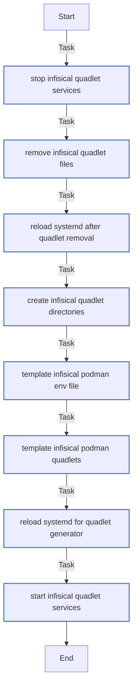

<!-- DOCSIBLE START -->

# 📃 Role overview

## infisical_podman

| Field                | Value           |
|--------------------- |-----------------|
| Readme update        | 2026/04/13 |

### Defaults

**These are static variables with lower priority**

#### File: defaults/main.yml

| Var          | Type         | Value       |
|--------------|--------------|-------------|
| [infisical_name](https://github.com/Lebowski89/homelab/blob/main/defaults/main.yml#L3)   | str | `infisical` |    
| [infisical_image](https://github.com/Lebowski89/homelab/blob/main/defaults/main.yml#L4)   | str | `infisical/infisical:v0.159.1` |    
| [infisical_port](https://github.com/Lebowski89/homelab/blob/main/defaults/main.yml#L5)   | int | `8066` |    
| [infisical_path](https://github.com/Lebowski89/homelab/blob/main/defaults/main.yml#L6)   | str | `/opt/{{ infisical_name }}` |    
| [infisical_enc_key](https://github.com/Lebowski89/homelab/blob/main/defaults/main.yml#L7)   | str |  |    
| [infisical_jwt_key](https://github.com/Lebowski89/homelab/blob/main/defaults/main.yml#L8)   | str |  |    
| [infisical_network](https://github.com/Lebowski89/homelab/blob/main/defaults/main.yml#L10)   | str | `infisical` |    
| [infisical_postgres_name](https://github.com/Lebowski89/homelab/blob/main/defaults/main.yml#L12)   | str | `infisical-postgres` |    
| [infisical_postgres_image](https://github.com/Lebowski89/homelab/blob/main/defaults/main.yml#L13)   | str | `postgres:18.3` |    
| [infisical_postgres_port](https://github.com/Lebowski89/homelab/blob/main/defaults/main.yml#L14)   | int | `5432` |    
| [infisical_postgres_path](https://github.com/Lebowski89/homelab/blob/main/defaults/main.yml#L15)   | str | `{{ infisical_path }}/postgres` |    
| [infisical_postgres_user](https://github.com/Lebowski89/homelab/blob/main/defaults/main.yml#L16)   | str |  |    
| [infisical_postgres_pass](https://github.com/Lebowski89/homelab/blob/main/defaults/main.yml#L17)   | str |  |    
| [infisical_expose_postgres](https://github.com/Lebowski89/homelab/blob/main/defaults/main.yml#L18)   | bool | `False` |    
| [infisical_redis_name](https://github.com/Lebowski89/homelab/blob/main/defaults/main.yml#L20)   | str | `infisical-redis` |    
| [infisical_redis_image](https://github.com/Lebowski89/homelab/blob/main/defaults/main.yml#L21)   | str | `redis:8.6.2-alpine3.23` |    
| [infisical_redis_port](https://github.com/Lebowski89/homelab/blob/main/defaults/main.yml#L22)   | int | `6390` |    
| [infisical_redis_path](https://github.com/Lebowski89/homelab/blob/main/defaults/main.yml#L23)   | str | `{{ infisical_path }}/redis` |    
| [infisical_redis_key](https://github.com/Lebowski89/homelab/blob/main/defaults/main.yml#L24)   | str |  |    
| [infisical_expose_redis](https://github.com/Lebowski89/homelab/blob/main/defaults/main.yml#L25)   | bool | `False` |    
| [infisical_smtp_email](https://github.com/Lebowski89/homelab/blob/main/defaults/main.yml#L27)   | str |  |    
| [infisical_smtp_host](https://github.com/Lebowski89/homelab/blob/main/defaults/main.yml#L28)   | str |  |    
| [infisical_smtp_port](https://github.com/Lebowski89/homelab/blob/main/defaults/main.yml#L29)   | str |  |    
| [infisical_smtp_user](https://github.com/Lebowski89/homelab/blob/main/defaults/main.yml#L30)   | str |  |    
| [infisical_smtp_pass](https://github.com/Lebowski89/homelab/blob/main/defaults/main.yml#L31)   | str |  |    
| [infisical_smtp_sender](https://github.com/Lebowski89/homelab/blob/main/defaults/main.yml#L32)   | str |  |    
| [infisical_site_url](https://github.com/Lebowski89/homelab/blob/main/defaults/main.yml#L34)   | str | `http://localhost:8080` |    

### Tasks

#### File: tasks/main.yml

| Name | Module | Has Conditions | Tags |
| ---- | ------ | -------------- | -----|
| Stop Infisical quadlet services | ansible.builtin.systemd_service | False | infisical_recreate,infisical_remove |
| Remove Infisical quadlet files | ansible.builtin.file | False | infisical_recreate,infisical_remove |
| Reload systemd after quadlet removal | ansible.builtin.systemd_service | False | infisical_remove |
| Create Infisical quadlet directories | ansible.builtin.file | False | infisical_bootstrap,infisical_deploy,infisical_recreate |
| Template Infisical Podman env file | ansible.builtin.template | False | infisical_bootstrap,infisical_deploy,infisical_recreate |
| Template Infisical Podman quadlets | ansible.builtin.template | False | infisical_deploy,infisical_recreate |
| Reload systemd for quadlet generator | ansible.builtin.systemd_service | False | infisical_deploy,infisical_recreate |
| Start Infisical quadlet services | ansible.builtin.systemd_service | False | infisical_deploy,infisical_recreate |

## Task Flow Graphs

### Graph for main.yml

#### Dependencies

No dependencies specified.
<!-- DOCSIBLE END -->
