<!-- DOCSIBLE START -->

# 📃 Role overview

## netbox

| Field                | Value           |
|--------------------- |-----------------|
| Readme update        | 2026/05/12 |

### Defaults

**These are static variables with lower priority**

#### File: defaults/main.yml

| Var          | Type         | Value       |
|--------------|--------------|-------------|
| [netbox_secret_key](https://github.com/Lebowski89/homelab/blob/main/defaults/main.yml#L9)   | str |  |    
| [netbox_api_token_pepper_1](https://github.com/Lebowski89/homelab/blob/main/defaults/main.yml#L10)   | str |  |    
| [netbox_redis_password](https://github.com/Lebowski89/homelab/blob/main/defaults/main.yml#L11)   | str |  |    
| [netbox_redis_cache_password](https://github.com/Lebowski89/homelab/blob/main/defaults/main.yml#L12)   | str |  |    
| [netbox_superuser_password](https://github.com/Lebowski89/homelab/blob/main/defaults/main.yml#L13)   | str |  |    
| [netbox_superuser_api_token](https://github.com/Lebowski89/homelab/blob/main/defaults/main.yml#L14)   | str |  |    
| [netbox_postgres_user](https://github.com/Lebowski89/homelab/blob/main/defaults/main.yml#L15)   | str |  |    
| [netbox_postgres_pass](https://github.com/Lebowski89/homelab/blob/main/defaults/main.yml#L16)   | str |  |    
| [netbox_domain](https://github.com/Lebowski89/homelab/blob/main/defaults/main.yml#L17)   | str |  |    
| [netbox_docker_secrets](https://github.com/Lebowski89/homelab/blob/main/defaults/main.yml#L19)   | dict | `{}` |    
| [netbox_docker_secrets.**netbox_db_user_secret**](https://github.com/Lebowski89/homelab/blob/main/defaults/main.yml#L20)   | str | `{{ netbox_postgres_user }}` |    
| [netbox_docker_secrets.**netbox_db_password_secret**](https://github.com/Lebowski89/homelab/blob/main/defaults/main.yml#L21)   | str | `{{ netbox_postgres_pass }}` |    
| [netbox_docker_secrets.**netbox_secret_key_secret**](https://github.com/Lebowski89/homelab/blob/main/defaults/main.yml#L22)   | str | `{{ netbox_secret_key }}` |    
| [netbox_docker_secrets.**netbox_api_token_pepper_1_secret**](https://github.com/Lebowski89/homelab/blob/main/defaults/main.yml#L23)   | str | `{{ netbox_api_token_pepper_1 }}` |    
| [netbox_docker_secrets.**netbox_redis_password_secret**](https://github.com/Lebowski89/homelab/blob/main/defaults/main.yml#L24)   | str | `{{ netbox_redis_password }}` |    
| [netbox_docker_secrets.**netbox_redis_cache_password_secret**](https://github.com/Lebowski89/homelab/blob/main/defaults/main.yml#L25)   | str | `{{ netbox_redis_cache_password }}` |    
| [netbox_docker_secrets.**netbox_superuser_password_secret**](https://github.com/Lebowski89/homelab/blob/main/defaults/main.yml#L26)   | str | `{{ netbox_superuser_password }}` |    
| [netbox_docker_secrets.**netbox_superuser_api_token_secret**](https://github.com/Lebowski89/homelab/blob/main/defaults/main.yml#L27)   | str | `{{ netbox_superuser_api_token }}` |    
| [netbox_name](https://github.com/Lebowski89/homelab/blob/main/defaults/main.yml#L33)   | str | `netbox` |    
| [netbox_worker_name](https://github.com/Lebowski89/homelab/blob/main/defaults/main.yml#L34)   | str | `netbox-worker` |    
| [netbox_stack](https://github.com/Lebowski89/homelab/blob/main/defaults/main.yml#L35)   | str | `netbox` |    
| [netbox_image](https://github.com/Lebowski89/homelab/blob/main/defaults/main.yml#L37)   | str | `netboxcommunity/netbox:v4.5-4.0.2` |    
| [netbox_puid](https://github.com/Lebowski89/homelab/blob/main/defaults/main.yml#L38)   | str | `{{ docker_host_puid ¦ default('1000') }}` |    
| [netbox_pgid](https://github.com/Lebowski89/homelab/blob/main/defaults/main.yml#L39)   | str | `{{ docker_host_pgid ¦ default('1000') }}` |    
| [netbox_base_path](https://github.com/Lebowski89/homelab/blob/main/defaults/main.yml#L40)   | str | `{{ docker_host_appdata_root ¦ default('/opt') }}/netbox` |    
| [netbox_compose_path](https://github.com/Lebowski89/homelab/blob/main/defaults/main.yml#L41)   | str | `{{ netbox_base_path }}/netbox-compose.yml` |    
| [netbox_env_path](https://github.com/Lebowski89/homelab/blob/main/defaults/main.yml#L42)   | str | `{{ netbox_base_path }}/.env` |    
| [netbox_timezone](https://github.com/Lebowski89/homelab/blob/main/defaults/main.yml#L43)   | str | `{{ timezone ¦ default('Australia/Melbourne') }}` |    
| [netbox_frontend_fqdn](https://github.com/Lebowski89/homelab/blob/main/defaults/main.yml#L45)   | str | `{{ netbox_name }}.int.{{ netbox_domain }}` |    
| [netbox_frontend_address](https://github.com/Lebowski89/homelab/blob/main/defaults/main.yml#L46)   | str | `https://{{ netbox_frontend_fqdn }}:8443` |    
| [netbox_backend_address](https://github.com/Lebowski89/homelab/blob/main/defaults/main.yml#L47)   | str | `http://{{ netbox_name }}:8080` |    
| [netbox_swarm_node_hostname](https://github.com/Lebowski89/homelab/blob/main/defaults/main.yml#L49)   | str | `{{ inventory_hostname }}` |    
| [netbox_docker_network](https://github.com/Lebowski89/homelab/blob/main/defaults/main.yml#L50)   | str | `overlay` |    
| [netbox_logging](https://github.com/Lebowski89/homelab/blob/main/defaults/main.yml#L52)   | dict | `{}` |    
| [netbox_logging.**driver**](https://github.com/Lebowski89/homelab/blob/main/defaults/main.yml#L53)   | str | `json-file` |    
| [netbox_logging.**options**](https://github.com/Lebowski89/homelab/blob/main/defaults/main.yml#L54)   | dict | `{}` |    
| [netbox_logging.options.**max-size**](https://github.com/Lebowski89/homelab/blob/main/defaults/main.yml#L55)   | str | `50m` |    
| [netbox_logging.options.**max-file**](https://github.com/Lebowski89/homelab/blob/main/defaults/main.yml#L56)   | str | `5` |    
| [netbox_logging.options.**compress**](https://github.com/Lebowski89/homelab/blob/main/defaults/main.yml#L57)   | str | `true` |    
| [netbox_restart_policy](https://github.com/Lebowski89/homelab/blob/main/defaults/main.yml#L59)   | dict | `{}` |    
| [netbox_restart_policy.**condition**](https://github.com/Lebowski89/homelab/blob/main/defaults/main.yml#L60)   | str | `on-failure` |    
| [netbox_restart_policy.**delay**](https://github.com/Lebowski89/homelab/blob/main/defaults/main.yml#L61)   | str | `10s` |    
| [netbox_restart_policy.**max_attempts**](https://github.com/Lebowski89/homelab/blob/main/defaults/main.yml#L62)   | int | `5` |    
| [netbox_restart_policy.**window**](https://github.com/Lebowski89/homelab/blob/main/defaults/main.yml#L63)   | str | `2m` |    
| [netbox_redis_name](https://github.com/Lebowski89/homelab/blob/main/defaults/main.yml#L69)   | str | `netbox-redis` |    
| [netbox_redis_cache_name](https://github.com/Lebowski89/homelab/blob/main/defaults/main.yml#L70)   | str | `netbox-redis-cache` |    
| [netbox_redis_image](https://github.com/Lebowski89/homelab/blob/main/defaults/main.yml#L71)   | str | `valkey/valkey:9.1-alpine` |    
| [netbox_redis_puid](https://github.com/Lebowski89/homelab/blob/main/defaults/main.yml#L72)   | str | `{{ docker_host_puid ¦ default('1000') }}` |    
| [netbox_redis_pgid](https://github.com/Lebowski89/homelab/blob/main/defaults/main.yml#L73)   | str | `{{ docker_host_pgid ¦ default('1000') }}` |    
| [netbox_redis_path](https://github.com/Lebowski89/homelab/blob/main/defaults/main.yml#L74)   | str | `{{ netbox_base_path }}/redis` |    
| [netbox_redis_cache_path](https://github.com/Lebowski89/homelab/blob/main/defaults/main.yml#L75)   | str | `{{ netbox_base_path }}/redis-cache` |    
| [netbox_postgres_name](https://github.com/Lebowski89/homelab/blob/main/defaults/main.yml#L81)   | str | `netbox-bootstrap-postgres` |    
| [netbox_postgres_image](https://github.com/Lebowski89/homelab/blob/main/defaults/main.yml#L82)   | str | `docker.io/library/postgres:18.3` |    
| [netbox_postgres_puid](https://github.com/Lebowski89/homelab/blob/main/defaults/main.yml#L83)   | str | `999` |    
| [netbox_postgres_pgid](https://github.com/Lebowski89/homelab/blob/main/defaults/main.yml#L84)   | str | `999` |    
| [netbox_postgres_path](https://github.com/Lebowski89/homelab/blob/main/defaults/main.yml#L85)   | str | `{{ netbox_base_path }}/postgres` |    
| [netbox_postgres_db_name](https://github.com/Lebowski89/homelab/blob/main/defaults/main.yml#L86)   | str | `netbox` |    
| [netbox_traefik_enable](https://github.com/Lebowski89/homelab/blob/main/defaults/main.yml#L92)   | bool | `True` |    
| [netbox_traefik_dynamic_dir](https://github.com/Lebowski89/homelab/blob/main/defaults/main.yml#L93)   | str | `/opt/traefik/dynamic` |    
| [netbox_traefik_entrypoint](https://github.com/Lebowski89/homelab/blob/main/defaults/main.yml#L94)   | str | `https_private` |    
| [netbox_traefik_authelia_enable](https://github.com/Lebowski89/homelab/blob/main/defaults/main.yml#L95)   | bool | `False` |    
| [netbox_traefik_crowdsec_enable](https://github.com/Lebowski89/homelab/blob/main/defaults/main.yml#L96)   | bool | `False` |    
| [netbox_traefik_headers_middleware](https://github.com/Lebowski89/homelab/blob/main/defaults/main.yml#L97)   | str | `netbox-headers@file` |    
| [netbox_traefik_middleware_chain](https://github.com/Lebowski89/homelab/blob/main/defaults/main.yml#L98)   | str | `{{ netbox_name }}-ui-chain` |    
| [netbox_traefik_certresolver](https://github.com/Lebowski89/homelab/blob/main/defaults/main.yml#L99)   | str | `dns-cloudflare` |    
| [netbox_traefik_tls_options](https://github.com/Lebowski89/homelab/blob/main/defaults/main.yml#L100)   | str | `securetls@file` |    
| [netbox_traefik_dynamic_owner](https://github.com/Lebowski89/homelab/blob/main/defaults/main.yml#L101)   | str | `1000` |    
| [netbox_traefik_dynamic_group](https://github.com/Lebowski89/homelab/blob/main/defaults/main.yml#L102)   | str | `1000` |    

### Tasks

#### File: tasks/main.yml

| Name | Module | Has Conditions |
| ---- | ------ | -------------- |
| NetBox ¦ Assert required non-secret values are defined | ansible.builtin.assert | False |
| NetBox ¦ Remove stack | community.docker.docker_stack | False |
| NetBox ¦ Remove compose file | ansible.builtin.file | False |
| NetBox ¦ Create directories | ansible.builtin.file | False |
| NetBox ¦ Template env file | ansible.builtin.template | False |
| NetBox ¦ Assert Docker secret values are defined | ansible.builtin.assert | False |
| NetBox ¦ Ensure Docker Swarm secrets exist | community.docker.docker_secret | False |
| NetBox ¦ Render Traefik dynamic file | ansible.builtin.template | True |
| NetBox ¦ Render compose file | ansible.builtin.template | False |
| NetBox ¦ Deploy stack | community.docker.docker_stack | False |

## Task Flow Graphs

### Graph for main.yml

```mermaid
flowchart TD
Start
classDef block stroke:#3498db,stroke-width:2px;
classDef task stroke:#4b76bb,stroke-width:2px;
classDef includeTasks stroke:#16a085,stroke-width:2px;
classDef importTasks stroke:#34495e,stroke-width:2px;
classDef includeRole stroke:#2980b9,stroke-width:2px;
classDef importRole stroke:#699ba7,stroke-width:2px;
classDef includeVars stroke:#8e44ad,stroke-width:2px;
classDef rescue stroke:#665352,stroke-width:2px;

  Start-->|Task| NetBox___Assert_required_non_secret_values_are_defined0[netbox   assert required non secret values are<br>defined]:::task
  NetBox___Assert_required_non_secret_values_are_defined0-->|Task| NetBox___Remove_stack1[netbox   remove stack]:::task
  NetBox___Remove_stack1-->|Task| NetBox___Remove_compose_file2[netbox   remove compose file]:::task
  NetBox___Remove_compose_file2-->|Task| NetBox___Create_directories3[netbox   create directories]:::task
  NetBox___Create_directories3-->|Task| NetBox___Template_env_file4[netbox   template env file]:::task
  NetBox___Template_env_file4-->|Task| NetBox___Assert_Docker_secret_values_are_defined5[netbox   assert docker secret values are defined]:::task
  NetBox___Assert_Docker_secret_values_are_defined5-->|Task| NetBox___Ensure_Docker_Swarm_secrets_exist6[netbox   ensure docker swarm secrets exist]:::task
  NetBox___Ensure_Docker_Swarm_secrets_exist6-->|Task| NetBox___Render_Traefik_dynamic_file7[netbox   render traefik dynamic file<br>When: **netbox traefik enable   bool**]:::task
  NetBox___Render_Traefik_dynamic_file7-->|Task| NetBox___Render_compose_file8[netbox   render compose file]:::task
  NetBox___Render_compose_file8-->|Task| NetBox___Deploy_stack9[netbox   deploy stack]:::task
  NetBox___Deploy_stack9-->End
```

#### Dependencies

No dependencies specified.
<!-- DOCSIBLE END -->
