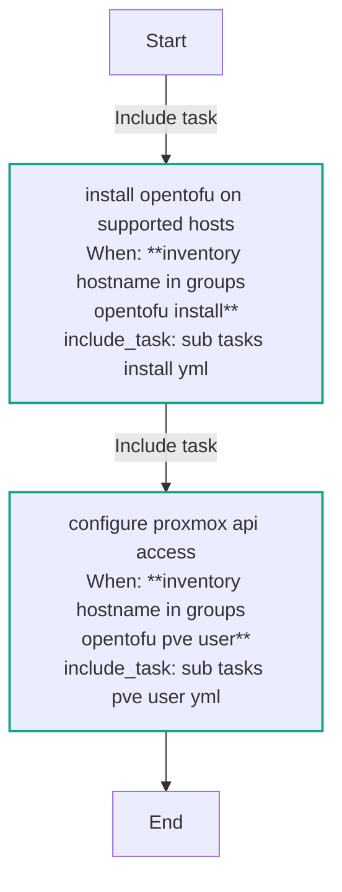
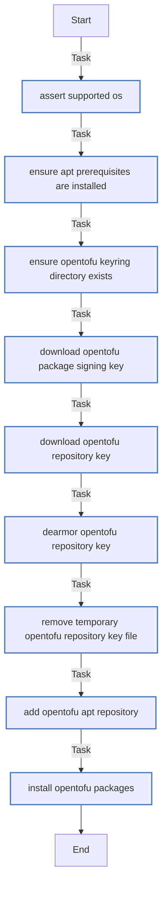

<!-- DOCSIBLE START -->

# 📃 Role overview

## opentofu

| Field                | Value           |
|--------------------- |-----------------|
| Readme update        | 2026/04/11 |

### Defaults

**These are static variables with lower priority**

#### File: defaults/main.yml

| Var          | Type         | Value       |
|--------------|--------------|-------------|
| [opentofu_prereq_packages](https://github.com/Lebowski89/homelab/blob/main/defaults/main.yml#L3)   | list | `[]` |    
| [opentofu_prereq_packages.**0**](https://github.com/Lebowski89/homelab/blob/main/defaults/main.yml#L4)   | str | `apt-transport-https` |    
| [opentofu_prereq_packages.**1**](https://github.com/Lebowski89/homelab/blob/main/defaults/main.yml#L5)   | str | `ca-certificates` |    
| [opentofu_prereq_packages.**2**](https://github.com/Lebowski89/homelab/blob/main/defaults/main.yml#L6)   | str | `curl` |    
| [opentofu_prereq_packages.**3**](https://github.com/Lebowski89/homelab/blob/main/defaults/main.yml#L7)   | str | `gnupg` |    
| [opentofu_prereq_packages.**4**](https://github.com/Lebowski89/homelab/blob/main/defaults/main.yml#L8)   | str | `software-properties-common` |    
| [opentofu_source_url](https://github.com/Lebowski89/homelab/blob/main/defaults/main.yml#L10)   | str | `https://packages.opentofu.org/opentofu/tofu/any/` |    
| [opentofu_source_suite](https://github.com/Lebowski89/homelab/blob/main/defaults/main.yml#L11)   | str | `any` |    
| [opentofu_keyring_dir](https://github.com/Lebowski89/homelab/blob/main/defaults/main.yml#L12)   | str | `/etc/apt/keyrings` |    
| [opentofu_keyring_file](https://github.com/Lebowski89/homelab/blob/main/defaults/main.yml#L13)   | str | `/etc/apt/keyrings/opentofu.gpg` |    
| [opentofu_keyring_file_repo](https://github.com/Lebowski89/homelab/blob/main/defaults/main.yml#L14)   | str | `/etc/apt/keyrings/opentofu-repo.gpg` |    
| [opentofu_repo_filename](https://github.com/Lebowski89/homelab/blob/main/defaults/main.yml#L15)   | str | `opentofu` |    
| [opentofu_packages](https://github.com/Lebowski89/homelab/blob/main/defaults/main.yml#L17)   | list | `[]` |    
| [opentofu_packages.**0**](https://github.com/Lebowski89/homelab/blob/main/defaults/main.yml#L17)   | str | `tofu` |    

### Tasks

#### File: tasks/main.yml

| Name | Module | Has Conditions | Tags |
| ---- | ------ | -------------- | -----|
| Install OpenTofu on supported hosts | ansible.builtin.include_tasks | True | opentofu,opentofu_install |
| Configure Proxmox API access | ansible.builtin.include_tasks | True | opentofu,opentofu_pve_user |

#### File: tasks/sub_tasks/install.yml

| Name | Module | Has Conditions |
| ---- | ------ | -------------- |
| Assert supported OS | ansible.builtin.assert | False |
| Ensure apt prerequisites are installed | ansible.builtin.apt | False |
| Ensure OpenTofu keyring directory exists | ansible.builtin.file | False |
| Download OpenTofu package signing key | ansible.builtin.get_url | False |
| Download OpenTofu repository key | ansible.builtin.get_url | False |
| Dearmor OpenTofu repository key | ansible.builtin.command | False |
| Remove temporary OpenTofu repository key file | ansible.builtin.file | False |
| Add OpenTofu apt repository | ansible.builtin.apt_repository | False |
| Install OpenTofu packages | ansible.builtin.apt | False |

#### File: tasks/sub_tasks/pve_user.yml

| Name | Module | Has Conditions |
| ---- | ------ | -------------- |
| Assert required OpenTofu Proxmox user vars are defined | ansible.builtin.assert | False |
| Manage Proxmox OpenTofu API objects | block | False |
| Ensure OpenTofu Proxmox role exists | community.proxmox.proxmox_role | False |
| Ensure OpenTofu Proxmox user exists | community.proxmox.proxmox_user | False |
| Ensure OpenTofu role is assigned at root path | community.proxmox.proxmox_access_acl | False |
| List existing OpenTofu API tokens | ansible.builtin.command | False |
| Determine whether OpenTofu API token needs to be created | ansible.builtin.set_fact | False |
| Create OpenTofu API token if missing | ansible.builtin.command | True |
| Show OpenTofu API token secret once when created | ansible.builtin.debug | True |
| Pause so operator can copy token | ansible.builtin.pause | True |

## Task Flow Graphs

### Graph for main.yml

### Graph for sub_tasks/install.yml

### Graph for sub_tasks/pve_user.yml

```mermaid
flowchart TD
Start
classDef block stroke:#3498db,stroke-width:2px;
classDef task stroke:#4b76bb,stroke-width:2px;
classDef includeTasks stroke:#16a085,stroke-width:2px;
classDef importTasks stroke:#34495e,stroke-width:2px;
classDef includeRole stroke:#2980b9,stroke-width:2px;
classDef importRole stroke:#699ba7,stroke-width:2px;
classDef includeVars stroke:#8e44ad,stroke-width:2px;
classDef rescue stroke:#665352,stroke-width:2px;

  Start-->|Task| Assert_required_OpenTofu_Proxmox_user_vars_are_defined0[assert required opentofu proxmox user vars are<br>defined]:::task
  Assert_required_OpenTofu_Proxmox_user_vars_are_defined0-->|Block Start| Manage_Proxmox_OpenTofu_API_objects1_block_start_0[[manage proxmox opentofu api objects]]:::block
  Manage_Proxmox_OpenTofu_API_objects1_block_start_0-->|Task| Ensure_OpenTofu_Proxmox_role_exists0[ensure opentofu proxmox role exists]:::task
  Ensure_OpenTofu_Proxmox_role_exists0-->|Task| Ensure_OpenTofu_Proxmox_user_exists1[ensure opentofu proxmox user exists]:::task
  Ensure_OpenTofu_Proxmox_user_exists1-->|Task| Ensure_OpenTofu_role_is_assigned_at_root_path2[ensure opentofu role is assigned at root path]:::task
  Ensure_OpenTofu_role_is_assigned_at_root_path2-.->|End of Block| Manage_Proxmox_OpenTofu_API_objects1_block_start_0
  Ensure_OpenTofu_role_is_assigned_at_root_path2-->|Task| List_existing_OpenTofu_API_tokens2[list existing opentofu api tokens]:::task
  List_existing_OpenTofu_API_tokens2-->|Task| Determine_whether_OpenTofu_API_token_needs_to_be_created3[determine whether opentofu api token needs to be<br>created]:::task
  Determine_whether_OpenTofu_API_token_needs_to_be_created3-->|Task| Create_OpenTofu_API_token_if_missing4[create opentofu api token if missing<br>When: **opentofu pve token missing**]:::task
  Create_OpenTofu_API_token_if_missing4-->|Task| Show_OpenTofu_API_token_secret_once_when_created5[show opentofu api token secret once when created<br>When: **opentofu pve token missing**]:::task
  Show_OpenTofu_API_token_secret_once_when_created5-->|Task| Pause_so_operator_can_copy_token6[pause so operator can copy token<br>When: **opentofu pve token missing**]:::task
  Pause_so_operator_can_copy_token6-->End
```

#### Dependencies

No dependencies specified.
<!-- DOCSIBLE END -->
