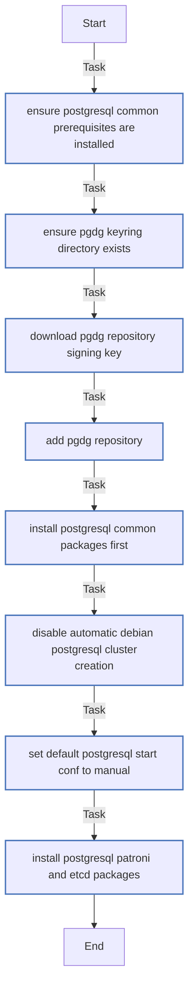
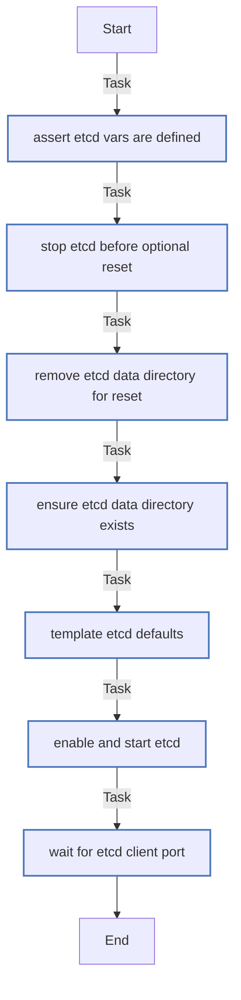
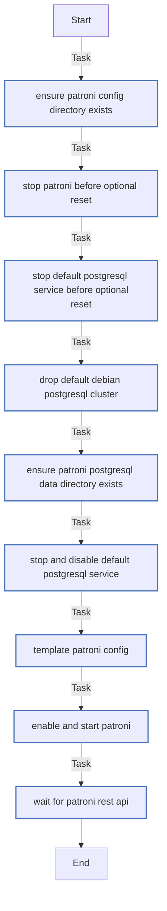
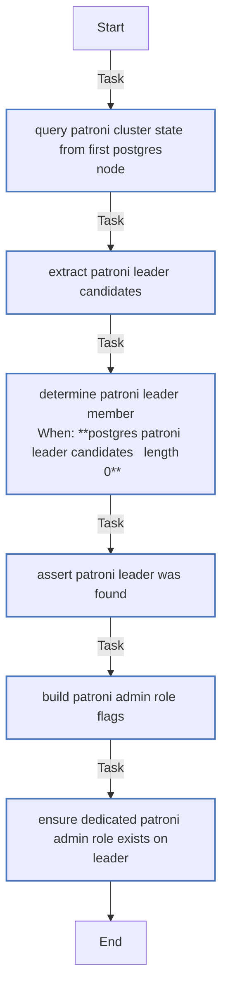

```mermaid
flowchart TD
Start
classDef block stroke:#3498db,stroke-width:2px;
classDef task stroke:#4b76bb,stroke-width:2px;
classDef includeTasks stroke:#16a085,stroke-width:2px;
classDef importTasks stroke:#34495e,stroke-width:2px;
classDef includeRole stroke:#2980b9,stroke-width:2px;
classDef importRole stroke:#699ba7,stroke-width:2px;
classDef includeVars stroke:#8e44ad,stroke-width:2px;
classDef rescue stroke:#665352,stroke-width:2px;

  Start-->|Task| Reset_node___Stop_Patroni0[reset node   stop patroni]:::task
  Reset_node___Stop_Patroni0-->|Task| Reset_node___Disable_Patroni1[reset node   disable patroni]:::task
  Reset_node___Disable_Patroni1-->|Task| Reset_node___Stop_PostgreSQL2[reset node   stop postgresql]:::task
  Reset_node___Stop_PostgreSQL2-->|Task| Reset_node___Disable_PostgreSQL3[reset node   disable postgresql]:::task
  Reset_node___Disable_PostgreSQL3-->|Task| Reset_node___Stop_etcd4[reset node   stop etcd]:::task
  Reset_node___Stop_etcd4-->|Task| Reset_node___Disable_etcd5[reset node   disable etcd]:::task
  Reset_node___Disable_etcd5-->|Task| Reset_node___Kill_stray_postgres_patroni_etcd_processes6[reset node   kill stray postgres patroni etcd<br>processes]:::task
  Reset_node___Kill_stray_postgres_patroni_etcd_processes6-->|Task| Reset_node___Drop_Debian_PostgreSQL_cluster_if_present7[reset node   drop debian postgresql cluster if<br>present]:::task
  Reset_node___Drop_Debian_PostgreSQL_cluster_if_present7-->|Task| Reset_node___Remove_Patroni_config8[reset node   remove patroni config]:::task
  Reset_node___Remove_Patroni_config8-->|Task| Reset_node___Remove_Patroni_config_dir_leftovers9[reset node   remove patroni config dir leftovers]:::task
  Reset_node___Remove_Patroni_config_dir_leftovers9-->|Task| Reset_node___Remove_PostgreSQL_data_dir10[reset node   remove postgresql data dir]:::task
  Reset_node___Remove_PostgreSQL_data_dir10-->|Task| Reset_node___Remove_Debian_PostgreSQL_config_dir11[reset node   remove debian postgresql config dir]:::task
  Reset_node___Remove_Debian_PostgreSQL_config_dir11-->|Task| Reset_node___Remove_Debian_PostgreSQL_data_root_if_still_present12[reset node   remove debian postgresql data root if<br>still present]:::task
  Reset_node___Remove_Debian_PostgreSQL_data_root_if_still_present12-->|Task| Reset_node___Remove_PostgreSQL_runtime_sockets_and_pid_files13[reset node   remove postgresql runtime sockets and<br>pid files]:::task
  Reset_node___Remove_PostgreSQL_runtime_sockets_and_pid_files13-->|Task| Reset_node___Optionally_remove_etcd_data_dir_too14[reset node   optionally remove etcd data dir too]:::task
  Reset_node___Optionally_remove_etcd_data_dir_too14-->|Task| Reset_node___Reset_failed_systemd_units15[reset node   reset failed systemd units]:::task
  Reset_node___Reset_failed_systemd_units15-->|Task| Reset_node___Recreate_Patroni_PostgreSQL_data_dir16[reset node   recreate patroni postgresql data dir]:::task
  Reset_node___Recreate_Patroni_PostgreSQL_data_dir16-->|Task| Reset_node___Recreate_Patroni_config_dir17[reset node   recreate patroni config dir]:::task
  Reset_node___Recreate_Patroni_config_dir17-->|Task| Reset_node___Recreate_etcd_data_dir_if_keeping_etcd18[reset node   recreate etcd data dir if keeping<br>etcd]:::task
  Reset_node___Recreate_etcd_data_dir_if_keeping_etcd18-->End
```

<!-- DOCSIBLE START -->

# 📃 Role overview

## postgres

| Field                | Value           |
|--------------------- |-----------------|
| Readme update        | 2026/04/11 |

### Defaults

**These are static variables with lower priority**

#### File: defaults/main.yml

| Var          | Type         | Value       |
|--------------|--------------|-------------|
| [postgres_version](https://github.com/Lebowski89/homelab/blob/main/defaults/main.yml#L7)   | int | `18` |    
| [postgres_etcd_data_dir](https://github.com/Lebowski89/homelab/blob/main/defaults/main.yml#L13)   | str | `/var/lib/etcd` |    
| [postgres_etcd_client_port](https://github.com/Lebowski89/homelab/blob/main/defaults/main.yml#L14)   | int | `2379` |    
| [postgres_etcd_peer_port](https://github.com/Lebowski89/homelab/blob/main/defaults/main.yml#L15)   | int | `2380` |    
| [postgres_etcd_cluster_token](https://github.com/Lebowski89/homelab/blob/main/defaults/main.yml#L16)   | str | `pg-ha-1` |    
| [postgres_patroni_scope](https://github.com/Lebowski89/homelab/blob/main/defaults/main.yml#L24)   | str | `pg-cluster` |    
| [postgres_patroni_namespace](https://github.com/Lebowski89/homelab/blob/main/defaults/main.yml#L25)   | str | `/service` |    
| [postgres_patroni_node_name](https://github.com/Lebowski89/homelab/blob/main/defaults/main.yml#L26)   | str | `{{ inventory_hostname }}` |    
| [postgres_patroni_config_dir](https://github.com/Lebowski89/homelab/blob/main/defaults/main.yml#L28)   | str | `/etc/patroni` |    
| [postgres_patroni_config_path](https://github.com/Lebowski89/homelab/blob/main/defaults/main.yml#L29)   | str | `{{ postgres_patroni_config_dir }}/config.yml` |    
| [postgres_patroni_data_dir](https://github.com/Lebowski89/homelab/blob/main/defaults/main.yml#L30)   | str | `/var/lib/postgresql/{{ postgres_version }}/main` |    
| [postgres_patroni_bin_dir](https://github.com/Lebowski89/homelab/blob/main/defaults/main.yml#L31)   | str | `/usr/lib/postgresql/{{ postgres_version }}/bin` |    
| [postgres_patroni_restapi_port](https://github.com/Lebowski89/homelab/blob/main/defaults/main.yml#L32)   | int | `8008` |    
| [postgres_patroni_postgres_port](https://github.com/Lebowski89/homelab/blob/main/defaults/main.yml#L33)   | int | `5432` |    
| [postgres_patroni_superuser_name](https://github.com/Lebowski89/homelab/blob/main/defaults/main.yml#L39)   | str | `postgres` |    
| [postgres_patroni_superuser_pass](https://github.com/Lebowski89/homelab/blob/main/defaults/main.yml#L40)   | str |  |    
| [postgres_patroni_replication_name](https://github.com/Lebowski89/homelab/blob/main/defaults/main.yml#L42)   | str | `replicator` |    
| [postgres_patroni_replication_pass](https://github.com/Lebowski89/homelab/blob/main/defaults/main.yml#L43)   | str |  |    
| [postgres_patroni_admin_role_name](https://github.com/Lebowski89/homelab/blob/main/defaults/main.yml#L45)   | str | `admin` |    
| [postgres_patroni_admin_role_pass](https://github.com/Lebowski89/homelab/blob/main/defaults/main.yml#L46)   | str |  |    
| [postgres_patroni_admin_role_login](https://github.com/Lebowski89/homelab/blob/main/defaults/main.yml#L47)   | bool | `True` |    
| [postgres_patroni_admin_role_createdb](https://github.com/Lebowski89/homelab/blob/main/defaults/main.yml#L48)   | bool | `True` |    
| [postgres_patroni_admin_role_createrole](https://github.com/Lebowski89/homelab/blob/main/defaults/main.yml#L49)   | bool | `False` |    
| [postgres_patroni_etcd_hosts](https://github.com/Lebowski89/homelab/blob/main/defaults/main.yml#L51)   | list | `[]` |    
| [postgres_patroni_pg_hba_extra](https://github.com/Lebowski89/homelab/blob/main/defaults/main.yml#L52)   | list | `[]` |    
| [postgres_backup_dir](https://github.com/Lebowski89/homelab/blob/main/defaults/main.yml#L58)   | str | `/var/backups/postgres` |    
| [postgres_backup_compress](https://github.com/Lebowski89/homelab/blob/main/defaults/main.yml#L59)   | bool | `True` |    
| [postgres_backup_all_dbs_run](https://github.com/Lebowski89/homelab/blob/main/defaults/main.yml#L61)   | bool | `False` |    
| [postgres_backup_all_dbs_dir](https://github.com/Lebowski89/homelab/blob/main/defaults/main.yml#L62)   | str | `{{ postgres_backup_dir }}` |    
| [postgres_backup_all_dbs_exclude](https://github.com/Lebowski89/homelab/blob/main/defaults/main.yml#L63)   | list | `[]` |    
| [postgres_backup_all_dbs_exclude.**0**](https://github.com/Lebowski89/homelab/blob/main/defaults/main.yml#L63)   | str | `postgres` |    
| [postgres_backup_single_db](https://github.com/Lebowski89/homelab/blob/main/defaults/main.yml#L66)   | str | `test_db` |    
| [postgres_backup_single_custom_format](https://github.com/Lebowski89/homelab/blob/main/defaults/main.yml#L67)   | bool | `True` |    
| [postgres_backup_single_compress](https://github.com/Lebowski89/homelab/blob/main/defaults/main.yml#L68)   | bool | `True` |    
| [postgres_restore_all_dbs_run](https://github.com/Lebowski89/homelab/blob/main/defaults/main.yml#L74)   | bool | `False` |    
| [postgres_restore_all_dbs_dir](https://github.com/Lebowski89/homelab/blob/main/defaults/main.yml#L75)   | str |  |    
| [postgres_restore_all_dbs_drop_existing](https://github.com/Lebowski89/homelab/blob/main/defaults/main.yml#L76)   | bool | `True` |    
| [postgres_restore_single_file](https://github.com/Lebowski89/homelab/blob/main/defaults/main.yml#L78)   | str | `/var/backups/postgres/gotify.dump` |    
| [postgres_restore_single_db](https://github.com/Lebowski89/homelab/blob/main/defaults/main.yml#L79)   | str | `gotify` |    
| [postgres_restore_single_drop_existing](https://github.com/Lebowski89/homelab/blob/main/defaults/main.yml#L80)   | bool | `True` |    

### Tasks

#### File: tasks/main.yml

| Name | Module | Has Conditions | Tags |
| ---- | ------ | -------------- | -----|
| Install postgres packages | ansible.builtin.include_tasks | False | postgres,postgres_apt |
| Configure etcd | ansible.builtin.include_tasks | False | postgres,postgres_etcd,postgres_etcd_reset |
| Configure Patroni | ansible.builtin.include_tasks | False | postgres,postgres_patroni,postgres_patroni_reset |
| Ensure dedicated PostgreSQL admin role exists | ansible.builtin.include_tasks | False | postgres,postgres_admin |
| Backup PostgreSQL cluster with pg_dumpall | ansible.builtin.include_tasks | False | postgres_backup_all,postgres_nuke_node |
| Backup PostgreSQL single database with pg_dump | ansible.builtin.include_tasks | False | p,o,s,t,g,r,e,s,_,b,a,c,k,u,p,_,o,n,e |
| Reset PostgreSQL/Patroni node destructively | ansible.builtin.include_tasks | False | p,o,s,t,g,r,e,s,_,n,u,k,e,_,n,o,d,e |
| Restore PostgreSQL cluster from pg_dumpall backup | ansible.builtin.include_tasks | False | p,o,s,t,g,r,e,s,_,r,e,s,t,o,r,e,_,a,l,l |
| Restore PostgreSQL single database from pg_dump backup | ansible.builtin.include_tasks | False | p,o,s,t,g,r,e,s,_,r,e,s,t,o,r,e,_,o,n,e |

#### File: tasks/sub_tasks/apt.yml

| Name | Module | Has Conditions |
| ---- | ------ | -------------- |
| Ensure PostgreSQL common prerequisites are installed | ansible.builtin.apt | False |
| Ensure PGDG keyring directory exists | ansible.builtin.file | False |
| Download PGDG repository signing key | ansible.builtin.get_url | False |
| Add PGDG repository | ansible.builtin.apt_repository | False |
| Install PostgreSQL common packages first | ansible.builtin.apt | False |
| Disable automatic Debian PostgreSQL cluster creation | ansible.builtin.lineinfile | False |
| Set default PostgreSQL start_conf to manual | ansible.builtin.lineinfile | False |
| Install PostgreSQL Patroni, and etcd packages | ansible.builtin.apt | False |

#### File: tasks/sub_tasks/backup/db_all.yml

| Name | Module | Has Conditions |
| ---- | ------ | -------------- |
| Backup all DBs ¦ Query Patroni cluster state from first postgres node | ansible.builtin.uri | False |
| Backup all DBs ¦ Extract Patroni leader candidates | ansible.builtin.set_fact | False |
| Backup all DBs ¦ Determine Patroni leader member | ansible.builtin.set_fact | False |
| Backup all DBs ¦ Build timestamp | ansible.builtin.set_fact | False |
| Backup all DBs ¦ Build output directory | ansible.builtin.set_fact | False |
| Backup all DBs ¦ Ensure output directory exists on leader | ansible.builtin.file | False |
| Backup all DBs ¦ Query non-template databases | community.postgresql.postgresql_query | False |
| Backup all DBs ¦ Build database list | ansible.builtin.set_fact | False |
| Backup all DBs ¦ Dump each database in custom format | ansible.builtin.shell | False |
| Backup all DBs ¦ Show result | ansible.builtin.debug | False |

#### File: tasks/sub_tasks/backup/db_one.yml

| Name | Module | Has Conditions |
| ---- | ------ | -------------- |
| Backup single DB ¦ Assert requested database was provided | ansible.builtin.assert | False |
| Backup single DB ¦ Query Patroni cluster state from first postgres node | ansible.builtin.uri | False |
| Backup single DB ¦ Extract Patroni leader candidates | ansible.builtin.set_fact | False |
| Backup single DB ¦ Determine Patroni leader member | ansible.builtin.set_fact | False |
| Backup single DB ¦ Build timestamp | ansible.builtin.set_fact | False |
| Backup single DB ¦ Set output extension | ansible.builtin.set_fact | False |
| Backup single DB ¦ Set output path | ansible.builtin.set_fact | False |
| Backup single DB ¦ Ensure backup directory exists on leader | ansible.builtin.file | False |
| Backup single DB ¦ Dump database in custom format | ansible.builtin.shell | True |
| Backup single DB ¦ Dump database in plain SQL format | ansible.builtin.shell | True |
| Backup single DB ¦ Show result | ansible.builtin.debug | False |

#### File: tasks/sub_tasks/etcd.yml

| Name | Module | Has Conditions | Tags |
| ---- | ------ | -------------- | -----|
| Assert etcd vars are defined | ansible.builtin.assert | False | postgres,postgres_etcd |
| Stop etcd before optional reset | ansible.builtin.systemd_service | False | p,o,s,t,g,r,e,s,_,e,t,c,d,_,r,e,s,e,t |
| Remove etcd data directory for reset | ansible.builtin.file | False | p,o,s,t,g,r,e,s,_,e,t,c,d,_,r,e,s,e,t |
| Ensure etcd data directory exists | ansible.builtin.file | False | postgres,postgres_etcd |
| Template etcd defaults | ansible.builtin.template | False | postgres,postgres_etcd |
| Enable and start etcd | ansible.builtin.systemd_service | False | postgres,postgres_etcd |
| Wait for etcd client port | ansible.builtin.wait_for | False | postgres,postgres_etcd |

#### File: tasks/sub_tasks/patroni.yml

| Name | Module | Has Conditions | Tags |
| ---- | ------ | -------------- | -----|
| Ensure Patroni config directory exists | ansible.builtin.file | False | postgres,postgres_patroni |
| Stop Patroni before optional reset | ansible.builtin.systemd_service | False | p,o,s,t,g,r,e,s,_,p,a,t,r,o,n,i,_,r,e,s,e,t |
| Stop default PostgreSQL service before optional reset | ansible.builtin.systemd_service | False | p,o,s,t,g,r,e,s,_,p,a,t,r,o,n,i,_,r,e,s,e,t |
| Drop default Debian PostgreSQL cluster | ansible.builtin.command | False | p,o,s,t,g,r,e,s,_,p,a,t,r,o,n,i,_,r,e,s,e,t |
| Ensure Patroni PostgreSQL data directory exists | ansible.builtin.file | False | postgres,postgres_patroni |
| Stop and disable default PostgreSQL service | ansible.builtin.systemd_service | False | postgres,postgres_patroni |
| Template Patroni config | ansible.builtin.template | False | postgres,postgres_patroni |
| Enable and start Patroni | ansible.builtin.systemd_service | False | postgres,postgres_patroni |
| Wait for Patroni REST API | ansible.builtin.wait_for | False | postgres,postgres_patroni |

#### File: tasks/sub_tasks/pg_admin.yml

| Name | Module | Has Conditions |
| ---- | ------ | -------------- |
| Query Patroni cluster state from first postgres node | ansible.builtin.uri | False |
| Extract Patroni leader candidates | ansible.builtin.set_fact | False |
| Determine Patroni leader member | ansible.builtin.set_fact | True |
| Assert Patroni leader was found | ansible.builtin.assert | False |
| Build Patroni admin role flags | ansible.builtin.set_fact | False |
| Ensure dedicated Patroni admin role exists on leader | community.postgresql.postgresql_user | False |

#### File: tasks/sub_tasks/reset_node.yml

| Name | Module | Has Conditions |
| ---- | ------ | -------------- |
| Reset node ¦ Stop Patroni | ansible.builtin.systemd_service | False |
| Reset node ¦ Disable Patroni | ansible.builtin.systemd_service | False |
| Reset node ¦ Stop PostgreSQL | ansible.builtin.systemd_service | False |
| Reset node ¦ Disable PostgreSQL | ansible.builtin.systemd_service | False |
| Reset node ¦ Stop etcd | ansible.builtin.systemd_service | False |
| Reset node ¦ Disable etcd | ansible.builtin.systemd_service | False |
| Reset node ¦ Kill stray postgres/patroni/etcd processes | ansible.builtin.shell | False |
| Reset node ¦ Drop Debian PostgreSQL cluster if present | ansible.builtin.command | False |
| Reset node ¦ Remove Patroni config | ansible.builtin.file | False |
| Reset node ¦ Remove Patroni config dir leftovers | ansible.builtin.file | False |
| Reset node ¦ Remove PostgreSQL data dir | ansible.builtin.file | False |
| Reset node ¦ Remove Debian PostgreSQL config dir | ansible.builtin.file | False |
| Reset node ¦ Remove Debian PostgreSQL data root if still present | ansible.builtin.file | False |
| Reset node ¦ Remove PostgreSQL runtime sockets and pid files | ansible.builtin.shell | False |
| Reset node ¦ Optionally remove etcd data dir too | ansible.builtin.file | False |
| Reset node ¦ Reset failed systemd units | ansible.builtin.shell | False |
| Reset node ¦ Recreate Patroni PostgreSQL data dir | ansible.builtin.file | False |
| Reset node ¦ Recreate Patroni config dir | ansible.builtin.file | False |
| Reset node ¦ Recreate etcd data dir if keeping etcd | ansible.builtin.file | False |

#### File: tasks/sub_tasks/restore/db_all.yml

| Name | Module | Has Conditions |
| ---- | ------ | -------------- |
| Restore all DBs ¦ Assert restore was explicitly requested | ansible.builtin.assert | False |
| Restore all DBs ¦ Query Patroni cluster state from first postgres node | ansible.builtin.uri | False |
| Restore all DBs ¦ Extract Patroni leader candidates | ansible.builtin.set_fact | False |
| Restore all DBs ¦ Determine Patroni leader member | ansible.builtin.set_fact | False |
| Restore all DBs ¦ Check restore directory exists on leader | ansible.builtin.stat | False |
| Restore all DBs ¦ Assert restore directory exists | ansible.builtin.assert | False |
| Restore all DBs ¦ Find dump files | ansible.builtin.find | False |
| Restore all DBs ¦ Assert dump files were found | ansible.builtin.assert | False |
| Restore all DBs ¦ Build restore database/file map | ansible.builtin.set_fact | False |
| Restore all DBs ¦ Drop and recreate databases if requested | ansible.builtin.shell | True |
| Restore all DBs ¦ Ensure databases exist when not dropping | community.postgresql.postgresql_db | True |
| Restore all DBs ¦ Restore each database | ansible.builtin.shell | False |
| Restore all DBs ¦ Show result | ansible.builtin.debug | False |

#### File: tasks/sub_tasks/restore/db_one.yml

| Name | Module | Has Conditions |
| ---- | ------ | -------------- |
| Restore single DB ¦ Assert requested input was provided | ansible.builtin.assert | False |
| Restore single DB ¦ Query Patroni cluster state from first postgres node | ansible.builtin.uri | False |
| Restore single DB ¦ Extract Patroni leader candidates | ansible.builtin.set_fact | False |
| Restore single DB ¦ Determine Patroni leader member | ansible.builtin.set_fact | False |
| Restore single DB ¦ Check restore file exists on leader | ansible.builtin.stat | False |
| Restore single DB ¦ Assert restore file exists | ansible.builtin.assert | False |
| Restore single DB ¦ Drop target database if requested | ansible.builtin.shell | True |
| Restore single DB ¦ Ensure target database exists when not dropping | community.postgresql.postgresql_db | True |
| Restore single DB ¦ Restore custom-format dump | ansible.builtin.shell | True |
| Restore single DB ¦ Restore plain SQL dump | ansible.builtin.shell | True |
| Restore single DB ¦ Show result | ansible.builtin.debug | False |

## Task Flow Graphs

### Graph for main.yml

```mermaid
flowchart TD
Start
classDef block stroke:#3498db,stroke-width:2px;
classDef task stroke:#4b76bb,stroke-width:2px;
classDef includeTasks stroke:#16a085,stroke-width:2px;
classDef importTasks stroke:#34495e,stroke-width:2px;
classDef includeRole stroke:#2980b9,stroke-width:2px;
classDef importRole stroke:#699ba7,stroke-width:2px;
classDef includeVars stroke:#8e44ad,stroke-width:2px;
classDef rescue stroke:#665352,stroke-width:2px;

  Start-->|Include task| Install_postgres_packages_sub_tasks_apt_yml_0[install postgres packages<br>include_task: sub tasks apt yml]:::includeTasks
  Install_postgres_packages_sub_tasks_apt_yml_0-->|Include task| Configure_etcd_sub_tasks_etcd_yml_1[configure etcd<br>include_task: sub tasks etcd yml]:::includeTasks
  Configure_etcd_sub_tasks_etcd_yml_1-->|Include task| Configure_Patroni_sub_tasks_patroni_yml_2[configure patroni<br>include_task: sub tasks patroni yml]:::includeTasks
  Configure_Patroni_sub_tasks_patroni_yml_2-->|Include task| Ensure_dedicated_PostgreSQL_admin_role_exists_sub_tasks_pg_admin_yml_3[ensure dedicated postgresql admin role exists<br>include_task: sub tasks pg admin yml]:::includeTasks
  Ensure_dedicated_PostgreSQL_admin_role_exists_sub_tasks_pg_admin_yml_3-->|Include task| Backup_PostgreSQL_cluster_with_pg_dumpall_sub_tasks_backup_db_all_yml_4[backup postgresql cluster with pg dumpall<br>include_task: sub tasks backup db all yml]:::includeTasks
  Backup_PostgreSQL_cluster_with_pg_dumpall_sub_tasks_backup_db_all_yml_4-->|Include task| Backup_PostgreSQL_single_database_with_pg_dump_sub_tasks_backup_db_one_yml_5[backup postgresql single database with pg dump<br>include_task: sub tasks backup db one yml]:::includeTasks
  Backup_PostgreSQL_single_database_with_pg_dump_sub_tasks_backup_db_one_yml_5-->|Include task| Reset_PostgreSQL_Patroni_node_destructively_sub_tasks_reset_node_yml_6[reset postgresql patroni node destructively<br>include_task: sub tasks reset node yml]:::includeTasks
  Reset_PostgreSQL_Patroni_node_destructively_sub_tasks_reset_node_yml_6-->|Include task| Restore_PostgreSQL_cluster_from_pg_dumpall_backup_sub_tasks_restore_db_all_yml_7[restore postgresql cluster from pg dumpall backup<br>include_task: sub tasks restore db all yml]:::includeTasks
  Restore_PostgreSQL_cluster_from_pg_dumpall_backup_sub_tasks_restore_db_all_yml_7-->|Include task| Restore_PostgreSQL_single_database_from_pg_dump_backup_sub_tasks_restore_db_one_yml_8[restore postgresql single database from pg dump<br>backup<br>include_task: sub tasks restore db one yml]:::includeTasks
  Restore_PostgreSQL_single_database_from_pg_dump_backup_sub_tasks_restore_db_one_yml_8-->End
```

### Graph for sub_tasks/apt.yml

### Graph for sub_tasks/backup/db_all.yml

```mermaid
flowchart TD
Start
classDef block stroke:#3498db,stroke-width:2px;
classDef task stroke:#4b76bb,stroke-width:2px;
classDef includeTasks stroke:#16a085,stroke-width:2px;
classDef importTasks stroke:#34495e,stroke-width:2px;
classDef includeRole stroke:#2980b9,stroke-width:2px;
classDef importRole stroke:#699ba7,stroke-width:2px;
classDef includeVars stroke:#8e44ad,stroke-width:2px;
classDef rescue stroke:#665352,stroke-width:2px;

  Start-->|Task| Backup_all_DBs___Query_Patroni_cluster_state_from_first_postgres_node0[backup all dbs   query patroni cluster state from<br>first postgres node]:::task
  Backup_all_DBs___Query_Patroni_cluster_state_from_first_postgres_node0-->|Task| Backup_all_DBs___Extract_Patroni_leader_candidates1[backup all dbs   extract patroni leader candidates]:::task
  Backup_all_DBs___Extract_Patroni_leader_candidates1-->|Task| Backup_all_DBs___Determine_Patroni_leader_member2[backup all dbs   determine patroni leader member]:::task
  Backup_all_DBs___Determine_Patroni_leader_member2-->|Task| Backup_all_DBs___Build_timestamp3[backup all dbs   build timestamp]:::task
  Backup_all_DBs___Build_timestamp3-->|Task| Backup_all_DBs___Build_output_directory4[backup all dbs   build output directory]:::task
  Backup_all_DBs___Build_output_directory4-->|Task| Backup_all_DBs___Ensure_output_directory_exists_on_leader5[backup all dbs   ensure output directory exists on<br>leader]:::task
  Backup_all_DBs___Ensure_output_directory_exists_on_leader5-->|Task| Backup_all_DBs___Query_non_template_databases6[backup all dbs   query non template databases]:::task
  Backup_all_DBs___Query_non_template_databases6-->|Task| Backup_all_DBs___Build_database_list7[backup all dbs   build database list]:::task
  Backup_all_DBs___Build_database_list7-->|Task| Backup_all_DBs___Dump_each_database_in_custom_format8[backup all dbs   dump each database in custom<br>format]:::task
  Backup_all_DBs___Dump_each_database_in_custom_format8-->|Task| Backup_all_DBs___Show_result9[backup all dbs   show result]:::task
  Backup_all_DBs___Show_result9-->End
```

### Graph for sub_tasks/backup/db_one.yml

```mermaid
flowchart TD
Start
classDef block stroke:#3498db,stroke-width:2px;
classDef task stroke:#4b76bb,stroke-width:2px;
classDef includeTasks stroke:#16a085,stroke-width:2px;
classDef importTasks stroke:#34495e,stroke-width:2px;
classDef includeRole stroke:#2980b9,stroke-width:2px;
classDef importRole stroke:#699ba7,stroke-width:2px;
classDef includeVars stroke:#8e44ad,stroke-width:2px;
classDef rescue stroke:#665352,stroke-width:2px;

  Start-->|Task| Backup_single_DB___Assert_requested_database_was_provided0[backup single db   assert requested database was<br>provided]:::task
  Backup_single_DB___Assert_requested_database_was_provided0-->|Task| Backup_single_DB___Query_Patroni_cluster_state_from_first_postgres_node1[backup single db   query patroni cluster state<br>from first postgres node]:::task
  Backup_single_DB___Query_Patroni_cluster_state_from_first_postgres_node1-->|Task| Backup_single_DB___Extract_Patroni_leader_candidates2[backup single db   extract patroni leader<br>candidates]:::task
  Backup_single_DB___Extract_Patroni_leader_candidates2-->|Task| Backup_single_DB___Determine_Patroni_leader_member3[backup single db   determine patroni leader member]:::task
  Backup_single_DB___Determine_Patroni_leader_member3-->|Task| Backup_single_DB___Build_timestamp4[backup single db   build timestamp]:::task
  Backup_single_DB___Build_timestamp4-->|Task| Backup_single_DB___Set_output_extension5[backup single db   set output extension]:::task
  Backup_single_DB___Set_output_extension5-->|Task| Backup_single_DB___Set_output_path6[backup single db   set output path]:::task
  Backup_single_DB___Set_output_path6-->|Task| Backup_single_DB___Ensure_backup_directory_exists_on_leader7[backup single db   ensure backup directory exists<br>on leader]:::task
  Backup_single_DB___Ensure_backup_directory_exists_on_leader7-->|Task| Backup_single_DB___Dump_database_in_custom_format8[backup single db   dump database in custom format<br>When: **postgres backup single custom format   bool**]:::task
  Backup_single_DB___Dump_database_in_custom_format8-->|Task| Backup_single_DB___Dump_database_in_plain_SQL_format9[backup single db   dump database in plain sql<br>format<br>When: **not postgres backup single custom format   bool**]:::task
  Backup_single_DB___Dump_database_in_plain_SQL_format9-->|Task| Backup_single_DB___Show_result10[backup single db   show result]:::task
  Backup_single_DB___Show_result10-->End
```

### Graph for sub_tasks/etcd.yml

### Graph for sub_tasks/patroni.yml

### Graph for sub_tasks/pg_admin.yml

### Graph for sub_tasks/reset_node.yml

### Graph for sub_tasks/restore/db_all.yml

```mermaid
flowchart TD
Start
classDef block stroke:#3498db,stroke-width:2px;
classDef task stroke:#4b76bb,stroke-width:2px;
classDef includeTasks stroke:#16a085,stroke-width:2px;
classDef importTasks stroke:#34495e,stroke-width:2px;
classDef includeRole stroke:#2980b9,stroke-width:2px;
classDef importRole stroke:#699ba7,stroke-width:2px;
classDef includeVars stroke:#8e44ad,stroke-width:2px;
classDef rescue stroke:#665352,stroke-width:2px;

  Start-->|Task| Restore_all_DBs___Assert_restore_was_explicitly_requested0[restore all dbs   assert restore was explicitly<br>requested]:::task
  Restore_all_DBs___Assert_restore_was_explicitly_requested0-->|Task| Restore_all_DBs___Query_Patroni_cluster_state_from_first_postgres_node1[restore all dbs   query patroni cluster state from<br>first postgres node]:::task
  Restore_all_DBs___Query_Patroni_cluster_state_from_first_postgres_node1-->|Task| Restore_all_DBs___Extract_Patroni_leader_candidates2[restore all dbs   extract patroni leader<br>candidates]:::task
  Restore_all_DBs___Extract_Patroni_leader_candidates2-->|Task| Restore_all_DBs___Determine_Patroni_leader_member3[restore all dbs   determine patroni leader member]:::task
  Restore_all_DBs___Determine_Patroni_leader_member3-->|Task| Restore_all_DBs___Check_restore_directory_exists_on_leader4[restore all dbs   check restore directory exists<br>on leader]:::task
  Restore_all_DBs___Check_restore_directory_exists_on_leader4-->|Task| Restore_all_DBs___Assert_restore_directory_exists5[restore all dbs   assert restore directory exists]:::task
  Restore_all_DBs___Assert_restore_directory_exists5-->|Task| Restore_all_DBs___Find_dump_files6[restore all dbs   find dump files]:::task
  Restore_all_DBs___Find_dump_files6-->|Task| Restore_all_DBs___Assert_dump_files_were_found7[restore all dbs   assert dump files were found]:::task
  Restore_all_DBs___Assert_dump_files_were_found7-->|Task| Restore_all_DBs___Build_restore_database_file_map8[restore all dbs   build restore database file map]:::task
  Restore_all_DBs___Build_restore_database_file_map8-->|Task| Restore_all_DBs___Drop_and_recreate_databases_if_requested9[restore all dbs   drop and recreate databases if<br>requested<br>When: **postgres restore all dbs drop existing   bool**]:::task
  Restore_all_DBs___Drop_and_recreate_databases_if_requested9-->|Task| Restore_all_DBs___Ensure_databases_exist_when_not_dropping10[restore all dbs   ensure databases exist when not<br>dropping<br>When: **not  postgres restore all dbs drop existing   bool<br>**]:::task
  Restore_all_DBs___Ensure_databases_exist_when_not_dropping10-->|Task| Restore_all_DBs___Restore_each_database11[restore all dbs   restore each database]:::task
  Restore_all_DBs___Restore_each_database11-->|Task| Restore_all_DBs___Show_result12[restore all dbs   show result]:::task
  Restore_all_DBs___Show_result12-->End
```

### Graph for sub_tasks/restore/db_one.yml

```mermaid
flowchart TD
Start
classDef block stroke:#3498db,stroke-width:2px;
classDef task stroke:#4b76bb,stroke-width:2px;
classDef includeTasks stroke:#16a085,stroke-width:2px;
classDef importTasks stroke:#34495e,stroke-width:2px;
classDef includeRole stroke:#2980b9,stroke-width:2px;
classDef importRole stroke:#699ba7,stroke-width:2px;
classDef includeVars stroke:#8e44ad,stroke-width:2px;
classDef rescue stroke:#665352,stroke-width:2px;

  Start-->|Task| Restore_single_DB___Assert_requested_input_was_provided0[restore single db   assert requested input was<br>provided]:::task
  Restore_single_DB___Assert_requested_input_was_provided0-->|Task| Restore_single_DB___Query_Patroni_cluster_state_from_first_postgres_node1[restore single db   query patroni cluster state<br>from first postgres node]:::task
  Restore_single_DB___Query_Patroni_cluster_state_from_first_postgres_node1-->|Task| Restore_single_DB___Extract_Patroni_leader_candidates2[restore single db   extract patroni leader<br>candidates]:::task
  Restore_single_DB___Extract_Patroni_leader_candidates2-->|Task| Restore_single_DB___Determine_Patroni_leader_member3[restore single db   determine patroni leader<br>member]:::task
  Restore_single_DB___Determine_Patroni_leader_member3-->|Task| Restore_single_DB___Check_restore_file_exists_on_leader4[restore single db   check restore file exists on<br>leader]:::task
  Restore_single_DB___Check_restore_file_exists_on_leader4-->|Task| Restore_single_DB___Assert_restore_file_exists5[restore single db   assert restore file exists]:::task
  Restore_single_DB___Assert_restore_file_exists5-->|Task| Restore_single_DB___Drop_target_database_if_requested6[restore single db   drop target database if<br>requested<br>When: **postgres restore single drop existing   bool**]:::task
  Restore_single_DB___Drop_target_database_if_requested6-->|Task| Restore_single_DB___Ensure_target_database_exists_when_not_dropping7[restore single db   ensure target database exists<br>when not dropping<br>When: **not  postgres restore single drop existing   bool**]:::task
  Restore_single_DB___Ensure_target_database_exists_when_not_dropping7-->|Task| Restore_single_DB___Restore_custom_format_dump8[restore single db   restore custom format dump<br>When: **postgres restore single file   lower  endswith  <br>dump**]:::task
  Restore_single_DB___Restore_custom_format_dump8-->|Task| Restore_single_DB___Restore_plain_SQL_dump9[restore single db   restore plain sql dump<br>When: **not  postgres restore single file   lower <br>endswith   dump**]:::task
  Restore_single_DB___Restore_plain_SQL_dump9-->|Task| Restore_single_DB___Show_result10[restore single db   show result]:::task
  Restore_single_DB___Show_result10-->End
```

#### Dependencies

No dependencies specified.
<!-- DOCSIBLE END -->
