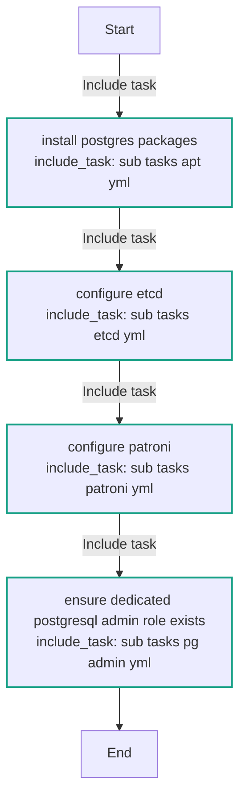
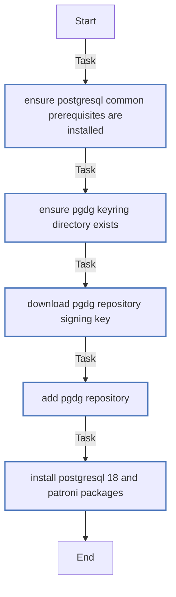
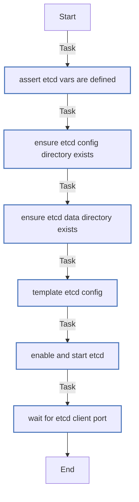
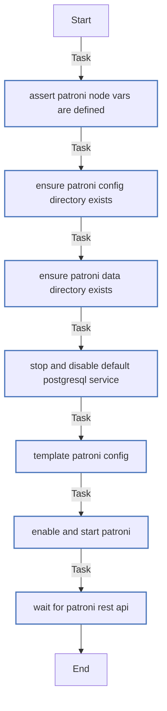
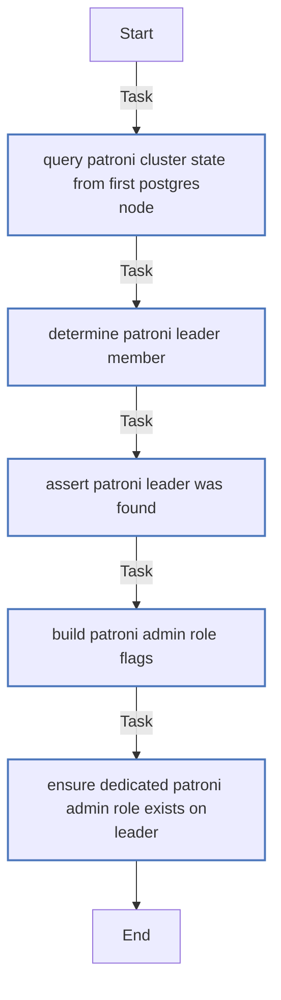

<!-- DOCSIBLE START -->

# 📃 Role overview

## postgres

| Field                | Value           |
|--------------------- |-----------------|
| Readme update        | 2026/04/11 |

### Defaults

**These are static variables with lower priority**

#### File: defaults/main.yml

| Var          | Type         | Value       |
|--------------|--------------|-------------|
| [postgres_etcd_cluster_token](https://github.com/Lebowski89/homelab/blob/main/defaults/main.yml#L3)   | str | `pg-ha-1` |    
| [postgres_etcd_data_dir](https://github.com/Lebowski89/homelab/blob/main/defaults/main.yml#L4)   | str | `/var/lib/etcd` |    
| [postgres_etcd_config_dir](https://github.com/Lebowski89/homelab/blob/main/defaults/main.yml#L5)   | str | `/etc/etcd` |    
| [postgres_etcd_config_path](https://github.com/Lebowski89/homelab/blob/main/defaults/main.yml#L6)   | str | `{{ postgres_etcd_config_dir }}/etcd.conf.yml` |    
| [postgres_etcd_client_port](https://github.com/Lebowski89/homelab/blob/main/defaults/main.yml#L8)   | int | `2379` |    
| [postgres_etcd_peer_port](https://github.com/Lebowski89/homelab/blob/main/defaults/main.yml#L9)   | int | `2380` |    
| [postgres_patroni_scope](https://github.com/Lebowski89/homelab/blob/main/defaults/main.yml#L11)   | str | `pg-cluster` |    
| [postgres_patroni_namespace](https://github.com/Lebowski89/homelab/blob/main/defaults/main.yml#L12)   | str | `/service` |    
| [postgres_patroni_restapi_port](https://github.com/Lebowski89/homelab/blob/main/defaults/main.yml#L14)   | int | `8008` |    
| [postgres_patroni_postgres_port](https://github.com/Lebowski89/homelab/blob/main/defaults/main.yml#L15)   | int | `5432` |    
| [postgres_patroni_data_dir](https://github.com/Lebowski89/homelab/blob/main/defaults/main.yml#L17)   | str | `/var/lib/postgresql/18/main` |    
| [postgres_patroni_bin_dir](https://github.com/Lebowski89/homelab/blob/main/defaults/main.yml#L18)   | str | `/usr/lib/postgresql/18/bin` |    
| [postgres_patroni_config_dir](https://github.com/Lebowski89/homelab/blob/main/defaults/main.yml#L19)   | str | `/etc/patroni` |    
| [postgres_patroni_config_path](https://github.com/Lebowski89/homelab/blob/main/defaults/main.yml#L20)   | str | `{{ postgres_patroni_config_dir }}/patroni.yml` |    
| [postgres_patroni_superuser_name](https://github.com/Lebowski89/homelab/blob/main/defaults/main.yml#L22)   | str | `postgres` |    
| [postgres_patroni_replication_name](https://github.com/Lebowski89/homelab/blob/main/defaults/main.yml#L23)   | str | `replicator` |    
| [postgres_patroni_postgresql_parameters](https://github.com/Lebowski89/homelab/blob/main/defaults/main.yml#L25)   | dict | `{}` |    
| [postgres_patroni_postgresql_parameters.**max_connections**](https://github.com/Lebowski89/homelab/blob/main/defaults/main.yml#L26)   | int | `100` |    
| [postgres_patroni_postgresql_parameters.**shared_buffers**](https://github.com/Lebowski89/homelab/blob/main/defaults/main.yml#L27)   | str | `1GB` |    
| [postgres_patroni_postgresql_parameters.**wal_level**](https://github.com/Lebowski89/homelab/blob/main/defaults/main.yml#L28)   | str | `replica` |    
| [postgres_patroni_postgresql_parameters.**hot_standby**](https://github.com/Lebowski89/homelab/blob/main/defaults/main.yml#L29)   | str | `on` |    
| [postgres_patroni_postgresql_parameters.**max_wal_senders**](https://github.com/Lebowski89/homelab/blob/main/defaults/main.yml#L30)   | int | `10` |    
| [postgres_patroni_postgresql_parameters.**max_replication_slots**](https://github.com/Lebowski89/homelab/blob/main/defaults/main.yml#L31)   | int | `10` |    
| [postgres_patroni_postgresql_parameters.**wal_keep_size**](https://github.com/Lebowski89/homelab/blob/main/defaults/main.yml#L32)   | str | `1GB` |    
| [postgres_patroni_postgresql_parameters.**max_worker_processes**](https://github.com/Lebowski89/homelab/blob/main/defaults/main.yml#L33)   | int | `8` |    
| [postgres_patroni_postgresql_parameters.**max_locks_per_transaction**](https://github.com/Lebowski89/homelab/blob/main/defaults/main.yml#L34)   | int | `64` |    
| [postgres_patroni_postgresql_parameters.**max_prepared_transactions**](https://github.com/Lebowski89/homelab/blob/main/defaults/main.yml#L35)   | int | `0` |    
| [postgres_patroni_postgresql_parameters.**track_commit_timestamp**](https://github.com/Lebowski89/homelab/blob/main/defaults/main.yml#L36)   | str | `off` |    
| [postgres_patroni_postgresql_parameters.**password_encryption**](https://github.com/Lebowski89/homelab/blob/main/defaults/main.yml#L37)   | str | `scram-sha-256` |    
| [postgres_patroni_admin_role_login](https://github.com/Lebowski89/homelab/blob/main/defaults/main.yml#L39)   | bool | `True` |    
| [postgres_patroni_admin_role_createdb](https://github.com/Lebowski89/homelab/blob/main/defaults/main.yml#L40)   | bool | `True` |    
| [postgres_patroni_admin_role_createrole](https://github.com/Lebowski89/homelab/blob/main/defaults/main.yml#L41)   | bool | `False` |    

### Tasks

#### File: tasks/main.yml

| Name | Module | Has Conditions | Tags |
| ---- | ------ | -------------- | -----|
| Install postgres packages | ansible.builtin.include_tasks | False | postgres,postgres_apt |
| Configure etcd | ansible.builtin.include_tasks | False | postgres,postgres_etcd |
| Configure Patroni | ansible.builtin.include_tasks | False | postgres,postgres_patroni |
| Ensure dedicated PostgreSQL admin role exists | ansible.builtin.include_tasks | False | postgres,postgres_admin |

#### File: tasks/sub_tasks/apt.yml

| Name | Module | Has Conditions |
| ---- | ------ | -------------- |
| Ensure PostgreSQL common prerequisites are installed | ansible.builtin.apt | False |
| Ensure PGDG keyring directory exists | ansible.builtin.file | False |
| Download PGDG repository signing key | ansible.builtin.get_url | False |
| Add PGDG repository | ansible.builtin.apt_repository | False |
| Install PostgreSQL 18 and Patroni packages | ansible.builtin.apt | False |

#### File: tasks/sub_tasks/etcd.yml

| Name | Module | Has Conditions |
| ---- | ------ | -------------- |
| Assert etcd vars are defined | ansible.builtin.assert | False |
| Ensure etcd config directory exists | ansible.builtin.file | False |
| Ensure etcd data directory exists | ansible.builtin.file | False |
| Template etcd config | ansible.builtin.template | False |
| Enable and start etcd | ansible.builtin.systemd_service | False |
| Wait for etcd client port | ansible.builtin.wait_for | False |

#### File: tasks/sub_tasks/patroni.yml

| Name | Module | Has Conditions |
| ---- | ------ | -------------- |
| Assert Patroni node vars are defined | ansible.builtin.assert | False |
| Ensure Patroni config directory exists | ansible.builtin.file | False |
| Ensure Patroni data directory exists | ansible.builtin.file | False |
| Stop and disable default PostgreSQL service | ansible.builtin.systemd_service | False |
| Template Patroni config | ansible.builtin.template | False |
| Enable and start Patroni | ansible.builtin.systemd_service | False |
| Wait for Patroni REST API | ansible.builtin.wait_for | False |

#### File: tasks/sub_tasks/pg_admin.yml

| Name | Module | Has Conditions |
| ---- | ------ | -------------- |
| Query Patroni cluster state from first postgres node | ansible.builtin.uri | False |
| Determine Patroni leader member | ansible.builtin.set_fact | False |
| Assert Patroni leader was found | ansible.builtin.assert | False |
| Build Patroni admin role flags | ansible.builtin.set_fact | False |
| Ensure dedicated Patroni admin role exists on leader | community.postgresql.postgresql_user | False |

## Task Flow Graphs

### Graph for main.yml

### Graph for sub_tasks/apt.yml

### Graph for sub_tasks/etcd.yml

### Graph for sub_tasks/patroni.yml

### Graph for sub_tasks/pg_admin.yml

#### Dependencies

No dependencies specified.
<!-- DOCSIBLE END -->
