<!-- DOCSIBLE START -->

# 📃 Role overview

## postgres

| Field                | Value           |
|--------------------- |-----------------|
| Readme update        | 2026/04/11 |

### Defaults

**These are static variables with lower priority**

#### File: defaults/main.yml

| Var          | Type         | Value       |
|--------------|--------------|-------------|
| [postgres_version](https://github.com/Lebowski89/homelab/blob/main/defaults/main.yml#L7)   | int | `18` |    
| [postgres_etcd_data_dir](https://github.com/Lebowski89/homelab/blob/main/defaults/main.yml#L13)   | str | `/var/lib/etcd` |    
| [postgres_etcd_client_port](https://github.com/Lebowski89/homelab/blob/main/defaults/main.yml#L14)   | int | `2379` |    
| [postgres_etcd_peer_port](https://github.com/Lebowski89/homelab/blob/main/defaults/main.yml#L15)   | int | `2380` |    
| [postgres_etcd_cluster_token](https://github.com/Lebowski89/homelab/blob/main/defaults/main.yml#L16)   | str | `pg-ha-1` |    
| [postgres_etcd_initial_cluster](https://github.com/Lebowski89/homelab/blob/main/defaults/main.yml#L18)   | list | `[]` |    
| [postgres_patroni_scope](https://github.com/Lebowski89/homelab/blob/main/defaults/main.yml#L24)   | str | `pg-cluster` |    
| [postgres_patroni_namespace](https://github.com/Lebowski89/homelab/blob/main/defaults/main.yml#L25)   | str | `/service` |    
| [postgres_patroni_node_name](https://github.com/Lebowski89/homelab/blob/main/defaults/main.yml#L26)   | str | `{{ inventory_hostname }}` |    
| [postgres_patroni_config_dir](https://github.com/Lebowski89/homelab/blob/main/defaults/main.yml#L28)   | str | `/etc/patroni` |    
| [postgres_patroni_config_path](https://github.com/Lebowski89/homelab/blob/main/defaults/main.yml#L29)   | str | `{{ postgres_patroni_config_dir }}/config.yml` |    
| [postgres_patroni_data_dir](https://github.com/Lebowski89/homelab/blob/main/defaults/main.yml#L30)   | str | `/var/lib/postgresql/{{ postgres_version }}/main` |    
| [postgres_patroni_bin_dir](https://github.com/Lebowski89/homelab/blob/main/defaults/main.yml#L31)   | str | `/usr/lib/postgresql/{{ postgres_version }}/bin` |    
| [postgres_patroni_restapi_port](https://github.com/Lebowski89/homelab/blob/main/defaults/main.yml#L32)   | int | `8008` |    
| [postgres_patroni_postgres_port](https://github.com/Lebowski89/homelab/blob/main/defaults/main.yml#L33)   | int | `5432` |    
| [postgres_patroni_superuser_name](https://github.com/Lebowski89/homelab/blob/main/defaults/main.yml#L39)   | str | `postgres` |    
| [postgres_patroni_superuser_pass](https://github.com/Lebowski89/homelab/blob/main/defaults/main.yml#L40)   | str |  |    
| [postgres_patroni_replication_name](https://github.com/Lebowski89/homelab/blob/main/defaults/main.yml#L42)   | str | `replicator` |    
| [postgres_patroni_replication_pass](https://github.com/Lebowski89/homelab/blob/main/defaults/main.yml#L43)   | str |  |    
| [postgres_patroni_admin_role_name](https://github.com/Lebowski89/homelab/blob/main/defaults/main.yml#L45)   | str | `admin` |    
| [postgres_patroni_admin_role_pass](https://github.com/Lebowski89/homelab/blob/main/defaults/main.yml#L46)   | str |  |    
| [postgres_patroni_admin_role_login](https://github.com/Lebowski89/homelab/blob/main/defaults/main.yml#L47)   | bool | `True` |    
| [postgres_patroni_admin_role_createdb](https://github.com/Lebowski89/homelab/blob/main/defaults/main.yml#L48)   | bool | `True` |    
| [postgres_patroni_admin_role_createrole](https://github.com/Lebowski89/homelab/blob/main/defaults/main.yml#L49)   | bool | `False` |    
| [postgres_patroni_etcd_hosts](https://github.com/Lebowski89/homelab/blob/main/defaults/main.yml#L51)   | list | `[]` |    
| [postgres_patroni_pg_hba_extra](https://github.com/Lebowski89/homelab/blob/main/defaults/main.yml#L52)   | list | `[]` |    
| [postgres_uptime_kuma_monitor_role_name](https://github.com/Lebowski89/homelab/blob/main/defaults/main.yml#L58)   | str | `uptime_kuma_monitor` |    
| [postgres_uptime_kuma_monitor_role_pass](https://github.com/Lebowski89/homelab/blob/main/defaults/main.yml#L59)   | str |  |    
| [postgres_uptime_kuma_monitor_database](https://github.com/Lebowski89/homelab/blob/main/defaults/main.yml#L60)   | str | `postgres` |    
| [postgres_backup_dir](https://github.com/Lebowski89/homelab/blob/main/defaults/main.yml#L72)   | str | `/tmp` |    
| [postgres_backup_dbs](https://github.com/Lebowski89/homelab/blob/main/defaults/main.yml#L73)   | list | `[]` |    
| [postgres_backup_dbs_dir](https://github.com/Lebowski89/homelab/blob/main/defaults/main.yml#L74)   | str | `{{ postgres_backup_dir }}` |    
| [postgres_backup_dbs_format](https://github.com/Lebowski89/homelab/blob/main/defaults/main.yml#L75)   | str | `custom` |    
| [postgres_restore_dbs_dir](https://github.com/Lebowski89/homelab/blob/main/defaults/main.yml#L81)   | str | `/tmp` |    
| [postgres_restore_dbs_drop_existing](https://github.com/Lebowski89/homelab/blob/main/defaults/main.yml#L82)   | bool | `True` |    
| [postgres_restore_dbs_map](https://github.com/Lebowski89/homelab/blob/main/defaults/main.yml#L87)   | list | `[]` |    
| [postgres_fix_owner_map](https://github.com/Lebowski89/homelab/blob/main/defaults/main.yml#L102)   | list | `[]` |    

### Tasks

#### File: tasks/main.yml

| Name | Module | Has Conditions | Tags |
| ---- | ------ | -------------- | -----|
| Install postgres packages | ansible.builtin.include_tasks | True | postgres,postgres_apt |
| Configure etcd | ansible.builtin.include_tasks | True | postgres,postgres_etcd,postgres_etcd_reset |
| Configure Patroni | ansible.builtin.include_tasks | True | postgres,postgres_patroni,postgres_patroni_reset |
| Ensure dedicated PostgreSQL admin role exists | ansible.builtin.include_tasks | True | postgres_admin,postgres_admin_uptime_kuma |
| Ensure dedicated PostgreSQL Uptime Kuma role exists | ansible.builtin.include_tasks | True | p,o,s,t,g,r,e,s,_,a,d,m,i,n,_,u,p,t,i,m,e,_,k,u,m,a |
| Backup PostgreSQL single database with pg_dump | ansible.builtin.include_tasks | True | p,o,s,t,g,r,e,s,_,b,a,c,k,u,p |
| Restore PostgreSQL single database from pg_dump backup | ansible.builtin.include_tasks | True | p,o,s,t,g,r,e,s,_,r,e,s,t,o,r,e |
| Reset PostgreSQL/Patroni node destructively | ansible.builtin.include_tasks | True | p,o,s,t,g,r,e,s,_,a,d,m,i,n,_,n,u,k,e,_,n,o,d,e |
| Fix database ownership and privileges | ansible.builtin.include_tasks | True | p,o,s,t,g,r,e,s,_,a,d,m,i,n,_,f,i,x,_,o,w,n,e,r |
| Update Patroni dynamic pg_hba in DCS | ansible.builtin.include_tasks | True | p,o,s,t,g,r,e,s,_,a,d,m,i,n,_,u,p,d,a,t,e,_,p,g,_,h,b,a |

#### File: tasks/sub_tasks/admin/fix_owner.yml

| Name | Module | Has Conditions |
| ---- | ------ | -------------- |
| Fix DB owner ¦ Assert ownership map is provided | ansible.builtin.assert | False |
| Fix DB owner ¦ Validate ownership map entries | ansible.builtin.assert | False |
| Fix DB owner ¦ Query Patroni cluster state from first postgres node | ansible.builtin.uri | False |
| Fix DB owner ¦ Extract Patroni leader candidates | ansible.builtin.set_fact | False |
| Fix DB owner ¦ Determine Patroni leader member | ansible.builtin.set_fact | False |
| Fix DB owner ¦ Assert Patroni leader was found | ansible.builtin.assert | False |
| Fix DB owner ¦ Ensure target roles exist | community.postgresql.postgresql_query | False |
| Fix DB owner ¦ Assert target roles exist | ansible.builtin.assert | False |
| Fix DB owner ¦ Set database owners | community.postgresql.postgresql_query | False |
| Fix DB owner ¦ Fix schema ownership, object ownership, and privileges | ansible.builtin.shell | False |

#### File: tasks/sub_tasks/admin/pg_admin.yml

| Name | Module | Has Conditions |
| ---- | ------ | -------------- |
| Query Patroni cluster state from first postgres node | ansible.builtin.uri | False |
| Extract Patroni leader candidates | ansible.builtin.set_fact | False |
| Determine Patroni leader member | ansible.builtin.set_fact | True |
| Assert Patroni leader was found | ansible.builtin.assert | False |
| Build Patroni admin role flags | ansible.builtin.set_fact | False |
| Ensure dedicated Patroni admin role exists on leader | community.postgresql.postgresql_user | False |

#### File: tasks/sub_tasks/admin/pg_hba.yml

| Name | Module | Has Conditions |
| ---- | ------ | -------------- |
| Patroni dynamic pg_hba ¦ Query Patroni cluster state from first postgres node | ansible.builtin.uri | False |
| Patroni dynamic pg_hba ¦ Extract Patroni leader candidates | ansible.builtin.set_fact | False |
| Patroni dynamic pg_hba ¦ Determine Patroni leader member | ansible.builtin.set_fact | False |
| Patroni dynamic pg_hba ¦ Assert Patroni leader was found | ansible.builtin.assert | False |
| Patroni dynamic pg_hba ¦ Build desired pg_hba rules | ansible.builtin.set_fact | False |
| Patroni dynamic pg_hba ¦ Read current dynamic config from leader | ansible.builtin.uri | False |
| Patroni dynamic pg_hba ¦ Determine whether pg_hba update is needed | ansible.builtin.set_fact | False |
| Patroni dynamic pg_hba ¦ Patch DCS config with desired pg_hba | ansible.builtin.uri | True |
| Patroni dynamic pg_hba ¦ Restart patroni on all postgres nodes if DCS config changed | ansible.builtin.service | True |
| Patroni dynamic pg_hba ¦ Wait for Patroni REST API on all postgres nodes | ansible.builtin.wait_for | True |
| Patroni dynamic pg_hba ¦ Wait for live pg_hba.conf to contain HAProxy rules on all nodes | ansible.builtin.command | True |

#### File: tasks/sub_tasks/admin/pg_uptime_kuma.yml

| Name | Module | Has Conditions |
| ---- | ------ | -------------- |
| Ensure Uptime Kuma monitor role exists on leader | community.postgresql.postgresql_user | False |
| Grant Uptime Kuma monitor role CONNECT on monitor database | community.postgresql.postgresql_privs | False |

#### File: tasks/sub_tasks/admin/reset_node.yml

| Name | Module | Has Conditions |
| ---- | ------ | -------------- |
| Reset node ¦ Stop Patroni | ansible.builtin.systemd_service | False |
| Reset node ¦ Disable Patroni | ansible.builtin.systemd_service | False |
| Reset node ¦ Stop PostgreSQL | ansible.builtin.systemd_service | False |
| Reset node ¦ Disable PostgreSQL | ansible.builtin.systemd_service | False |
| Reset node ¦ Stop etcd | ansible.builtin.systemd_service | False |
| Reset node ¦ Disable etcd | ansible.builtin.systemd_service | False |
| Reset node ¦ Kill stray postgres/patroni/etcd processes | ansible.builtin.shell | False |
| Reset node ¦ Drop Debian PostgreSQL cluster if present | ansible.builtin.command | False |
| Reset node ¦ Remove Patroni config | ansible.builtin.file | False |
| Reset node ¦ Remove Patroni config dir leftovers | ansible.builtin.file | False |
| Reset node ¦ Remove PostgreSQL data dir | ansible.builtin.file | False |
| Reset node ¦ Remove Debian PostgreSQL config dir | ansible.builtin.file | False |
| Reset node ¦ Remove Debian PostgreSQL data root if still present | ansible.builtin.file | False |
| Reset node ¦ Remove PostgreSQL runtime sockets and pid files | ansible.builtin.shell | False |
| Reset node ¦ Optionally remove etcd data dir too | ansible.builtin.file | False |
| Reset node ¦ Reset failed systemd units | ansible.builtin.shell | False |
| Reset node ¦ Recreate Patroni PostgreSQL data dir | ansible.builtin.file | False |
| Reset node ¦ Recreate Patroni config dir | ansible.builtin.file | False |
| Reset node ¦ Recreate etcd data dir if keeping etcd | ansible.builtin.file | False |

#### File: tasks/sub_tasks/backup.yml

| Name | Module | Has Conditions |
| ---- | ------ | -------------- |
| Backup DBs ¦ Assert database list is provided | ansible.builtin.assert | False |
| Backup DBs ¦ Query Patroni cluster state from first postgres node | ansible.builtin.uri | False |
| Backup DBs ¦ Extract Patroni leader candidates | ansible.builtin.set_fact | False |
| Backup DBs ¦ Determine Patroni leader member | ansible.builtin.set_fact | False |
| Backup DBs ¦ Build timestamp | ansible.builtin.set_fact | False |
| Backup DBs ¦ Set output extension | ansible.builtin.set_fact | False |
| Backup DBs ¦ Ensure backup directory exists on leader | ansible.builtin.file | False |
| Backup DBs ¦ Dump each database in custom format | ansible.builtin.shell | True |
| Backup DBs ¦ Dump each database in plain SQL format | ansible.builtin.shell | True |
| Backup DBs ¦ Show result | ansible.builtin.debug | False |

#### File: tasks/sub_tasks/install/apt.yml

| Name | Module | Has Conditions |
| ---- | ------ | -------------- |
| Ensure PostgreSQL common prerequisites are installed | ansible.builtin.apt | False |
| Ensure PGDG keyring directory exists | ansible.builtin.file | False |
| Download PGDG repository signing key | ansible.builtin.get_url | False |
| Add PGDG repository | ansible.builtin.apt_repository | False |
| Install PostgreSQL common packages first | ansible.builtin.apt | False |
| Disable automatic Debian PostgreSQL cluster creation | ansible.builtin.lineinfile | False |
| Set default PostgreSQL start_conf to manual | ansible.builtin.lineinfile | False |
| Install PostgreSQL Patroni, and etcd packages | ansible.builtin.apt | False |

#### File: tasks/sub_tasks/install/etcd.yml

| Name | Module | Has Conditions | Tags |
| ---- | ------ | -------------- | -----|
| Assert etcd vars are defined | ansible.builtin.assert | False | postgres,postgres_etcd |
| Stop etcd before optional reset | ansible.builtin.systemd_service | False | p,o,s,t,g,r,e,s,_,e,t,c,d,_,r,e,s,e,t |
| Remove etcd data directory for reset | ansible.builtin.file | False | p,o,s,t,g,r,e,s,_,e,t,c,d,_,r,e,s,e,t |
| Ensure etcd data directory exists | ansible.builtin.file | False | postgres,postgres_etcd |
| Template etcd defaults | ansible.builtin.template | False | postgres,postgres_etcd |
| Enable and start etcd | ansible.builtin.systemd_service | False | postgres,postgres_etcd |
| Wait for etcd client port | ansible.builtin.wait_for | False | postgres,postgres_etcd |

#### File: tasks/sub_tasks/install/patroni.yml

| Name | Module | Has Conditions | Tags |
| ---- | ------ | -------------- | -----|
| Ensure Patroni config directory exists | ansible.builtin.file | False | postgres,postgres_patroni |
| Stop Patroni before optional reset | ansible.builtin.systemd_service | False | p,o,s,t,g,r,e,s,_,p,a,t,r,o,n,i,_,r,e,s,e,t |
| Stop default PostgreSQL service before optional reset | ansible.builtin.systemd_service | False | p,o,s,t,g,r,e,s,_,p,a,t,r,o,n,i,_,r,e,s,e,t |
| Drop default Debian PostgreSQL cluster | ansible.builtin.command | False | p,o,s,t,g,r,e,s,_,p,a,t,r,o,n,i,_,r,e,s,e,t |
| Ensure Patroni PostgreSQL data directory exists | ansible.builtin.file | False | postgres,postgres_patroni |
| Stop and disable default PostgreSQL service | ansible.builtin.systemd_service | False | postgres,postgres_patroni |
| Template Patroni config | ansible.builtin.template | False | postgres,postgres_patroni |
| Enable and start Patroni | ansible.builtin.systemd_service | False | postgres,postgres_patroni |
| Wait for Patroni REST API | ansible.builtin.wait_for | False | postgres,postgres_patroni |

#### File: tasks/sub_tasks/restore.yml

| Name | Module | Has Conditions |
| ---- | ------ | -------------- |
| Restore DBs ¦ Assert restore map and restore dir are provided | ansible.builtin.assert | False |
| Restore DBs ¦ Validate restore map entries | ansible.builtin.assert | False |
| Restore DBs ¦ Query Patroni cluster state from first postgres node | ansible.builtin.uri | False |
| Restore DBs ¦ Extract Patroni leader candidates | ansible.builtin.set_fact | False |
| Restore DBs ¦ Determine Patroni leader member | ansible.builtin.set_fact | False |
| Restore DBs ¦ Assert Patroni leader was found | ansible.builtin.assert | False |
| Restore DBs ¦ Build resolved restore map | ansible.builtin.set_fact | False |
| Restore DBs ¦ Check requested dump files exist | ansible.builtin.stat | False |
| Restore DBs ¦ Assert requested dump files exist | ansible.builtin.assert | False |
| Restore DBs ¦ Drop databases if requested | ansible.builtin.shell | True |
| Restore DBs ¦ Create databases | community.postgresql.postgresql_db | False |
| Restore DBs ¦ Restore each database | ansible.builtin.shell | False |
| Restore DBs ¦ Show result | ansible.builtin.debug | False |

## Task Flow Graphs

### Graph for main.yml

```mermaid
flowchart TD
Start
classDef block stroke:#3498db,stroke-width:2px;
classDef task stroke:#4b76bb,stroke-width:2px;
classDef includeTasks stroke:#16a085,stroke-width:2px;
classDef importTasks stroke:#34495e,stroke-width:2px;
classDef includeRole stroke:#2980b9,stroke-width:2px;
classDef importRole stroke:#699ba7,stroke-width:2px;
classDef includeVars stroke:#8e44ad,stroke-width:2px;
classDef rescue stroke:#665352,stroke-width:2px;

  Start-->|Include task| Install_postgres_packages_sub_tasks_install_apt_yml_0[install postgres packages<br>When: **tags postgres  in group names**<br>include_task: sub tasks install apt yml]:::includeTasks
  Install_postgres_packages_sub_tasks_install_apt_yml_0-->|Include task| Configure_etcd_sub_tasks_install_etcd_yml_1[configure etcd<br>When: **tags postgres  in group names**<br>include_task: sub tasks install etcd yml]:::includeTasks
  Configure_etcd_sub_tasks_install_etcd_yml_1-->|Include task| Configure_Patroni_sub_tasks_install_patroni_yml_2[configure patroni<br>When: **tags postgres  in group names**<br>include_task: sub tasks install patroni yml]:::includeTasks
  Configure_Patroni_sub_tasks_install_patroni_yml_2-->|Include task| Ensure_dedicated_PostgreSQL_admin_role_exists_sub_tasks_admin_pg_admin_yml_3[ensure dedicated postgresql admin role exists<br>When: **inventory hostname    docker services primary<br>manager and ansible run tags is not defined or <br>all  in ansible run tags or  postgres admin  in<br>ansible run tags or  postgres admin uptime kuma <br>in ansible run tags**<br>include_task: sub tasks admin pg admin yml]:::includeTasks
  Ensure_dedicated_PostgreSQL_admin_role_exists_sub_tasks_admin_pg_admin_yml_3-->|Include task| Ensure_dedicated_PostgreSQL_Uptime_Kuma_role_exists_sub_tasks_admin_pg_uptime_kuma_yml_4[ensure dedicated postgresql uptime kuma role<br>exists<br>When: **inventory hostname    docker services primary<br>manager and ansible run tags is not defined or <br>all  in ansible run tags or  postgres admin uptime<br>kuma  in ansible run tags**<br>include_task: sub tasks admin pg uptime kuma yml]:::includeTasks
  Ensure_dedicated_PostgreSQL_Uptime_Kuma_role_exists_sub_tasks_admin_pg_uptime_kuma_yml_4-->|Include task| Backup_PostgreSQL_single_database_with_pg_dump_sub_tasks_backup_yml_5[backup postgresql single database with pg dump<br>When: **inventory hostname    docker services primary<br>manager and  postgres backup  in ansible run tags**<br>include_task: sub tasks backup yml]:::includeTasks
  Backup_PostgreSQL_single_database_with_pg_dump_sub_tasks_backup_yml_5-->|Include task| Restore_PostgreSQL_single_database_from_pg_dump_backup_sub_tasks_restore_yml_6[restore postgresql single database from pg dump<br>backup<br>When: **inventory hostname    docker services primary<br>manager and  postgres restore  in ansible run tags**<br>include_task: sub tasks restore yml]:::includeTasks
  Restore_PostgreSQL_single_database_from_pg_dump_backup_sub_tasks_restore_yml_6-->|Include task| Reset_PostgreSQL_Patroni_node_destructively_sub_tasks_admin_reset_node_yml_7[reset postgresql patroni node destructively<br>When: **tags postgres  in group names and  postgres admin<br>nuke node  in ansible run tags**<br>include_task: sub tasks admin reset node yml]:::includeTasks
  Reset_PostgreSQL_Patroni_node_destructively_sub_tasks_admin_reset_node_yml_7-->|Include task| Fix_database_ownership_and_privileges_sub_tasks_admin_fix_owner_yml_8[fix database ownership and privileges<br>When: **inventory hostname    docker services primary<br>manager and  postgres admin fix owner  in ansible<br>run tags**<br>include_task: sub tasks admin fix owner yml]:::includeTasks
  Fix_database_ownership_and_privileges_sub_tasks_admin_fix_owner_yml_8-->|Include task| Update_Patroni_dynamic_pg_hba_in_DCS_sub_tasks_admin_pg_hba_yml_9[update patroni dynamic pg hba in dcs<br>When: **tags postgres  in group names and  postgres admin<br>update pg hba  in ansible run tags**<br>include_task: sub tasks admin pg hba yml]:::includeTasks
  Update_Patroni_dynamic_pg_hba_in_DCS_sub_tasks_admin_pg_hba_yml_9-->End
```

### Graph for sub_tasks/admin/fix_owner.yml

```mermaid
flowchart TD
Start
classDef block stroke:#3498db,stroke-width:2px;
classDef task stroke:#4b76bb,stroke-width:2px;
classDef includeTasks stroke:#16a085,stroke-width:2px;
classDef importTasks stroke:#34495e,stroke-width:2px;
classDef includeRole stroke:#2980b9,stroke-width:2px;
classDef importRole stroke:#699ba7,stroke-width:2px;
classDef includeVars stroke:#8e44ad,stroke-width:2px;
classDef rescue stroke:#665352,stroke-width:2px;

  Start-->|Task| Fix_DB_owner___Assert_ownership_map_is_provided0[fix db owner   assert ownership map is provided]:::task
  Fix_DB_owner___Assert_ownership_map_is_provided0-->|Task| Fix_DB_owner___Validate_ownership_map_entries1[fix db owner   validate ownership map entries]:::task
  Fix_DB_owner___Validate_ownership_map_entries1-->|Task| Fix_DB_owner___Query_Patroni_cluster_state_from_first_postgres_node2[fix db owner   query patroni cluster state from<br>first postgres node]:::task
  Fix_DB_owner___Query_Patroni_cluster_state_from_first_postgres_node2-->|Task| Fix_DB_owner___Extract_Patroni_leader_candidates3[fix db owner   extract patroni leader candidates]:::task
  Fix_DB_owner___Extract_Patroni_leader_candidates3-->|Task| Fix_DB_owner___Determine_Patroni_leader_member4[fix db owner   determine patroni leader member]:::task
  Fix_DB_owner___Determine_Patroni_leader_member4-->|Task| Fix_DB_owner___Assert_Patroni_leader_was_found5[fix db owner   assert patroni leader was found]:::task
  Fix_DB_owner___Assert_Patroni_leader_was_found5-->|Task| Fix_DB_owner___Ensure_target_roles_exist6[fix db owner   ensure target roles exist]:::task
  Fix_DB_owner___Ensure_target_roles_exist6-->|Task| Fix_DB_owner___Assert_target_roles_exist7[fix db owner   assert target roles exist]:::task
  Fix_DB_owner___Assert_target_roles_exist7-->|Task| Fix_DB_owner___Set_database_owners8[fix db owner   set database owners]:::task
  Fix_DB_owner___Set_database_owners8-->|Task| Fix_DB_owner___Fix_schema_ownership__object_ownership__and_privileges9[fix db owner   fix schema ownership  object<br>ownership  and privileges]:::task
  Fix_DB_owner___Fix_schema_ownership__object_ownership__and_privileges9-->End
```

### Graph for sub_tasks/admin/pg_admin.yml

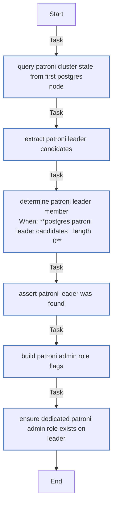

### Graph for sub_tasks/admin/pg_hba.yml

```mermaid
flowchart TD
Start
classDef block stroke:#3498db,stroke-width:2px;
classDef task stroke:#4b76bb,stroke-width:2px;
classDef includeTasks stroke:#16a085,stroke-width:2px;
classDef importTasks stroke:#34495e,stroke-width:2px;
classDef includeRole stroke:#2980b9,stroke-width:2px;
classDef importRole stroke:#699ba7,stroke-width:2px;
classDef includeVars stroke:#8e44ad,stroke-width:2px;
classDef rescue stroke:#665352,stroke-width:2px;

  Start-->|Task| Patroni_dynamic_pg_hba___Query_Patroni_cluster_state_from_first_postgres_node0[patroni dynamic pg hba   query patroni cluster<br>state from first postgres node]:::task
  Patroni_dynamic_pg_hba___Query_Patroni_cluster_state_from_first_postgres_node0-->|Task| Patroni_dynamic_pg_hba___Extract_Patroni_leader_candidates1[patroni dynamic pg hba   extract patroni leader<br>candidates]:::task
  Patroni_dynamic_pg_hba___Extract_Patroni_leader_candidates1-->|Task| Patroni_dynamic_pg_hba___Determine_Patroni_leader_member2[patroni dynamic pg hba   determine patroni leader<br>member]:::task
  Patroni_dynamic_pg_hba___Determine_Patroni_leader_member2-->|Task| Patroni_dynamic_pg_hba___Assert_Patroni_leader_was_found3[patroni dynamic pg hba   assert patroni leader was<br>found]:::task
  Patroni_dynamic_pg_hba___Assert_Patroni_leader_was_found3-->|Task| Patroni_dynamic_pg_hba___Build_desired_pg_hba_rules4[patroni dynamic pg hba   build desired pg hba<br>rules]:::task
  Patroni_dynamic_pg_hba___Build_desired_pg_hba_rules4-->|Task| Patroni_dynamic_pg_hba___Read_current_dynamic_config_from_leader5[patroni dynamic pg hba   read current dynamic<br>config from leader]:::task
  Patroni_dynamic_pg_hba___Read_current_dynamic_config_from_leader5-->|Task| Patroni_dynamic_pg_hba___Determine_whether_pg_hba_update_is_needed6[patroni dynamic pg hba   determine whether pg hba<br>update is needed]:::task
  Patroni_dynamic_pg_hba___Determine_whether_pg_hba_update_is_needed6-->|Task| Patroni_dynamic_pg_hba___Patch_DCS_config_with_desired_pg_hba7[patroni dynamic pg hba   patch dcs config with<br>desired pg hba<br>When: **postgres patroni pg hba needs restart   bool**]:::task
  Patroni_dynamic_pg_hba___Patch_DCS_config_with_desired_pg_hba7-->|Task| Patroni_dynamic_pg_hba___Restart_patroni_on_all_postgres_nodes_if_DCS_config_changed8[patroni dynamic pg hba   restart patroni on all<br>postgres nodes if dcs config changed<br>When: **postgres patroni pg hba needs restart   bool**]:::task
  Patroni_dynamic_pg_hba___Restart_patroni_on_all_postgres_nodes_if_DCS_config_changed8-->|Task| Patroni_dynamic_pg_hba___Wait_for_Patroni_REST_API_on_all_postgres_nodes9[patroni dynamic pg hba   wait for patroni rest api<br>on all postgres nodes<br>When: **postgres patroni pg hba needs restart   bool**]:::task
  Patroni_dynamic_pg_hba___Wait_for_Patroni_REST_API_on_all_postgres_nodes9-->|Task| Patroni_dynamic_pg_hba___Wait_for_live_pg_hba_conf_to_contain_HAProxy_rules_on_all_nodes10[patroni dynamic pg hba   wait for live pg hba conf<br>to contain haproxy rules on all nodes<br>When: **groups  tags haproxy     default       length   <br>0**]:::task
  Patroni_dynamic_pg_hba___Wait_for_live_pg_hba_conf_to_contain_HAProxy_rules_on_all_nodes10-->End
```

### Graph for sub_tasks/admin/pg_uptime_kuma.yml

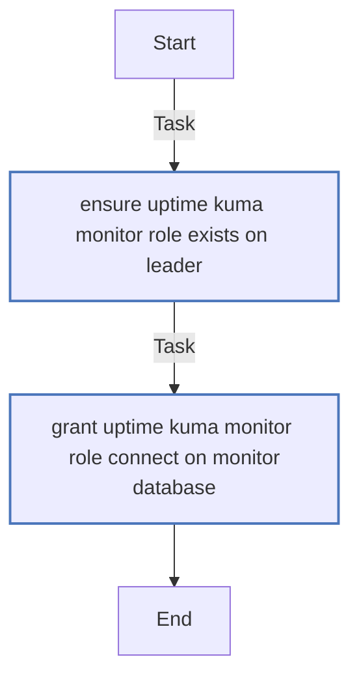

### Graph for sub_tasks/admin/reset_node.yml

```mermaid
flowchart TD
Start
classDef block stroke:#3498db,stroke-width:2px;
classDef task stroke:#4b76bb,stroke-width:2px;
classDef includeTasks stroke:#16a085,stroke-width:2px;
classDef importTasks stroke:#34495e,stroke-width:2px;
classDef includeRole stroke:#2980b9,stroke-width:2px;
classDef importRole stroke:#699ba7,stroke-width:2px;
classDef includeVars stroke:#8e44ad,stroke-width:2px;
classDef rescue stroke:#665352,stroke-width:2px;

  Start-->|Task| Reset_node___Stop_Patroni0[reset node   stop patroni]:::task
  Reset_node___Stop_Patroni0-->|Task| Reset_node___Disable_Patroni1[reset node   disable patroni]:::task
  Reset_node___Disable_Patroni1-->|Task| Reset_node___Stop_PostgreSQL2[reset node   stop postgresql]:::task
  Reset_node___Stop_PostgreSQL2-->|Task| Reset_node___Disable_PostgreSQL3[reset node   disable postgresql]:::task
  Reset_node___Disable_PostgreSQL3-->|Task| Reset_node___Stop_etcd4[reset node   stop etcd]:::task
  Reset_node___Stop_etcd4-->|Task| Reset_node___Disable_etcd5[reset node   disable etcd]:::task
  Reset_node___Disable_etcd5-->|Task| Reset_node___Kill_stray_postgres_patroni_etcd_processes6[reset node   kill stray postgres patroni etcd<br>processes]:::task
  Reset_node___Kill_stray_postgres_patroni_etcd_processes6-->|Task| Reset_node___Drop_Debian_PostgreSQL_cluster_if_present7[reset node   drop debian postgresql cluster if<br>present]:::task
  Reset_node___Drop_Debian_PostgreSQL_cluster_if_present7-->|Task| Reset_node___Remove_Patroni_config8[reset node   remove patroni config]:::task
  Reset_node___Remove_Patroni_config8-->|Task| Reset_node___Remove_Patroni_config_dir_leftovers9[reset node   remove patroni config dir leftovers]:::task
  Reset_node___Remove_Patroni_config_dir_leftovers9-->|Task| Reset_node___Remove_PostgreSQL_data_dir10[reset node   remove postgresql data dir]:::task
  Reset_node___Remove_PostgreSQL_data_dir10-->|Task| Reset_node___Remove_Debian_PostgreSQL_config_dir11[reset node   remove debian postgresql config dir]:::task
  Reset_node___Remove_Debian_PostgreSQL_config_dir11-->|Task| Reset_node___Remove_Debian_PostgreSQL_data_root_if_still_present12[reset node   remove debian postgresql data root if<br>still present]:::task
  Reset_node___Remove_Debian_PostgreSQL_data_root_if_still_present12-->|Task| Reset_node___Remove_PostgreSQL_runtime_sockets_and_pid_files13[reset node   remove postgresql runtime sockets and<br>pid files]:::task
  Reset_node___Remove_PostgreSQL_runtime_sockets_and_pid_files13-->|Task| Reset_node___Optionally_remove_etcd_data_dir_too14[reset node   optionally remove etcd data dir too]:::task
  Reset_node___Optionally_remove_etcd_data_dir_too14-->|Task| Reset_node___Reset_failed_systemd_units15[reset node   reset failed systemd units]:::task
  Reset_node___Reset_failed_systemd_units15-->|Task| Reset_node___Recreate_Patroni_PostgreSQL_data_dir16[reset node   recreate patroni postgresql data dir]:::task
  Reset_node___Recreate_Patroni_PostgreSQL_data_dir16-->|Task| Reset_node___Recreate_Patroni_config_dir17[reset node   recreate patroni config dir]:::task
  Reset_node___Recreate_Patroni_config_dir17-->|Task| Reset_node___Recreate_etcd_data_dir_if_keeping_etcd18[reset node   recreate etcd data dir if keeping<br>etcd]:::task
  Reset_node___Recreate_etcd_data_dir_if_keeping_etcd18-->End
```

### Graph for sub_tasks/backup.yml

```mermaid
flowchart TD
Start
classDef block stroke:#3498db,stroke-width:2px;
classDef task stroke:#4b76bb,stroke-width:2px;
classDef includeTasks stroke:#16a085,stroke-width:2px;
classDef importTasks stroke:#34495e,stroke-width:2px;
classDef includeRole stroke:#2980b9,stroke-width:2px;
classDef importRole stroke:#699ba7,stroke-width:2px;
classDef includeVars stroke:#8e44ad,stroke-width:2px;
classDef rescue stroke:#665352,stroke-width:2px;

  Start-->|Task| Backup_DBs___Assert_database_list_is_provided0[backup dbs   assert database list is provided]:::task
  Backup_DBs___Assert_database_list_is_provided0-->|Task| Backup_DBs___Query_Patroni_cluster_state_from_first_postgres_node1[backup dbs   query patroni cluster state from<br>first postgres node]:::task
  Backup_DBs___Query_Patroni_cluster_state_from_first_postgres_node1-->|Task| Backup_DBs___Extract_Patroni_leader_candidates2[backup dbs   extract patroni leader candidates]:::task
  Backup_DBs___Extract_Patroni_leader_candidates2-->|Task| Backup_DBs___Determine_Patroni_leader_member3[backup dbs   determine patroni leader member]:::task
  Backup_DBs___Determine_Patroni_leader_member3-->|Task| Backup_DBs___Build_timestamp4[backup dbs   build timestamp]:::task
  Backup_DBs___Build_timestamp4-->|Task| Backup_DBs___Set_output_extension5[backup dbs   set output extension]:::task
  Backup_DBs___Set_output_extension5-->|Task| Backup_DBs___Ensure_backup_directory_exists_on_leader6[backup dbs   ensure backup directory exists on<br>leader]:::task
  Backup_DBs___Ensure_backup_directory_exists_on_leader6-->|Task| Backup_DBs___Dump_each_database_in_custom_format7[backup dbs   dump each database in custom format<br>When: **postgres backup dbs format     custom**]:::task
  Backup_DBs___Dump_each_database_in_custom_format7-->|Task| Backup_DBs___Dump_each_database_in_plain_SQL_format8[backup dbs   dump each database in plain sql<br>format<br>When: **postgres backup dbs format     custom**]:::task
  Backup_DBs___Dump_each_database_in_plain_SQL_format8-->|Task| Backup_DBs___Show_result9[backup dbs   show result]:::task
  Backup_DBs___Show_result9-->End
```

### Graph for sub_tasks/install/apt.yml

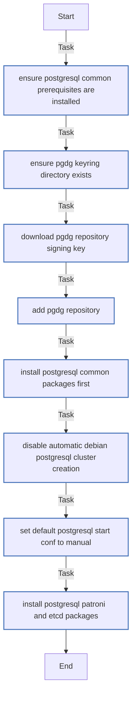

### Graph for sub_tasks/install/etcd.yml

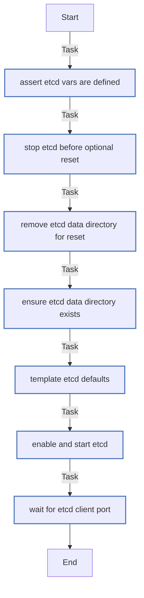

### Graph for sub_tasks/install/patroni.yml

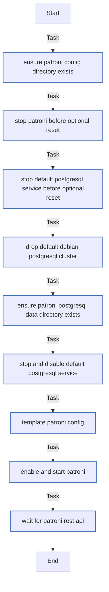

### Graph for sub_tasks/restore.yml

```mermaid
flowchart TD
Start
classDef block stroke:#3498db,stroke-width:2px;
classDef task stroke:#4b76bb,stroke-width:2px;
classDef includeTasks stroke:#16a085,stroke-width:2px;
classDef importTasks stroke:#34495e,stroke-width:2px;
classDef includeRole stroke:#2980b9,stroke-width:2px;
classDef importRole stroke:#699ba7,stroke-width:2px;
classDef includeVars stroke:#8e44ad,stroke-width:2px;
classDef rescue stroke:#665352,stroke-width:2px;

  Start-->|Task| Restore_DBs___Assert_restore_map_and_restore_dir_are_provided0[restore dbs   assert restore map and restore dir<br>are provided]:::task
  Restore_DBs___Assert_restore_map_and_restore_dir_are_provided0-->|Task| Restore_DBs___Validate_restore_map_entries1[restore dbs   validate restore map entries]:::task
  Restore_DBs___Validate_restore_map_entries1-->|Task| Restore_DBs___Query_Patroni_cluster_state_from_first_postgres_node2[restore dbs   query patroni cluster state from<br>first postgres node]:::task
  Restore_DBs___Query_Patroni_cluster_state_from_first_postgres_node2-->|Task| Restore_DBs___Extract_Patroni_leader_candidates3[restore dbs   extract patroni leader candidates]:::task
  Restore_DBs___Extract_Patroni_leader_candidates3-->|Task| Restore_DBs___Determine_Patroni_leader_member4[restore dbs   determine patroni leader member]:::task
  Restore_DBs___Determine_Patroni_leader_member4-->|Task| Restore_DBs___Assert_Patroni_leader_was_found5[restore dbs   assert patroni leader was found]:::task
  Restore_DBs___Assert_Patroni_leader_was_found5-->|Task| Restore_DBs___Build_resolved_restore_map6[restore dbs   build resolved restore map]:::task
  Restore_DBs___Build_resolved_restore_map6-->|Task| Restore_DBs___Check_requested_dump_files_exist7[restore dbs   check requested dump files exist]:::task
  Restore_DBs___Check_requested_dump_files_exist7-->|Task| Restore_DBs___Assert_requested_dump_files_exist8[restore dbs   assert requested dump files exist]:::task
  Restore_DBs___Assert_requested_dump_files_exist8-->|Task| Restore_DBs___Drop_databases_if_requested9[restore dbs   drop databases if requested<br>When: **postgres restore dbs drop existing   bool**]:::task
  Restore_DBs___Drop_databases_if_requested9-->|Task| Restore_DBs___Create_databases10[restore dbs   create databases]:::task
  Restore_DBs___Create_databases10-->|Task| Restore_DBs___Restore_each_database11[restore dbs   restore each database]:::task
  Restore_DBs___Restore_each_database11-->|Task| Restore_DBs___Show_result12[restore dbs   show result]:::task
  Restore_DBs___Show_result12-->End
```

#### Dependencies

No dependencies specified.
<!-- DOCSIBLE END -->
