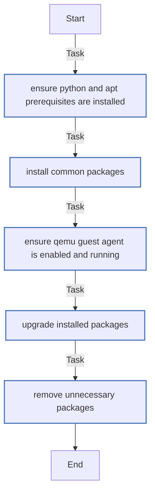
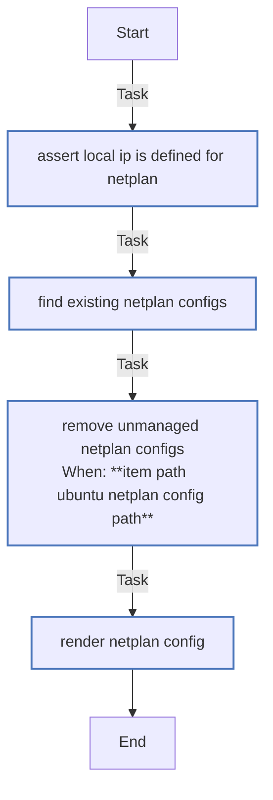
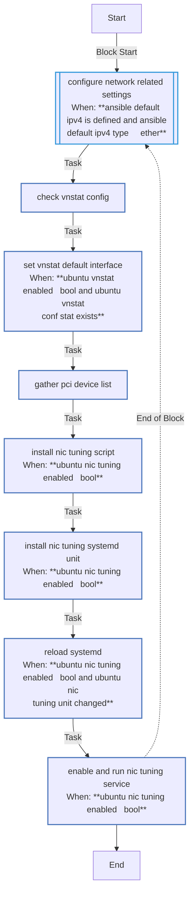
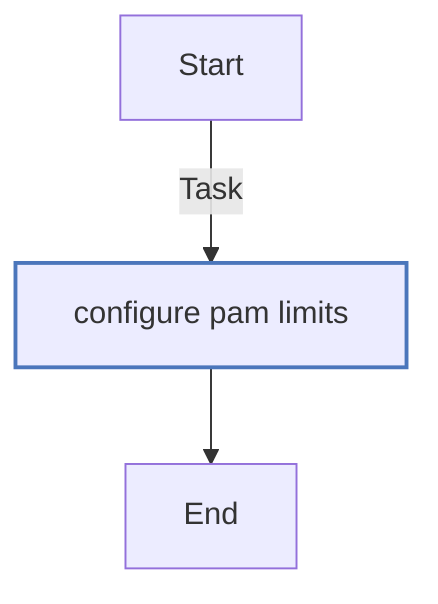
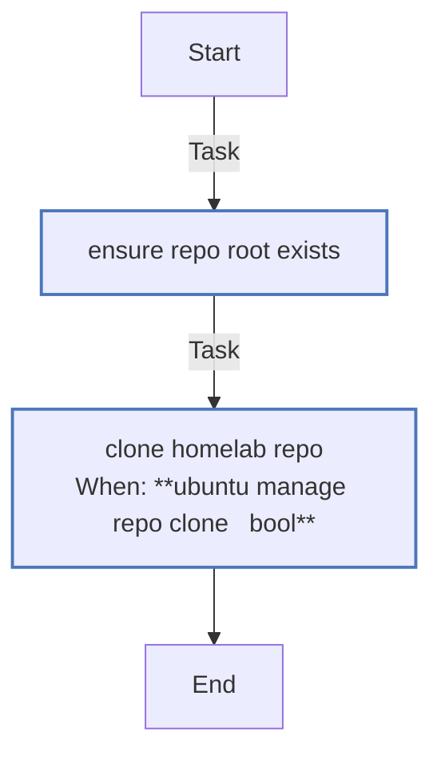
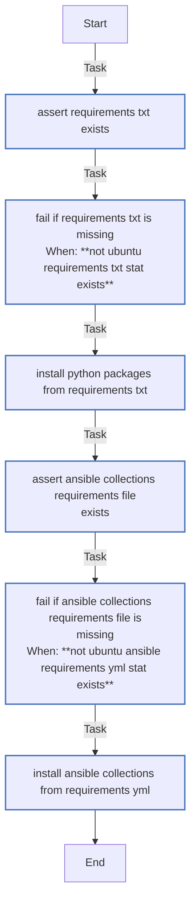
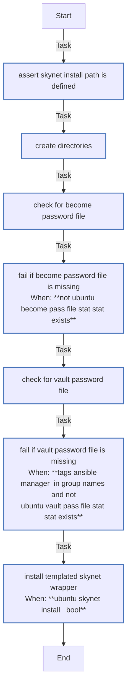
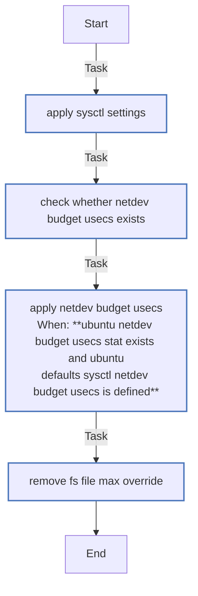
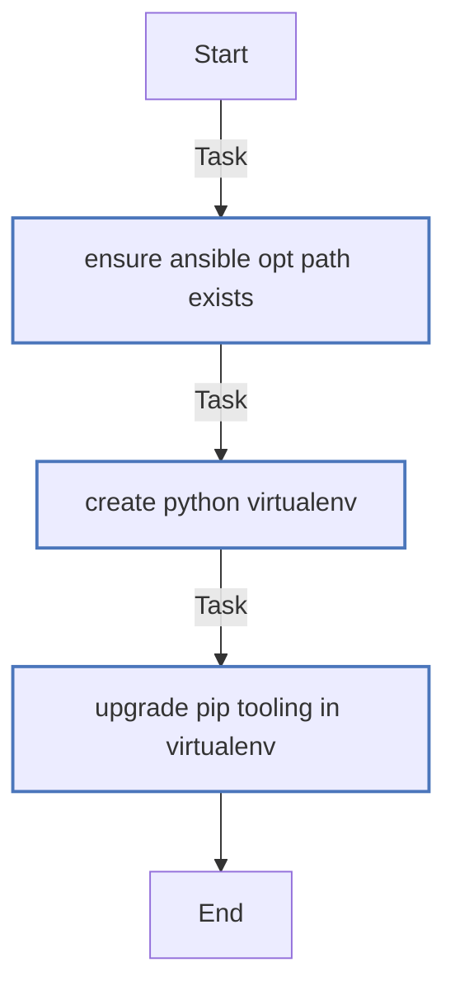

<!-- DOCSIBLE START -->

# 📃 Role overview

## ubuntu

| Field                | Value           |
|--------------------- |-----------------|
| Readme update        | 2026/04/11 |

### Defaults

**These are static variables with lower priority**

#### File: defaults/main.yml

| Var          | Type         | Value       |
|--------------|--------------|-------------|
| [ubuntu_apt_env_vars](https://github.com/Lebowski89/homelab/blob/main/defaults/main.yml#L3)   | dict | `{}` |    
| [ubuntu_apt_env_vars.**DEBIAN_FRONTEND**](https://github.com/Lebowski89/homelab/blob/main/defaults/main.yml#L4)   | str | `noninteractive` |    
| [ubuntu_apt_env_vars.**DEBIAN_PRIORITY**](https://github.com/Lebowski89/homelab/blob/main/defaults/main.yml#L5)   | str | `critical` |    
| [ubuntu_ansible_repo_root](https://github.com/Lebowski89/homelab/blob/main/defaults/main.yml#L7)   | str | `/opt` |    
| [ubuntu_ansible_repo_dirname](https://github.com/Lebowski89/homelab/blob/main/defaults/main.yml#L8)   | str | `homelab` |    
| [ubuntu_ansible_repo_path](https://github.com/Lebowski89/homelab/blob/main/defaults/main.yml#L9)   | str | `{{ ubuntu_ansible_repo_root }}/{{ ubuntu_ansible_repo_dirname }}` |    
| [ubuntu_ansible_dirname](https://github.com/Lebowski89/homelab/blob/main/defaults/main.yml#L10)   | str | `ansible` |    
| [ubuntu_ansible_path](https://github.com/Lebowski89/homelab/blob/main/defaults/main.yml#L11)   | str | `{{ ubuntu_ansible_repo_path }}/{{ ubuntu_ansible_dirname }}` |    
| [ubuntu_manage_repo_clone](https://github.com/Lebowski89/homelab/blob/main/defaults/main.yml#L13)   | bool | `True` |    
| [ubuntu_repo_url](https://github.com/Lebowski89/homelab/blob/main/defaults/main.yml#L14)   | str | `https://github.com/Lebowski89/homelab.git` |    
| [ubuntu_repo_version](https://github.com/Lebowski89/homelab/blob/main/defaults/main.yml#L15)   | str | `main` |    
| [ubuntu_ansible_opt_path](https://github.com/Lebowski89/homelab/blob/main/defaults/main.yml#L17)   | str | `/opt/ansible` |    
| [ubuntu_ansible_venv_path](https://github.com/Lebowski89/homelab/blob/main/defaults/main.yml#L18)   | str | `{{ ubuntu_ansible_opt_path }}/ansible-venv` |    
| [ubuntu_ansible_secrets_path](https://github.com/Lebowski89/homelab/blob/main/defaults/main.yml#L19)   | str | `{{ ubuntu_ansible_opt_path }}/.secrets` |    
| [ubuntu_ansible_become_pass_file](https://github.com/Lebowski89/homelab/blob/main/defaults/main.yml#L20)   | str | `{{ ubuntu_ansible_secrets_path }}/.ansible_become_pass` |    
| [ubuntu_ansible_vault_pass_file](https://github.com/Lebowski89/homelab/blob/main/defaults/main.yml#L21)   | str | `{{ ubuntu_ansible_secrets_path }}/.ansible_vault_pass` |    
| [ubuntu_skynet_install](https://github.com/Lebowski89/homelab/blob/main/defaults/main.yml#L23)   | bool | `True` |    
| [ubuntu_skynet_install_path](https://github.com/Lebowski89/homelab/blob/main/defaults/main.yml#L24)   | str | `/usr/local/bin/skynet` |    
| [ubuntu_skynet_doctor_ping_target](https://github.com/Lebowski89/homelab/blob/main/defaults/main.yml#L25)   | str | `tags_skynet` |    
| [ubuntu_skynet_docker_services_vars](https://github.com/Lebowski89/homelab/blob/main/defaults/main.yml#L26)   | str | `{{ ubuntu_ansible_path }}/group_vars/all/docker_services.yml` |    
| [ubuntu_sysctl_file](https://github.com/Lebowski89/homelab/blob/main/defaults/main.yml#L28)   | str | `/etc/sysctl.d/99-ubuntu-tuning.conf` |    
| [ubuntu_sysctl_settings](https://github.com/Lebowski89/homelab/blob/main/defaults/main.yml#L30)   | dict | `{}` |    
| [ubuntu_sysctl_settings.fs.inotify.**max_user_watches**](https://github.com/Lebowski89/homelab/blob/main/defaults/main.yml#L31)   | int | `524288` |    
| [ubuntu_sysctl_settings.net.core.**default_qdisc**](https://github.com/Lebowski89/homelab/blob/main/defaults/main.yml#L32)   | str | `fq` |    
| [ubuntu_sysctl_settings.net.core.**netdev_budget**](https://github.com/Lebowski89/homelab/blob/main/defaults/main.yml#L33)   | int | `50000` |    
| [ubuntu_sysctl_settings.net.core.**netdev_max_backlog**](https://github.com/Lebowski89/homelab/blob/main/defaults/main.yml#L34)   | int | `100000` |    
| [ubuntu_sysctl_settings.net.core.**rmem_max**](https://github.com/Lebowski89/homelab/blob/main/defaults/main.yml#L35)   | int | `67108864` |    
| [ubuntu_sysctl_settings.net.core.**somaxconn**](https://github.com/Lebowski89/homelab/blob/main/defaults/main.yml#L36)   | int | `4096` |    
| [ubuntu_sysctl_settings.net.core.**wmem_max**](https://github.com/Lebowski89/homelab/blob/main/defaults/main.yml#L37)   | int | `67108864` |    
| [ubuntu_sysctl_settings.net.ipv4.conf.all.**accept_redirects**](https://github.com/Lebowski89/homelab/blob/main/defaults/main.yml#L38)   | int | `0` |    
| [ubuntu_sysctl_settings.net.ipv4.conf.all.**accept_source_route**](https://github.com/Lebowski89/homelab/blob/main/defaults/main.yml#L39)   | int | `0` |    
| [ubuntu_sysctl_settings.net.ipv4.conf.all.**secure_redirects**](https://github.com/Lebowski89/homelab/blob/main/defaults/main.yml#L40)   | int | `0` |    
| [ubuntu_sysctl_settings.net.ipv4.**tcp_adv_win_scale**](https://github.com/Lebowski89/homelab/blob/main/defaults/main.yml#L41)   | int | `2` |    
| [ubuntu_sysctl_settings.net.ipv4.**tcp_congestion_control**](https://github.com/Lebowski89/homelab/blob/main/defaults/main.yml#L42)   | str | `bbr` |    
| [ubuntu_sysctl_settings.net.ipv4.**tcp_fin_timeout**](https://github.com/Lebowski89/homelab/blob/main/defaults/main.yml#L43)   | int | `10` |    
| [ubuntu_sysctl_settings.net.ipv4.**tcp_max_syn_backlog**](https://github.com/Lebowski89/homelab/blob/main/defaults/main.yml#L44)   | int | `30000` |    
| [ubuntu_sysctl_settings.net.ipv4.**tcp_max_tw_buckets**](https://github.com/Lebowski89/homelab/blob/main/defaults/main.yml#L45)   | int | `2000000` |    
| [ubuntu_sysctl_settings.net.ipv4.**tcp_mtu_probing**](https://github.com/Lebowski89/homelab/blob/main/defaults/main.yml#L46)   | int | `1` |    
| [ubuntu_sysctl_settings.net.ipv4.**tcp_rfc1337**](https://github.com/Lebowski89/homelab/blob/main/defaults/main.yml#L47)   | int | `1` |    
| [ubuntu_sysctl_settings.net.ipv4.**tcp_rmem**](https://github.com/Lebowski89/homelab/blob/main/defaults/main.yml#L48)   | str | `4096 87380 33554432` |    
| [ubuntu_sysctl_settings.net.ipv4.**tcp_sack**](https://github.com/Lebowski89/homelab/blob/main/defaults/main.yml#L49)   | int | `1` |    
| [ubuntu_sysctl_settings.net.ipv4.**tcp_slow_start_after_idle**](https://github.com/Lebowski89/homelab/blob/main/defaults/main.yml#L50)   | int | `0` |    
| [ubuntu_sysctl_settings.net.ipv4.**tcp_tw_reuse**](https://github.com/Lebowski89/homelab/blob/main/defaults/main.yml#L51)   | int | `2` |    
| [ubuntu_sysctl_settings.net.ipv4.**tcp_window_scaling**](https://github.com/Lebowski89/homelab/blob/main/defaults/main.yml#L52)   | int | `1` |    
| [ubuntu_sysctl_settings.net.ipv4.**tcp_wmem**](https://github.com/Lebowski89/homelab/blob/main/defaults/main.yml#L53)   | str | `4096 87380 33554432` |    
| [ubuntu_sysctl_settings.net.ipv4.**udp_rmem_min**](https://github.com/Lebowski89/homelab/blob/main/defaults/main.yml#L54)   | int | `8192` |    
| [ubuntu_sysctl_settings.net.ipv4.**udp_wmem_min**](https://github.com/Lebowski89/homelab/blob/main/defaults/main.yml#L55)   | int | `8192` |    
| [ubuntu_sysctl_settings.vm.**dirty_background_ratio**](https://github.com/Lebowski89/homelab/blob/main/defaults/main.yml#L56)   | int | `10` |    
| [ubuntu_sysctl_settings.vm.**dirty_ratio**](https://github.com/Lebowski89/homelab/blob/main/defaults/main.yml#L57)   | int | `15` |    
| [ubuntu_sysctl_settings.vm.**swappiness**](https://github.com/Lebowski89/homelab/blob/main/defaults/main.yml#L58)   | int | `10` |    
| [ubuntu_sysctl_settings.net.ipv4.neigh.default.**gc_thresh1**](https://github.com/Lebowski89/homelab/blob/main/defaults/main.yml#L59)   | int | `1024` |    
| [ubuntu_sysctl_settings.net.ipv4.neigh.default.**gc_thresh2**](https://github.com/Lebowski89/homelab/blob/main/defaults/main.yml#L60)   | int | `2048` |    
| [ubuntu_sysctl_settings.net.ipv4.neigh.default.**gc_thresh3**](https://github.com/Lebowski89/homelab/blob/main/defaults/main.yml#L61)   | int | `4096` |    
| [ubuntu_pam_limits](https://github.com/Lebowski89/homelab/blob/main/defaults/main.yml#L63)   | list | `[]` |    
| [ubuntu_pam_limits.**0**](https://github.com/Lebowski89/homelab/blob/main/defaults/main.yml#L64)   | dict | `{}` |    
| [ubuntu_pam_limits.0.**domain**](https://github.com/Lebowski89/homelab/blob/main/defaults/main.yml#L64)   | str | `*` |    
| [ubuntu_pam_limits.0.**limit_type**](https://github.com/Lebowski89/homelab/blob/main/defaults/main.yml#L65)   | str | `-` |    
| [ubuntu_pam_limits.0.**limit_item**](https://github.com/Lebowski89/homelab/blob/main/defaults/main.yml#L66)   | str | `nofile` |    
| [ubuntu_pam_limits.0.**value**](https://github.com/Lebowski89/homelab/blob/main/defaults/main.yml#L67)   | str | `100000` |    
| [ubuntu_pam_limits.**1**](https://github.com/Lebowski89/homelab/blob/main/defaults/main.yml#L68)   | dict | `{}` |    
| [ubuntu_pam_limits.1.**domain**](https://github.com/Lebowski89/homelab/blob/main/defaults/main.yml#L68)   | str | `*` |    
| [ubuntu_pam_limits.1.**limit_type**](https://github.com/Lebowski89/homelab/blob/main/defaults/main.yml#L69)   | str | `soft` |    
| [ubuntu_pam_limits.1.**limit_item**](https://github.com/Lebowski89/homelab/blob/main/defaults/main.yml#L70)   | str | `memlock` |    
| [ubuntu_pam_limits.1.**value**](https://github.com/Lebowski89/homelab/blob/main/defaults/main.yml#L71)   | str | `unlimited` |    
| [ubuntu_pam_limits.**2**](https://github.com/Lebowski89/homelab/blob/main/defaults/main.yml#L72)   | dict | `{}` |    
| [ubuntu_pam_limits.2.**domain**](https://github.com/Lebowski89/homelab/blob/main/defaults/main.yml#L72)   | str | `*` |    
| [ubuntu_pam_limits.2.**limit_type**](https://github.com/Lebowski89/homelab/blob/main/defaults/main.yml#L73)   | str | `hard` |    
| [ubuntu_pam_limits.2.**limit_item**](https://github.com/Lebowski89/homelab/blob/main/defaults/main.yml#L74)   | str | `memlock` |    
| [ubuntu_pam_limits.2.**value**](https://github.com/Lebowski89/homelab/blob/main/defaults/main.yml#L75)   | str | `unlimited` |    
| [ubuntu_defaults_netplan_config](https://github.com/Lebowski89/homelab/blob/main/defaults/main.yml#L77)   | str | `netplan-config.yaml` |    
| [ubuntu_netplan_config_path](https://github.com/Lebowski89/homelab/blob/main/defaults/main.yml#L78)   | str | `/etc/netplan/{{ ubuntu_defaults_netplan_config }}` |    
| [ubuntu_defaults_netplan_gateway](https://github.com/Lebowski89/homelab/blob/main/defaults/main.yml#L80)   | str | `<multiline value: folded_strip>` |    
| [ubuntu_defaults_netplan_nameservers](https://github.com/Lebowski89/homelab/blob/main/defaults/main.yml#L87)   | str | `<multiline value: folded_strip>` |    
| [ubuntu_netplan_prefix](https://github.com/Lebowski89/homelab/blob/main/defaults/main.yml#L97)   | int | `24` |    
| [ubuntu_nic_tuning_enabled](https://github.com/Lebowski89/homelab/blob/main/defaults/main.yml#L99)   | bool | `True` |    
| [ubuntu_vnstat_enabled](https://github.com/Lebowski89/homelab/blob/main/defaults/main.yml#L100)   | bool | `True` |    

### Tasks

#### File: tasks/main.yml

| Name | Module | Has Conditions | Tags |
| ---- | ------ | -------------- | -----|
| Install common apt packages | ansible.builtin.include_tasks | False | ubuntu,ubuntu_apt |
| Clone Homelab repo | ansible.builtin.include_tasks | True | ubuntu,ubuntu_repo |
| Setup Python venv | ansible.builtin.include_tasks | True | ubuntu,ubuntu_venv |
| Install required collections and pip packages | ansible.builtin.include_tasks | True | ubuntu,ubuntu_requirements |
| Install Skynet wrapper | ansible.builtin.include_tasks | True | ubuntu,ubuntu_skynet |
| Tune sysctl settings | ansible.builtin.include_tasks | False | ubuntu,ubuntu_sysctl |
| Set PAM limits | ansible.builtin.include_tasks | False | ubuntu,ubuntu_pam |
| Configure network tuning | ansible.builtin.include_tasks | False | ubuntu,ubuntu_network |
| Configure Netplan | ansible.builtin.include_tasks | True | ubuntu,ubuntu_netplan |

#### File: tasks/sub_tasks/apt.yml

| Name | Module | Has Conditions |
| ---- | ------ | -------------- |
| Ensure python and apt prerequisites are installed | ansible.builtin.apt | False |
| Install common packages | ansible.builtin.apt | False |
| Ensure qemu-guest-agent is enabled and running | ansible.builtin.systemd | False |
| Upgrade installed packages | ansible.builtin.apt | False |
| Remove unnecessary packages | ansible.builtin.apt | False |

#### File: tasks/sub_tasks/netplan.yml

| Name | Module | Has Conditions |
| ---- | ------ | -------------- |
| Assert local_ip is defined for netplan | ansible.builtin.assert | False |
| Find existing netplan configs | ansible.builtin.find | False |
| Remove unmanaged netplan configs | ansible.builtin.file | True |
| Render netplan config | ansible.builtin.template | False |

#### File: tasks/sub_tasks/network.yml

| Name | Module | Has Conditions |
| ---- | ------ | -------------- |
| Configure network-related settings | block | True |
| Check vnstat config | ansible.builtin.stat | False |
| Set vnstat default interface | ansible.builtin.lineinfile | True |
| Gather PCI device list | ansible.builtin.command | False |
| Install NIC tuning script | ansible.builtin.template | True |
| Install NIC tuning systemd unit | ansible.builtin.copy | True |
| Reload systemd | ansible.builtin.systemd_service | True |
| Enable and run NIC tuning service | ansible.builtin.systemd_service | True |

#### File: tasks/sub_tasks/pam.yml

| Name | Module | Has Conditions |
| ---- | ------ | -------------- |
| Configure PAM limits | community.general.pam_limits | False |

#### File: tasks/sub_tasks/repo.yml

| Name | Module | Has Conditions |
| ---- | ------ | -------------- |
| Ensure repo root exists | ansible.builtin.file | False |
| Clone homelab repo | ansible.builtin.git | True |

#### File: tasks/sub_tasks/requirements.yml

| Name | Module | Has Conditions |
| ---- | ------ | -------------- |
| Assert requirements.txt exists | ansible.builtin.stat | False |
| Fail if requirements.txt is missing | ansible.builtin.fail | True |
| Install Python packages from requirements.txt | ansible.builtin.pip | False |
| Assert Ansible collections requirements file exists | ansible.builtin.stat | False |
| Fail if Ansible collections requirements file is missing | ansible.builtin.fail | True |
| Install Ansible collections from requirements.yml | ansible.builtin.command | False |

#### File: tasks/sub_tasks/skynet.yml

| Name | Module | Has Conditions |
| ---- | ------ | -------------- |
| Assert skynet install path is defined | ansible.builtin.assert | False |
| Create directories | ansible.builtin.file | False |
| Check for become password file | ansible.builtin.stat | False |
| Fail if become password file is missing | ansible.builtin.fail | True |
| Check for vault password file | ansible.builtin.stat | False |
| Fail if vault password file is missing | ansible.builtin.fail | True |
| Install templated skynet wrapper | ansible.builtin.template | True |

#### File: tasks/sub_tasks/sysctl.yml

| Name | Module | Has Conditions |
| ---- | ------ | -------------- |
| Apply sysctl settings | ansible.posix.sysctl | False |
| Check whether netdev_budget_usecs exists | ansible.builtin.stat | False |
| Apply netdev_budget_usecs | ansible.posix.sysctl | True |
| Remove fs.file-max override | ansible.posix.sysctl | False |

#### File: tasks/sub_tasks/venv.yml

| Name | Module | Has Conditions |
| ---- | ------ | -------------- |
| Ensure Ansible opt path exists | ansible.builtin.file | False |
| Create Python virtualenv | ansible.builtin.command | False |
| Upgrade pip tooling in virtualenv | ansible.builtin.pip | False |

## Task Flow Graphs

### Graph for main.yml

```mermaid
flowchart TD
Start
classDef block stroke:#3498db,stroke-width:2px;
classDef task stroke:#4b76bb,stroke-width:2px;
classDef includeTasks stroke:#16a085,stroke-width:2px;
classDef importTasks stroke:#34495e,stroke-width:2px;
classDef includeRole stroke:#2980b9,stroke-width:2px;
classDef importRole stroke:#699ba7,stroke-width:2px;
classDef includeVars stroke:#8e44ad,stroke-width:2px;
classDef rescue stroke:#665352,stroke-width:2px;

  Start-->|Include task| Install_common_apt_packages_sub_tasks_apt_yml_0[install common apt packages<br>include_task: sub tasks apt yml]:::includeTasks
  Install_common_apt_packages_sub_tasks_apt_yml_0-->|Include task| Clone_Homelab_repo_sub_tasks_repo_yml_1[clone homelab repo<br>When: **tags ansible manager  in group names**<br>include_task: sub tasks repo yml]:::includeTasks
  Clone_Homelab_repo_sub_tasks_repo_yml_1-->|Include task| Setup_Python_venv_sub_tasks_venv_yml_2[setup python venv<br>When: **tags ansible manager  in group names**<br>include_task: sub tasks venv yml]:::includeTasks
  Setup_Python_venv_sub_tasks_venv_yml_2-->|Include task| Install_required_collections_and_pip_packages_sub_tasks_requirements_yml_3[install required collections and pip packages<br>When: **tags ansible manager  in group names**<br>include_task: sub tasks requirements yml]:::includeTasks
  Install_required_collections_and_pip_packages_sub_tasks_requirements_yml_3-->|Include task| Install_Skynet_wrapper_sub_tasks_skynet_yml_4[install skynet wrapper<br>When: **tags ansible manager  in group names**<br>include_task: sub tasks skynet yml]:::includeTasks
  Install_Skynet_wrapper_sub_tasks_skynet_yml_4-->|Include task| Tune_sysctl_settings_sub_tasks_sysctl_yml_5[tune sysctl settings<br>include_task: sub tasks sysctl yml]:::includeTasks
  Tune_sysctl_settings_sub_tasks_sysctl_yml_5-->|Include task| Set_PAM_limits_sub_tasks_pam_yml_6[set pam limits<br>include_task: sub tasks pam yml]:::includeTasks
  Set_PAM_limits_sub_tasks_pam_yml_6-->|Include task| Configure_network_tuning_sub_tasks_network_yml_7[configure network tuning<br>include_task: sub tasks network yml]:::includeTasks
  Configure_network_tuning_sub_tasks_network_yml_7-->|Include task| Configure_Netplan_sub_tasks_netplan_yml_8[configure netplan<br>When: **inventory hostname not in  groups  tags opentofu<br>managed     default**<br>include_task: sub tasks netplan yml]:::includeTasks
  Configure_Netplan_sub_tasks_netplan_yml_8-->End
```

### Graph for sub_tasks/apt.yml

### Graph for sub_tasks/netplan.yml

### Graph for sub_tasks/network.yml

### Graph for sub_tasks/pam.yml

### Graph for sub_tasks/repo.yml

### Graph for sub_tasks/requirements.yml

### Graph for sub_tasks/skynet.yml

### Graph for sub_tasks/sysctl.yml

### Graph for sub_tasks/venv.yml

#### Dependencies

No dependencies specified.
<!-- DOCSIBLE END -->
